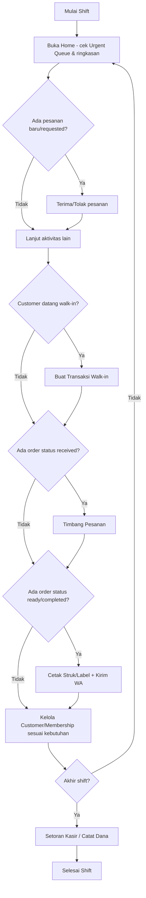
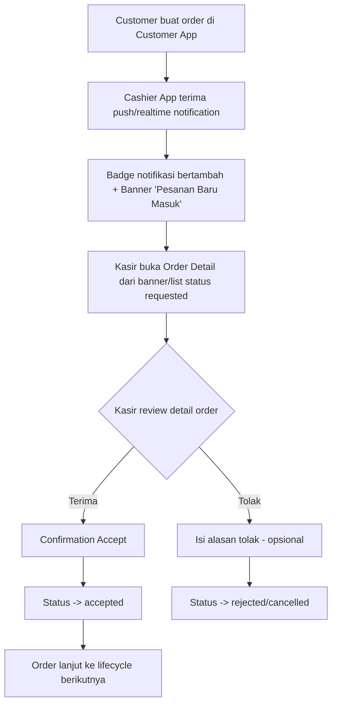
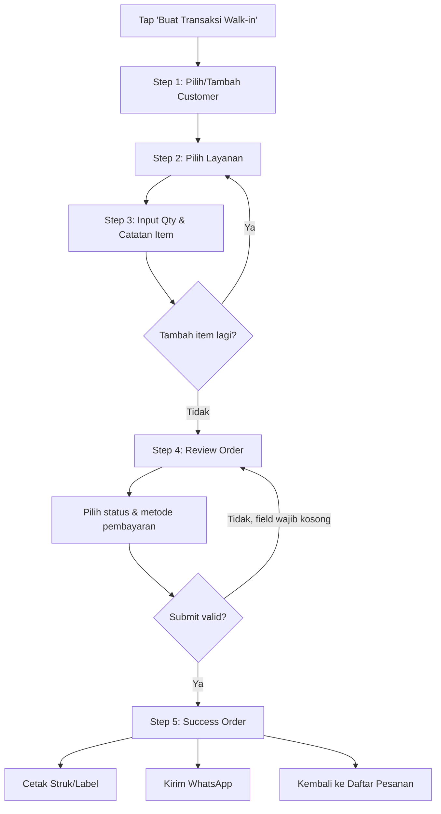
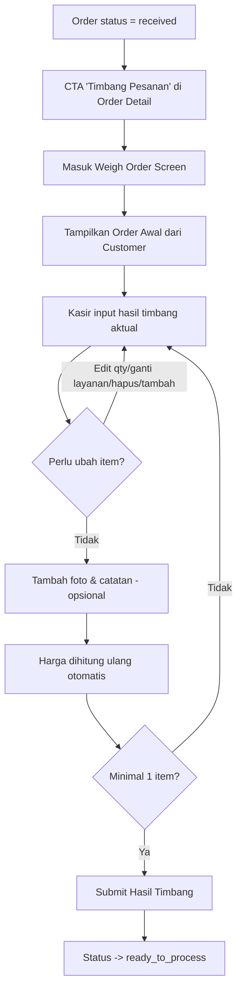
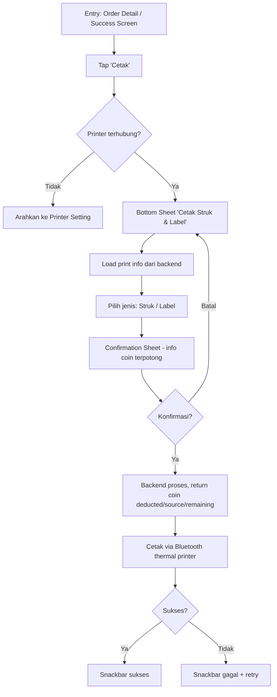
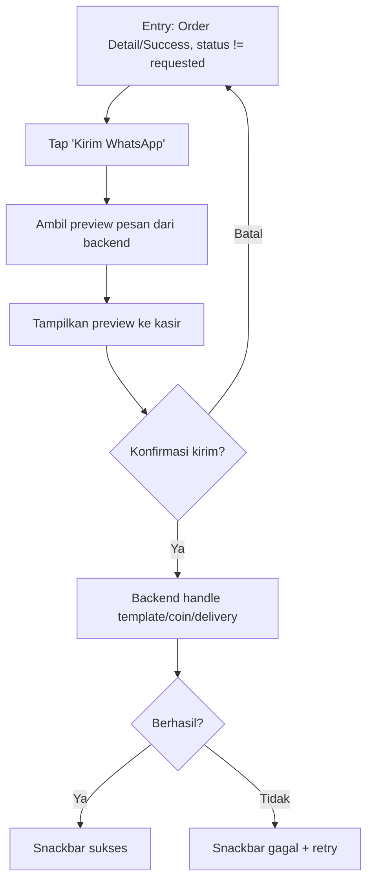
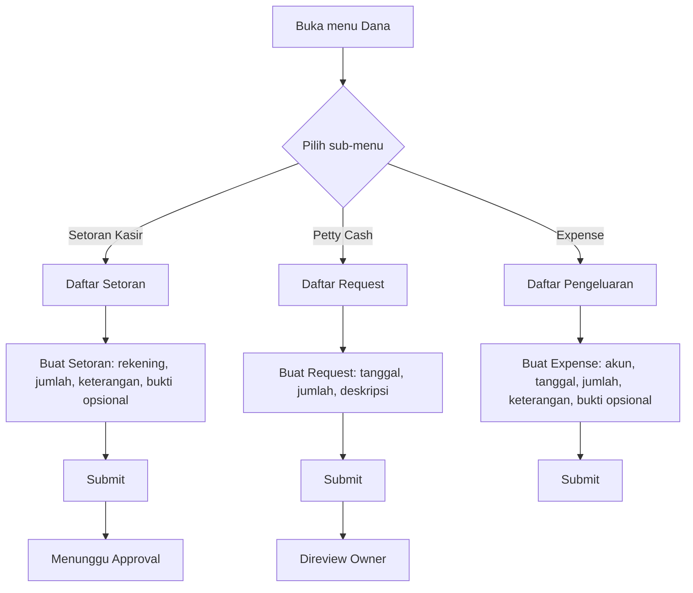
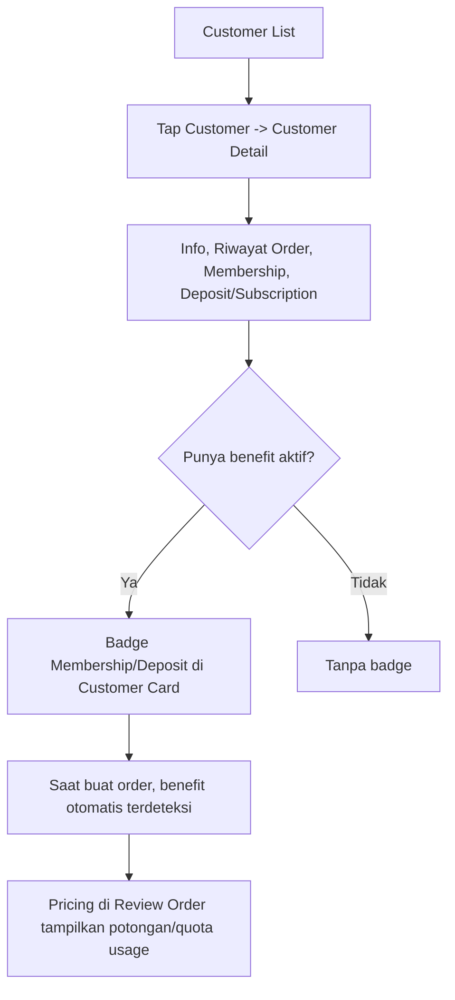

# WashWallet Cashier App — Rancangan Desain & UX Architecture

> **Status dokumen:** Draft rancangan flow & struktur (bukan UI visual final).
> **Tujuan dokumen:** Menjadi input terstruktur untuk analisis lanjutan (termasuk oleh AI model lain) dalam menyusun *user need*.
> **Sumber:** Brief produk WashWallet Cashier App Redesign.

---

## 0. Ringkasan Eksekutif

WashWallet Cashier App adalah POS/front-office tool internal untuk kasir outlet laundry. Masalah utama saat ini adalah **navigasi yang tumpang tindih** (bottom nav vs drawer) dan **semua fitur terasa sama penting**, padahal kasir sebenarnya hanya butuh tahu satu hal di setiap momen: *"Apa yang harus saya lakukan sekarang?"*

Dokumen ini menyusun ulang flow, information architecture, dan struktur layar berdasarkan prinsip tersebut — dimulai dari flow & struktur dulu, bukan tampilan visual.

---

## 1. Prinsip & Batasan Desain (ringkasan konteks)

- App operasional, bukan dashboard analytics atau landing page.
- Optimasi untuk: cepat dipindai, status jelas, minim distraksi, stabil, fokus pada *next action* kasir.
- Pertanyaan utama setiap layar: **"Apa yang harus dilakukan kasir sekarang?"** — bukan "fitur apa saja yang ada?".
- Design system existing (`wash_wallet_ui`, Material 3, font Satoshi, primary teal/green) **dipertahankan**, bukan dirombak.
- Hindari: hero marketing layout, grafik dekoratif besar, flow checkout panjang tanpa ringkasan sticky.

---

## 2. Peran Pengguna (User Roles)

| Role | Konteks Pemakaian | Fokus Kebutuhan |
|---|---|---|
| **Kasir / Frontliner** | Primary user, dipakai sepanjang shift, sering dalam kondisi outlet sibuk | Kecepatan transaksi, kejelasan status, minim salah input pembayaran |
| **Supervisor Outlet** | Memantau operasional outlet, mungkin approve hal tertentu | Visibilitas ringkasan harian, kontrol dana outlet |
| **Admin Operasional Ringan** | Mengelola data master (layanan, kategori, membership, paket) | Akses ke Setup Outlet, tidak butuh akses harian ke flow transaksi |

*Catatan: brief tidak menjelaskan apakah role-role ini punya permission/UI berbeda dalam app yang sama, atau app yang sama dipakai semua role tanpa pembedaan akses. Ini ditandai sebagai open question di Bagian 14.*

---

## 3. Primary Cashier User Journey (End-to-End Harian)



Journey ini menunjukkan bahwa **Home adalah pusat orientasi**, dan kasir berputar di antara: tangani pesanan baru → walk-in → timbang → cetak/WA → kelola customer → dana, sepanjang shift.

---

## 4. Information Architecture (Redesigned)

```
Bottom Navigation (5 item, primary daily nav)
├── Home
├── Pesanan
├── Customer
├── Dana
└── Setting

Setting (berisi akses sekunder)
├── Profile / Account
├── Printer Setting
├── Setup Outlet  ← data master dipindahkan ke sini
│   ├── Kategori
│   ├── Layanan
│   ├── Paket Deposit
│   └── Membership Plan
└── Logout
```

**Perubahan kunci dari struktur lama:**
- Drawer terpisah **dihilangkan** sebagai navigasi primer → semua primary nav ada di bottom bar.
- Data master (Kategori, Layanan, Paket, Membership) **tidak lagi sejajar** dengan menu harian — dipindah jadi sub-menu di dalam Setup Outlet.
- "Dana & Keuangan" dan "Transaksi" lama digabung ulang menjadi struktur **Pesanan** dan **Dana** yang lebih jelas perannya masing-masing.

---

## 5. Screen Inventory

| ID | Nama Layar | Modul | Entry Point |
|---|---|---|---|
| HOME-01 | Home Dashboard | Home | Bottom nav |
| ORD-01 | Order List (filter & search) | Pesanan | Bottom nav, Home quick action |
| ORD-02 | Order Detail | Pesanan | Order List, Banner notifikasi |
| ORD-03 | Walk-in Step 1: Pilih Customer | Pesanan | Home/Order List "Buat Transaksi Walk-in" |
| ORD-04 | Walk-in Step 2: Pilih Layanan | Pesanan | ORD-03 |
| ORD-05 | Walk-in Step 3: Input Qty & Notes (bottom sheet) | Pesanan | ORD-04 |
| ORD-06 | Walk-in Step 4: Review Order | Pesanan | ORD-04 (lanjut review) |
| ORD-07 | Walk-in Step 5: Success Order | Pesanan | ORD-06 submit sukses |
| ORD-08 | Weigh Order | Pesanan | ORD-02 (status `received`) |
| ORD-09 | Print Bottom Sheet (pilih Struk/Label) | Pesanan | ORD-02, ORD-07 |
| ORD-10 | Print Confirmation Sheet (info coin) | Pesanan | ORD-09 |
| ORD-11 | WhatsApp Preview & Confirm | Pesanan | ORD-02, ORD-07 |
| CUST-01 | Customer List | Customer | Bottom nav, ORD-03 |
| CUST-02 | Customer Detail | Customer | CUST-01 |
| CUST-03 | Create/Edit Customer | Customer | CUST-01, CUST-02, quick-add dari ORD-03 |
| CUST-04 | Membership List | Customer | CUST-02 |
| CUST-05 | Add Membership | Customer | CUST-04 |
| CUST-06 | Deposit/Subscription List | Customer | CUST-02 |
| CUST-07 | Add Deposit/Subscription | Customer | CUST-06 |
| DANA-01 | Dana Overview | Dana | Bottom nav |
| DANA-02 | Setoran Kasir List | Dana | DANA-01 |
| DANA-03 | Create Setoran | Dana | DANA-02 |
| DANA-04 | Petty Cash List | Dana | DANA-01 |
| DANA-05 | Create Petty Cash Request | Dana | DANA-04 |
| DANA-06 | Expense List | Dana | DANA-01 |
| DANA-07 | Create Expense | Dana | DANA-06 |
| SET-01 | Profile/Account | Setting | Bottom nav |
| SET-02 | Printer Setting | Setting | SET-01, redirect dari flow print |
| SET-03 | Setup Outlet (entry + 4 sub-menu) | Setting | SET-01 |
| SET-04 | Logout Confirmation | Setting | SET-01 |

---

## 6. Flow Diagram per Core Flow

### 6.1 New Online Order



### 6.2 Walk-in Order



### 6.3 Weighing



### 6.4 Print Receipt / Label



### 6.5 WhatsApp Notification



### 6.6 Finance / Setoran



### 6.7 Customer Membership/Deposit Context



---

## 7. Per-Screen Content Hierarchy & CTA

| Screen ID | Hierarki Konten (atas → bawah) | Main CTA | Secondary CTA |
|---|---|---|---|
| HOME-01 | Header (outlet, kasir, shift, notif, status printer) → Banner order baru (jika ada) → Urgent Queue → Quick Action → Daily Summary | Buka item Urgent Queue teratas | Buat Transaksi Walk-in |
| ORD-01 | Search → Filter status (chip/tab) → List order (no., customer, status badge, payment badge, waktu) | Tap order → Order Detail | Buat Transaksi Walk-in |
| ORD-02 | Header status → Info customer → Item list → Timeline → Financial summary → Payment status | CTA dinamis sesuai status (lihat Bagian 8) | Cetak / Kirim WA / Edit |
| ORD-03 | Search customer → List (badge member/deposit) → empty/loading | Pilih Customer | Tambah Customer Baru (quick add) |
| ORD-04 | Search/filter layanan → Card layanan (nama, harga, unit, durasi) → Sticky cart summary | Pilih Layanan | Lanjut Review (jika cart terisi) |
| ORD-05 | Harga satuan & unit → Qty stepper → Catatan item | Simpan | Hapus Item |
| ORD-06 | Customer card → Item list → Subtotal/quota/diskon → Total → Estimasi selesai → Payment status/method/account/paid/remaining | Submit Order | Edit Item |
| ORD-07 | No. order, customer, total, paid, remaining, estimasi selesai, status order & pembayaran | Cetak Struk | Cetak Label / Kirim WA / Lihat Detail / Kembali ke Daftar |
| ORD-08 | Order Awal (read-only) vs Hasil Timbang Aktual (editable) → foto/catatan → sticky estimasi total | Submit Hasil Timbang | Tambah Item / Ganti Layanan |
| ORD-09 | Pilihan Struk/Label | Lanjut Konfirmasi | Batal |
| ORD-10 | Info potongan coin | Konfirmasi & Cetak | Batal |
| ORD-11 | Preview pesan WA | Kirim | Batal |
| CUST-01 | Search → List customer (badge benefit) | Tambah Customer | Tap → Detail |
| CUST-02 | Info customer → Riwayat order → Membership → Deposit/Subscription | Buat Order untuk Customer Ini | Edit / Hapus |
| CUST-03 | Form: nama*, email, phone, address, gender, DOB, active flag | Simpan | Batal |
| CUST-04/06 | List + filter status | Tambah Membership/Deposit | Lihat Detail |
| DANA-01 | Ringkasan dana (cash balance, total setoran, petty cash, expense) | Buat Setoran | Lihat Riwayat |
| DANA-02/04/06 | List item + status approval | Buat Baru | Filter |
| DANA-03/05/07 | Form sesuai jenis | Submit | Batal |
| SET-01..04 | Profile / Printer / Setup Outlet / Logout | Sesuai konteks | — |

---

## 8. Main CTA Berdasarkan Order Status

| Status | Label ID | Main CTA Kasir | Catatan |
|---|---|---|---|
| `requested` | Diajukan | **Terima Pesanan** (sekunder: Tolak Pesanan) | Validated dari brief |
| `accepted` | Diterima | Lihat Detail / Pantau Status | Diusulkan — perlu validasi apakah ada aksi kasir di status ini |
| `picking_up` | Dalam Perjalanan/Dijemput | Pantau Status (read-only) | Diusulkan — kemungkinan domain Production/Courier App |
| `picked_up` | Sudah Diambil | Tandai Diterima di Outlet (jika manual) | Diusulkan |
| `received` | Di Outlet | **Timbang Pesanan** | Validated dari brief |
| `ready_to_process` | Siap Dikerjakan | **Kirim/Siapkan ke Produksi** | Validated dari brief |
| `in_progress` | Diproses | Pantau Progress (read-only) | Diusulkan — domain Production App |
| `ready` | Siap Ambil/Diantar | **Tandai Siap Ambil/Diantar** | Validated dari brief |
| `completed` | Selesai | **Cetak Struk / Kirim WA** | Validated dari brief |
| `cancelled` | Dibatalkan | Lihat Alasan Pembatalan | Diusulkan |
| `on_hold` | Ditahan | Lihat Catatan Hold / Lanjutkan | Diusulkan |
| `pending`, `pending_dropoff`, `weighing`, `queued`, `processing`, `delivering`, `delivered` | — | Belum dipetakan ke CTA spesifik | **Perlu validasi backend** — kemungkinan alias dari status spesifik di atas, lihat Bagian 18 brief sumber |

---

## 9. State Matrix (Loading / Empty / Error / Confirmation)

| Grup Screen | Loading | Empty | Error | Confirmation |
|---|---|---|---|---|
| Order List | Skeleton/list loading | "Belum ada pesanan" + CTA buat walk-in | Retry + pesan jelas | — |
| Order Detail | Loading indicator | — | Retry, fallback ke list | Accept / Reject / Print / Kirim WA |
| Customer List | Loading | "Belum ada customer" + tambah | Retry | Delete dengan confirm |
| Pilih Layanan | Loading | "Layanan tidak ditemukan" | Retry, cek koneksi | — |
| Weigh Order | Loading service list | — | Error actionable (foto/temp/file gagal) | Submit hasil timbang |
| Print | Loading print info | — | Printer belum tersambung → redirect setting | Confirm sebelum potong coin |
| WhatsApp | Loading preview | — | Gagal kirim + retry | Confirm kirim |
| Dana (semua) | Loading | "Belum ada transaksi" + tambah | Retry | Submit setoran/petty cash/expense |

---

## 10. Edge Cases

1. **Draft order lama ditemukan** saat mulai walk-in baru → harus ada opsi lanjutkan / ubah / hapus draft (app memakai local draft order, jangan disembunyikan).
2. **Quantity create order saat ini integer-only**, sementara domain timbang mungkin butuh nilai desimal (kg) → kalau redesign mengusulkan input desimal, perlu validasi backend/domain final dulu.
3. **Semua item tertutup quota paket** → payment status otomatis `paid_by_package`; field method/account/paid amount disembunyikan/dinonaktifkan.
4. **Metode transfer/QRIS** → wajib pilih rekening/source account. QRIS dikirim ke backend sebagai `transfer` — jangan asumsikan settlement otomatis.
5. **Status partial** → kasir wajib input nominal bayar, validasi nominal tidak melebihi total.
6. **Submit button disabled** → harus selalu ada alasan yang terlihat, jangan silent disable.
7. **Order baru realtime masuk** saat kasir sedang di tengah flow lain → banner non-intrusive, tidak memutus flow yang sedang berjalan.
8. **Reject pesanan** → alasan opsional tapi harus mudah diisi (quick reason + free text).
9. **Printer belum terhubung** saat mau cetak → redirect ke Printer Setting, bukan error generik.
10. **Print gagal setelah coin terpotong** → tampilkan status coin deducted/source/remaining, jangan hanya "gagal cetak" tanpa konteks.
11. **Upload foto/bukti gagal** (weighing, setoran, expense) → error actionable + retry/skip jika opsional.
12. **Customer dengan beberapa membership/deposit aktif** → perlu kejelasan mana yang dipakai untuk order saat ini.
13. **Order cancelled di tengah jalan** → riwayat dan alasan tetap bisa dilihat.
14. **Mismatch status order** antara dokumentasi API lama dan current cashier UI → current cashier UI dijadikan sumber utama; status lain perlu validasi BE.
15. **App bukan offline-first** → perlu state khusus saat koneksi hilang di tengah transaksi penting (submit order, print, dana) supaya data tidak hilang/duplikat.
16. **Local draft, token/session, printer setting, device id tersimpan lokal** → pertimbangkan recovery flow kalau app force-close di tengah transaksi.
17. **Beberapa screen belum fully wired** (finance detail, dashboard "Setor" handler, membership/subscription detail) → ditandai sebagai *improvement opportunity*, bukan diasumsikan sudah berfungsi.

---

## 11. Rekomendasi Komponen `wash_wallet_ui`

| Screen/Section | Komponen |
|---|---|
| Semua screen | `AppLayout`, `AppHeader` |
| Root nav (Home, Pesanan, Customer, Dana, Setting) | `AppBottomBar` |
| Setup Outlet & akses sekunder | `AppDrawer` (scope dipersempit) |
| Quick Action, card layanan/customer/transaksi | `AppCard` |
| Semua tombol aksi | `AppButton` |
| Step pilih layanan/qty/notes, print/WA confirm | `AppBottomSheet` |
| Notifikasi sukses/gagal (print, WA, submit) | `AppSnackbar` |
| Form input (nama, jumlah, keterangan, dll.) | `AppTextField` |
| Pilih rekening/akun/kategori | `AppDropdown` |
| Status umum (printer terhubung, dsb.) | `AppBadge` |
| Status order di list/detail | `OrderStatusBadge` |
| Status pembayaran di list/detail/review | `PaymentStatusBadge` |
| Saat fetch data (list, detail, preview) | `AppLoadingIndicator` |
| List kosong (order/customer/dana) | `AppEmptyState` |
| Gagal fetch/submit | `AppErrorState` |

---

## 12. Priority Matrix

| Prioritas | Item |
|---|---|
| **Must-have** | Home sebagai operational command center · New order notification & requested handling · Order list dengan filter/search · Order detail dengan contextual CTA · Walk-in flow lengkap (customer → layanan → qty → review → success) · Weigh order flow · Print modal + printer setting · Success screen dengan print/WA action |
| **Should-have** | WhatsApp notification (preview & confirm) · Finance menu & create forms (setoran/petty cash/expense) · Customer detail, membership, deposit/subscription |
| **Nice-to-have** | Data master grouping ke Setup Outlet · Penyempurnaan draft order management · Refinement filter/search lanjutan |

---

## 13. Catatan Implementasi & Batasan

- App **bukan offline-first** — semua flow asumsikan koneksi aktif, perlu fallback state untuk transaksi kritikal.
- **QRIS di UI saat ini = `transfer`** di backend — jangan desain seolah ada settlement otomatis.
- **Quantity create order integer-only** — desimal hanya relevan di domain timbang, perlu konfirmasi backend sebelum diterapkan di create order.
- **Finance detail screen, membership contract detail, customer subscription detail** belum fully wired — boleh diusulkan sebagai improvement, tidak boleh diasumsikan sudah ada.
- **Dashboard "Setor" handler** saat ini kosong — perlu di-define ulang sebagai bagian dari redesign Home.
- **Status order**: current cashier UI (status spesifik: `requested`, `received`, `ready_to_process`, dst.) dijadikan sumber utama. Status umum/lama dari dokumentasi API lama perlu divalidasi ulang sebelum dipetakan ke CTA.
- **Customer deposit/subscription ≠ Setoran Kasir** — dua konsep berbeda, jangan digabung dalam IA maupun copy.
- App **bukan full accounting system** — modul Dana hanya untuk accountability operasional outlet (setoran, petty cash, expense), bukan pembukuan penuh.
- **Print tidak boleh berjalan tanpa confirmation coin** — kasir harus tahu coin akan terpotong sebelum proses cetak final.

---

## 14. Catatan untuk Analisis Lanjutan (User Need Extraction)

Dokumen ini disusun supaya bisa diturunkan jadi user need. Beberapa sinyal yang bisa jadi titik tolak analisis:

**Pain point dari current state (tersirat):**
- Navigasi tumpang tindih (bottom nav vs drawer) → indikasi kasir kemungkinan sering "tersesat" mencari menu saat outlet sibuk.
- Semua fitur terasa sama penting → indikasi kasir tidak punya cara cepat membedakan mana yang urgent vs rutin.
- Data master gampang terlihat seperti menu harian → indikasi ada kebingungan antara *tugas harian* vs *tugas konfigurasi*.

**Indikasi Job-to-be-Done per peran (draft, perlu divalidasi langsung ke user):**
- Kasir: *"Saya perlu langsung tahu pesanan mana yang harus saya tangani sekarang, tanpa salah pilih status pembayaran, di tengah outlet yang sibuk."*
- Supervisor: *"Saya perlu visibilitas cepat atas kondisi dana outlet dan operasional harian tanpa harus generate laporan akuntansi penuh."*

**Open questions yang belum terjawab brief (perlu digali ke user/stakeholder):**
- Apakah ada multi-kasir dalam satu outlet, dan bagaimana shift handover ditangani?
- Apakah supervisor/admin punya tampilan/permission berbeda di app yang sama, atau app identik untuk semua role?
- Seberapa sering kasir butuh akses ke Setup Outlet di tengah shift (apakah benar-benar bisa dipindah total ke area sekunder)?
- Apakah ada kebutuhan notifikasi suara/getar untuk order baru, mengingat kasir sering tidak menatap layar terus-menerus?
- Bagaimana behaviour yang diharapkan saat koneksi terputus di tengah transaksi (mengingat app bukan offline-first)?

