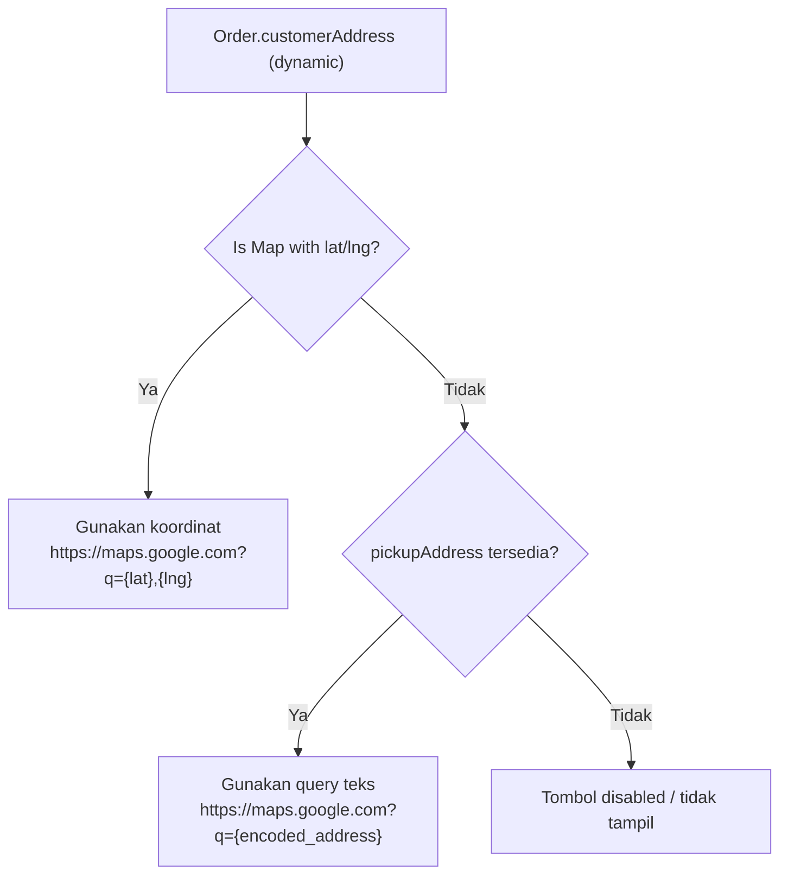
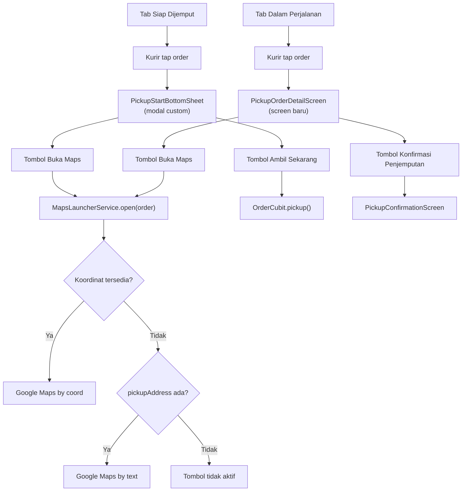
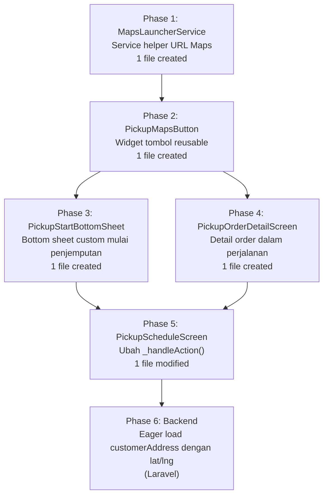

# Plan: Tombol Navigasi Google Maps untuk Kurir

> Dokumen ini adalah plan implementasi berdasarkan [courier_google_maps_navigation_button_user_need.md](file:///C:/Bimo/Project/wash_wallet/docs/user_need/courier_google_maps_navigation_button_user_need.md).

---

## ⚠️ Instruksi Wajib untuk AI/Developer

> [!IMPORTANT]
> **SEBELUM MULAI CODING, BACA SEMUA dokumen standarisasi di `docs/spec/`:**
> - [cubit_spec.md](file:///C:/Bimo/Project/wash_wallet/docs/spec/cubit_spec.md)
> - [state_spec.md](file:///C:/Bimo/Project/wash_wallet/docs/spec/state_spec.md)
> - [provider_spec.md](file:///C:/Bimo/Project/wash_wallet/docs/spec/provider_spec.md)
> - [usecase_spec.md](file:///C:/Bimo/Project/wash_wallet/docs/spec/usecase_spec.md)
> - [repository_spec.md](file:///C:/Bimo/Project/wash_wallet/docs/spec/repository_spec.md)
> - [repository_impl_spec.md](file:///C:/Bimo/Project/wash_wallet/docs/spec/repository_impl_spec.md)
> - [remote_datasource_spec.md](file:///C:/Bimo/Project/wash_wallet/docs/spec/remote_datasource_spec.md)
>
> Baca juga referensi pola yang sudah ada di [implementation_plan_new.md](file:///C:/Bimo/Project/wash_wallet/docs/plan/implementation_plan_new.md) sebagai gold standard.

> [!CAUTION]
> **Aturan Coding yang WAJIB Dipatuhi:**
>
> 1. **Gunakan shared UI components** dari `wash_wallet_ui` (`AppCard`, `AppButton`, `AppEmptyState`, `AppBadge`, `AppChip`, `AppDivider`, `AppLoadingIndicator`, `AppDialog`, `AppLayout`, `AppHeader`, `AppBottomBar`, `OrderStatusBadge`, dll)
> 2. **JANGAN hardcode warna** — selalu gunakan `context.colors.xxx` dari theme (`SemanticColors`)
> 3. **JANGAN hardcode spacing** — gunakan `context.space.xxx` dari `SpacingValues`
> 4. **JANGAN hardcode text style** — gunakan `context.typography.xxx` dari `AppTypography`
> 5. **JANGAN hardcode radius** — gunakan `context.radius.xxx` dari `RadiusValues`
> 6. **JANGAN tulis comment** — biarkan clean code, code harus self-explanatory
> 7. **JANGAN buat file panjang** — pecah menjadi beberapa widget terpisah di folder `widgets/`
> 8. **Gunakan `Result<T>` dengan `.when()`** — BUKAN `dartz Either` dengan `.fold()`
> 9. **Gunakan `sealed class` + Equatable** untuk state
> 10. **Satu usecase = satu file = satu `call()` method**
> 11. **Provider: private constructor + static factory methods**
> 12. **Cubit constructor: named parameters**
> 13. **Folder `usecases/`** (plural, bukan singular)
> 14. **Gunakan relative imports** untuk file dalam feature yang sama

---

## 1. Kondisi Saat Ini — Review

### 1.1 Struktur Feature Order

```
apps/production/lib/features/order/
├── data/
│   ├── datasources/order_remote_datasource.dart
│   └── repositories/order_repository_impl.dart
├── domain/
│   ├── repositories/order_repository.dart
│   └── usecases/
│       ├── get_all_usecase.dart
│       ├── get_by_id_usecase.dart
│       ├── start_usecase.dart
│       ├── complete_usecase.dart
│       ├── pickup_usecase.dart
│       └── confirm_pickup_usecase.dart
└── presentation/
    ├── bloc/
    │   ├── order_cubit.dart
    │   └── order_state.dart
    ├── providers/order_provider.dart
    ├── screens/
    │   ├── pickup_schedule_screen.dart
    │   ├── pickup_confirmation_screen.dart
    │   ├── index_order_screen.dart
    │   └── show_order_screen.dart
    └── widgets/
        ├── pickup/
        │   ├── pickup_date_selector.dart
        │   ├── pickup_order_card.dart
        │   ├── pickup_outlet_badge.dart
        │   └── pickup_outlet_filter.dart
        ├── order_complete_button.dart
        ├── order_detail_dialog.dart
        ├── order_in_progress_tab.dart
        ├── order_item_card.dart
        ├── order_queued_tab.dart
        └── widgets.dart
```

### 1.2 Fitur yang Sudah Berjalan

| Fitur | Status | Lokasi |
|---|---|---|
| Screen `PickupScheduleScreen` dengan dua tab | ✅ | [pickup_schedule_screen.dart](file:///C:/Bimo/Project/wash_wallet/apps/production/lib/features/order/presentation/screens/pickup_schedule_screen.dart) |
| Tab `Siap Dijemput` (status `accepted`) | ✅ | [pickup_schedule_screen.dart L171](file:///C:/Bimo/Project/wash_wallet/apps/production/lib/features/order/presentation/screens/pickup_schedule_screen.dart#L171) |
| Tab `Dalam Perjalanan` (status `picking_up`) | ✅ | [pickup_schedule_screen.dart L172](file:///C:/Bimo/Project/wash_wallet/apps/production/lib/features/order/presentation/screens/pickup_schedule_screen.dart#L172) |
| Dialog `Mulai Penjemputan` dengan aksi `Ambil Sekarang` | ✅ | [pickup_schedule_screen.dart L363-L373](file:///C:/Bimo/Project/wash_wallet/apps/production/lib/features/order/presentation/screens/pickup_schedule_screen.dart#L363-L373) |
| `PickupOrderCard` menampilkan `pickupAddress` | ✅ | [pickup_order_card.dart L120](file:///C:/Bimo/Project/wash_wallet/apps/production/lib/features/order/presentation/widgets/pickup/pickup_order_card.dart#L120) |
| `PickupConfirmationScreen` menampilkan `pickupAddress` | ✅ | [pickup_confirmation_screen.dart L140](file:///C:/Bimo/Project/wash_wallet/apps/production/lib/features/order/presentation/screens/pickup_confirmation_screen.dart#L140) |
| Entity `Order` sudah punya `customerAddress` (dynamic) | ✅ | [order.dart L35](file:///C:/Bimo/Project/wash_wallet/packages/wash_wallet_domain/lib/src/entities/order.dart#L35) |
| Entity `Order` sudah punya `pickupAddress` (String?) | ✅ | [order.dart L75](file:///C:/Bimo/Project/wash_wallet/packages/wash_wallet_domain/lib/src/entities/order.dart#L75) |
| Multi-outlet support sudah diimplementasi | ✅ | [courier_multi_outlet_pickup_plan.md](file:///C:/Bimo/Project/wash_wallet/docs/plan/courier_multi_outlet_pickup_plan.md) |
| Aksi order `Dalam Perjalanan` → `PickupConfirmationScreen` | ✅ | [pickup_schedule_screen.dart L354-L361](file:///C:/Bimo/Project/wash_wallet/apps/production/lib/features/order/presentation/screens/pickup_schedule_screen.dart#L354-L361) |

### 1.3 Gap — Yang Harus Diubah atau Ditambahkan

| # | Gap | Detail | Severity |
|---|---|---|---|
| G1 | Dialog `Mulai Penjemputan` tidak punya tombol Google Maps | `AppDialog.confirm()` hanya render `confirmLabel` dan `cancelLabel`, tidak ada slot untuk tombol tambahan | 🔴 Core |
| G2 | Order `Dalam Perjalanan` tidak punya detail screen | Saat ini klik order `Dalam Perjalanan` langsung ke `PickupConfirmationScreen`, bukan ke detail order | 🔴 Core |
| G3 | `pickupAddress` belum dapat koordinat | Entity `Order.customerAddress` masih `dynamic`, belum ada `pickupLatitude`/`pickupLongitude` eksplisit | 🔴 Core |
| G4 | Backend belum tentu mengirim `customerAddress` pada list/detail kurir | Perlu dicek dan dipastikan backend mengirim koordinat | 🔴 Core |
| G5 | Belum ada helper/service untuk membuka URL Google Maps | Tidak ada shared utility untuk URL scheme Google Maps | 🟠 Important |
| G6 | Belum ada widget `MapsButton` yang reusable | Tombol Maps akan dipakai di dua tempat (modal + detail order) | 🟠 Important |

---

## 2. Keputusan Desain

### 2.1 Navigasi Order Dalam Perjalanan

> [!IMPORTANT]
> **Keputusan:** Saat kurir menekan order dari tab `Dalam Perjalanan`, sistem membuka **detail order** (bukan langsung `PickupConfirmationScreen`). Detail order tersebut memiliki:
> 1. Informasi lengkap order + alamat customer
> 2. Tombol Google Maps dekat alamat
> 3. Tombol `Konfirmasi Penjemputan` untuk melanjutkan flow eksisting

Ini berarti `_handleAction()` di `pickup_schedule_screen.dart` perlu diubah untuk membuka screen detail order ketika `isPickingUp == true`.

### 2.2 Dialog Mulai Penjemputan

> [!IMPORTANT]
> **Keputusan:** Dialog `Mulai Penjemputan` diganti dengan **modal bottom sheet custom** (`PickupStartBottomSheet`) agar bisa menampilkan:
> 1. Ringkasan order (nomor order, nama customer, alamat)
> 2. Tombol `Buka Maps` (secondary action)
> 3. Tombol `Ambil Sekarang` (primary action)

`AppDialog.confirm()` tidak cukup fleksibel untuk layout ini, sehingga widget custom diperlukan.

### 2.3 Strategi Koordinat



**Parsing aman `customerAddress`:**
```dart
double? pickupLat;
double? pickupLng;

if (order.customerAddress is Map) {
  final addr = order.customerAddress as Map;
  pickupLat = double.tryParse(addr['latitude']?.toString() ?? '');
  pickupLng = double.tryParse(addr['longitude']?.toString() ?? '');
}
```

### 2.4 Backend Requirement

> [!WARNING]
> **Backend harus memastikan `customerAddress` beserta `latitude` dan `longitude` dikirim** pada endpoint:
> - `GET /orders?status=accepted&...` (list order Siap Dijemput)
> - `GET /orders?status=picking_up&...` (list order Dalam Perjalanan)
> - `GET /orders/{id}` (detail order)
>
> Jika `customerAddress` relation belum di-eager-load pada endpoint list/detail kurir, backend perlu menambahkan `with('customerAddress')` pada query terkait.
>
> Selama backend belum mengirim koordinat, fallback `pickupAddress` (teks) tetap berfungsi.

### 2.5 URL Google Maps

Format URL yang dipakai:

```
// Prioritas: koordinat
https://www.google.com/maps/search/?api=1&query={latitude},{longitude}

// Fallback: query teks (harus URL-encoded)
https://www.google.com/maps/search/?api=1&query={Uri.encodeComponent(address)}
```

### 2.6 Package URL Launcher

Project menggunakan `url_launcher` untuk membuka URL eksternal. Plan ini mengasumsikan package tersebut sudah tersedia. Jika belum:
- Tambahkan `url_launcher: ^6.x.x` di `pubspec.yaml` app `production`
- Jalankan `flutter pub get`

---

## 3. Proposed Changes

### Alur Data Baru



---

### Phase 1 — Service Helper: MapsLauncherService (G5)

#### [NEW] `apps/production/lib/features/order/presentation/utils/maps_launcher_service.dart`

Utility class untuk membuka Google Maps. Tidak bergantung pada `BuildContext`.

```dart
import 'package:url_launcher/url_launcher.dart';
import 'package:wash_wallet_domain/wash_wallet_domain.dart';

class MapsLauncherService {
  MapsLauncherService._();

  static String? buildMapsUrl(Order order) {
    double? lat;
    double? lng;

    if (order.customerAddress is Map) {
      final addr = order.customerAddress as Map;
      lat = double.tryParse(addr['latitude']?.toString() ?? '');
      lng = double.tryParse(addr['longitude']?.toString() ?? '');
    }

    if (lat != null && lng != null) {
      return 'https://www.google.com/maps/search/?api=1&query=$lat,$lng';
    }

    final address = order.pickupAddress;
    if (address != null && address.isNotEmpty) {
      return 'https://www.google.com/maps/search/?api=1&query=${Uri.encodeComponent(address)}';
    }

    return null;
  }

  static bool hasNavigationTarget(Order order) {
    return buildMapsUrl(order) != null;
  }

  static Future<bool> openMaps(Order order) async {
    final url = buildMapsUrl(order);
    if (url == null) return false;

    final uri = Uri.parse(url);
    if (await canLaunchUrl(uri)) {
      return launchUrl(uri, mode: LaunchMode.externalApplication);
    }

    final webUri = Uri.parse(url);
    return launchUrl(webUri, mode: LaunchMode.platformDefault);
  }
}
```

---

### Phase 2 — Widget Reusable: PickupMapsButton (G6)

#### [NEW] `apps/production/lib/features/order/presentation/widgets/pickup/pickup_maps_button.dart`

Widget tombol Google Maps yang reusable. Dipakai di bottom sheet dan detail order.

```dart
import 'package:flutter/material.dart';
import 'package:wash_wallet_ui/wash_wallet_ui.dart';
import 'package:wash_wallet_domain/wash_wallet_domain.dart';
import '../utils/maps_launcher_service.dart';

class PickupMapsButton extends StatelessWidget {
  final Order order;
  final AppButtonSize size;

  const PickupMapsButton({
    super.key,
    required this.order,
    this.size = AppButtonSize.md,
  });

  @override
  Widget build(BuildContext context) {
    final canOpen = MapsLauncherService.hasNavigationTarget(order);

    if (!canOpen) {
      return AppButton.secondary(
        label: 'Alamat belum tersedia',
        onPressed: null,
        size: size,
        icon: const Icon(Icons.map_outlined),
      );
    }

    return AppButton.secondary(
      label: 'Buka Maps',
      size: size,
      icon: const Icon(Icons.navigation_outlined),
      onPressed: () => _handleOpen(context),
    );
  }

  Future<void> _handleOpen(BuildContext context) async {
    final success = await MapsLauncherService.openMaps(order);
    if (!success && context.mounted) {
      ScaffoldMessenger.of(context).showSnackBar(
        const SnackBar(content: Text('Gagal membuka Maps. Coba lagi nanti.')),
      );
    }
  }
}
```

---

### Phase 3 — Modal Custom: PickupStartBottomSheet (G1)

Ganti `AppDialog.confirm()` dengan bottom sheet custom yang mendukung tombol Maps.

#### [NEW] `apps/production/lib/features/order/presentation/widgets/pickup/pickup_start_bottom_sheet.dart`

```dart
import 'package:flutter/material.dart';
import 'package:flutter_bloc/flutter_bloc.dart';
import 'package:wash_wallet_ui/wash_wallet_ui.dart';
import 'package:wash_wallet_domain/wash_wallet_domain.dart';
import 'package:intl/intl.dart';

import '../../bloc/order_cubit.dart';
import 'pickup_maps_button.dart';

class PickupStartBottomSheet extends StatelessWidget {
  final Order order;

  const PickupStartBottomSheet({super.key, required this.order});

  static Future<void> show(BuildContext context, Order order) {
    return showModalBottomSheet(
      context: context,
      isScrollControlled: true,
      shape: RoundedRectangleBorder(
        borderRadius: BorderRadius.vertical(
          top: Radius.circular(context.radius.xl),
        ),
      ),
      builder: (_) => BlocProvider.value(
        value: context.read<OrderCubit>(),
        child: PickupStartBottomSheet(order: order),
      ),
    );
  }

  @override
  Widget build(BuildContext context) {
    return Padding(
      padding: EdgeInsets.fromLTRB(
        context.space.lg,
        context.space.lg,
        context.space.lg,
        context.space.lg + MediaQuery.of(context).viewInsets.bottom,
      ),
      child: Column(
        mainAxisSize: MainAxisSize.min,
        crossAxisAlignment: CrossAxisAlignment.start,
        children: [
          Center(
            child: Container(
              width: 40,
              height: 4,
              decoration: BoxDecoration(
                color: context.colors.border,
                borderRadius: BorderRadius.circular(context.radius.full),
              ),
            ),
          ),
          SizedBox(height: context.space.lg),
          Text(
            'Mulai Penjemputan',
            style: context.typography.titleLarge.copyWith(
              fontWeight: FontWeight.bold,
            ),
          ),
          SizedBox(height: context.space.lg),
          _buildOrderInfo(context),
          SizedBox(height: context.space.xl),
          _buildActions(context),
          SizedBox(height: context.space.md),
        ],
      ),
    );
  }

  Widget _buildOrderInfo(BuildContext context) {
    return AppCard(
      child: Column(
        crossAxisAlignment: CrossAxisAlignment.start,
        children: [
          _buildInfoRow(context, 'Pesanan', order.orderNumber),
          SizedBox(height: context.space.sm),
          _buildInfoRow(
            context,
            'Customer',
            order.customer?.name ?? 'Customer Umum',
          ),
          SizedBox(height: context.space.sm),
          _buildAddressRow(context),
          if (order.pickupSchedule != null) ...[
            SizedBox(height: context.space.sm),
            _buildInfoRow(
              context,
              'Jadwal',
              DateFormat('HH:mm').format(order.pickupSchedule!),
            ),
          ],
        ],
      ),
    );
  }

  Widget _buildAddressRow(BuildContext context) {
    return Row(
      crossAxisAlignment: CrossAxisAlignment.start,
      children: [
        SizedBox(
          width: 72,
          child: Text(
            'Alamat',
            style: context.typography.labelSmall.copyWith(
              color: context.colors.textSecondary,
            ),
          ),
        ),
        Expanded(
          child: Text(
            order.pickupAddress ?? 'Alamat tidak tersedia',
            style: context.typography.bodyMedium.copyWith(
              fontWeight: FontWeight.w500,
            ),
          ),
        ),
      ],
    );
  }

  Widget _buildInfoRow(BuildContext context, String label, String value) {
    return Row(
      crossAxisAlignment: CrossAxisAlignment.start,
      children: [
        SizedBox(
          width: 72,
          child: Text(
            label,
            style: context.typography.labelSmall.copyWith(
              color: context.colors.textSecondary,
            ),
          ),
        ),
        Expanded(
          child: Text(
            value,
            style: context.typography.bodyMedium.copyWith(
              fontWeight: FontWeight.w500,
            ),
          ),
        ),
      ],
    );
  }

  Widget _buildActions(BuildContext context) {
    return Column(
      crossAxisAlignment: CrossAxisAlignment.stretch,
      children: [
        PickupMapsButton(order: order, size: AppButtonSize.lg),
        SizedBox(height: context.space.md),
        AppButton.primary(
          label: 'Ambil Sekarang',
          isFullWidth: true,
          icon: const Icon(Icons.directions_bike),
          onPressed: () {
            Navigator.pop(context);
            context.read<OrderCubit>().pickup(order.id);
          },
        ),
      ],
    );
  }
}
```

---

### Phase 4 — Screen Detail Order Dalam Perjalanan (G2)

#### [NEW] `apps/production/lib/features/order/presentation/screens/pickup_order_detail_screen.dart`

Screen detail untuk order yang sedang dalam perjalanan (`picking_up`). Menampilkan informasi order, tombol Maps, dan aksi konfirmasi pickup.

```dart
import 'package:flutter/material.dart';
import 'package:flutter_bloc/flutter_bloc.dart';
import 'package:wash_wallet_ui/wash_wallet_ui.dart';
import 'package:wash_wallet_domain/wash_wallet_domain.dart';
import 'package:intl/intl.dart';

import '../widgets/pickup/pickup_maps_button.dart';
import 'pickup_confirmation_screen.dart';

class PickupOrderDetailScreen extends StatelessWidget {
  final Order order;

  const PickupOrderDetailScreen({super.key, required this.order});

  @override
  Widget build(BuildContext context) {
    return AppLayout(
      header: AppHeader(
        title: 'Detail Penjemputan',
        subtitle: order.orderNumber,
        onBackPressed: () => Navigator.pop(context),
        type: AppHeaderType.standard,
        showMenuButton: false,
      ),
      body: SingleChildScrollView(
        padding: EdgeInsets.all(context.space.lg),
        child: Column(
          crossAxisAlignment: CrossAxisAlignment.start,
          children: [
            _buildCustomerSection(context),
            SizedBox(height: context.space.lg),
            _buildAddressSection(context),
            SizedBox(height: context.space.lg),
            _buildScheduleSection(context),
            SizedBox(height: context.space.lg),
            _buildItemsSection(context),
            SizedBox(height: context.space.xxl),
            _buildConfirmButton(context),
            SizedBox(height: context.space.md),
          ],
        ),
      ),
    );
  }

  Widget _buildCustomerSection(BuildContext context) {
    return AppCard(
      child: Column(
        crossAxisAlignment: CrossAxisAlignment.start,
        children: [
          Text(
            'Informasi Customer',
            style: context.typography.titleSmall.copyWith(
              fontWeight: FontWeight.bold,
              color: context.colors.textSecondary,
            ),
          ),
          SizedBox(height: context.space.md),
          Text(
            order.customer?.name ?? 'Customer Umum',
            style: context.typography.titleMedium.copyWith(
              fontWeight: FontWeight.bold,
            ),
          ),
        ],
      ),
    );
  }

  Widget _buildAddressSection(BuildContext context) {
    return AppCard(
      child: Column(
        crossAxisAlignment: CrossAxisAlignment.start,
        children: [
          Text(
            'Alamat Customer',
            style: context.typography.titleSmall.copyWith(
              fontWeight: FontWeight.bold,
              color: context.colors.textSecondary,
            ),
          ),
          SizedBox(height: context.space.md),
          Row(
            crossAxisAlignment: CrossAxisAlignment.start,
            children: [
              Icon(
                Icons.location_on_outlined,
                size: 20,
                color: context.colors.textSecondary,
              ),
              SizedBox(width: context.space.sm),
              Expanded(
                child: Text(
                  order.pickupAddress ?? 'Alamat tidak tersedia',
                  style: context.typography.bodyMedium,
                ),
              ),
            ],
          ),
          SizedBox(height: context.space.md),
          PickupMapsButton(order: order, size: AppButtonSize.md),
        ],
      ),
    );
  }

  Widget _buildScheduleSection(BuildContext context) {
    if (order.pickupSchedule == null) return const SizedBox.shrink();

    return AppCard(
      child: Column(
        crossAxisAlignment: CrossAxisAlignment.start,
        children: [
          Text(
            'Jadwal Penjemputan',
            style: context.typography.titleSmall.copyWith(
              fontWeight: FontWeight.bold,
              color: context.colors.textSecondary,
            ),
          ),
          SizedBox(height: context.space.md),
          Row(
            children: [
              Icon(
                Icons.schedule_outlined,
                size: 20,
                color: context.colors.textSecondary,
              ),
              SizedBox(width: context.space.sm),
              Text(
                DateFormat('EEEE, d MMM yyyy HH:mm').format(
                  order.pickupSchedule!,
                ),
                style: context.typography.bodyMedium.copyWith(
                  fontWeight: FontWeight.w500,
                ),
              ),
            ],
          ),
        ],
      ),
    );
  }

  Widget _buildItemsSection(BuildContext context) {
    return AppCard(
      child: Column(
        crossAxisAlignment: CrossAxisAlignment.start,
        children: [
          Text(
            'Item Pesanan',
            style: context.typography.titleSmall.copyWith(
              fontWeight: FontWeight.bold,
              color: context.colors.textSecondary,
            ),
          ),
          SizedBox(height: context.space.md),
          Row(
            children: [
              Icon(
                Icons.inventory_2_outlined,
                size: 20,
                color: context.colors.textSecondary,
              ),
              SizedBox(width: context.space.sm),
              Text(
                '${order.orderItemsCount} Item',
                style: context.typography.bodyMedium.copyWith(
                  fontWeight: FontWeight.w500,
                ),
              ),
            ],
          ),
        ],
      ),
    );
  }

  Widget _buildConfirmButton(BuildContext context) {
    return AppButton.primary(
      label: 'Konfirmasi Penjemputan',
      isFullWidth: true,
      icon: const Icon(Icons.check_circle_outline),
      onPressed: () {
        Navigator.push(
          context,
          MaterialPageRoute(
            builder: (_) => PickupConfirmationScreen(order: order),
          ),
        );
      },
    );
  }
}
```

---

### Phase 5 — Modifikasi PickupScheduleScreen (G1, G2)

#### [MODIFY] [pickup_schedule_screen.dart](file:///C:/Bimo/Project/wash_wallet/apps/production/lib/features/order/presentation/screens/pickup_schedule_screen.dart)

**Perubahan yang diperlukan:**

**1. Tambah import:**
```dart
import '../widgets/pickup/pickup_start_bottom_sheet.dart';
import 'pickup_order_detail_screen.dart';
```

**2. Ubah `_handleAction()` untuk menggunakan bottom sheet dan detail screen:**

Sebelum:
```dart
void _handleAction(BuildContext context, Order order, bool isPickingUp) {
  if (isPickingUp) {
    Navigator.push(
      context,
      MaterialPageRoute(
        builder: (_) => PickupConfirmationScreen(order: order),
      ),
    ).then((_) => _loadData());
  } else {
    AppDialog.confirm(
      context,
      title: 'Mulai Penjemputan',
      message:
          'Apakah Anda yakin ingin mulai menjemput pesanan ${order.orderNumber}?',
      confirmLabel: 'Ambil Sekarang',
    ).then((confirmed) {
      if (confirmed == true) {
        context.read<OrderCubit>().pickup(order.id);
      }
    });
  }
}
```

Sesudah:
```dart
void _handleAction(BuildContext context, Order order, bool isPickingUp) {
  if (isPickingUp) {
    Navigator.push(
      context,
      MaterialPageRoute(
        builder: (_) => PickupOrderDetailScreen(order: order),
      ),
    ).then((_) => _loadData());
  } else {
    PickupStartBottomSheet.show(context, order).then((_) => _loadData());
  }
}
```

**3. Hapus import `pickup_confirmation_screen.dart`** karena navigasi ke `PickupConfirmationScreen` dipindah ke `PickupOrderDetailScreen`:

```dart
// HAPUS baris ini dari pickup_schedule_screen.dart
import 'pickup_confirmation_screen.dart';
```

---

### Phase 6 — Backend: Pastikan Koordinat Terkirim (G3, G4)

> [!IMPORTANT]
> Phase ini adalah **persyaratan backend** yang harus dilakukan oleh developer backend (Laravel). Plan ini mendokumentasikan kebutuhan tersebut agar frontend dapat menerima koordinat.

**Yang perlu dilakukan backend:**

1. Pada `OrderController` untuk endpoint kurir (list `accepted`, list `picking_up`, show by ID), pastikan relation `customerAddress` di-eager-load:
   ```php
   // Dalam query builder order untuk kurir
   $query->with(['customer', 'outlet', 'customerAddress']);
   ```

2. Pastikan `CustomerAddressResource` (yang sudah memiliki `latitude` dan `longitude`) ikut ter-serialize dalam response `customerAddress`.

3. Response yang diharapkan frontend pada field `customerAddress`:
   ```json
   {
     "customerAddress": {
       "id": 1,
       "address": "Jl. Mulyosari Utara 12, Surabaya",
       "latitude": -7.2575,
       "longitude": 112.7521
     }
   }
   ```

**Jika backend belum siap:**
- Fallback ke `pickupAddress` (teks) otomatis aktif karena `MapsLauncherService` sudah menangani hal ini.
- Tombol `Buka Maps` tetap berfungsi dengan query teks.

---

## 4. Ringkasan Perubahan per File

### Files yang DIUBAH

| File | Phase | Perubahan |
|---|---|---|
| [pickup_schedule_screen.dart](file:///C:/Bimo/Project/wash_wallet/apps/production/lib/features/order/presentation/screens/pickup_schedule_screen.dart) | 5 | Ubah `_handleAction()`: order `Dalam Perjalanan` → `PickupOrderDetailScreen`, order `Siap Dijemput` → `PickupStartBottomSheet.show()` |

### Files BARU

| File | Phase | Deskripsi |
|---|---|---|
| `presentation/utils/maps_launcher_service.dart` | 1 | Service helper untuk build URL dan buka Google Maps |
| `presentation/widgets/pickup/pickup_maps_button.dart` | 2 | Widget tombol Maps reusable dengan state-aware |
| `presentation/widgets/pickup/pickup_start_bottom_sheet.dart` | 3 | Bottom sheet custom pengganti dialog untuk mulai penjemputan |
| `presentation/screens/pickup_order_detail_screen.dart` | 4 | Screen detail order untuk tab `Dalam Perjalanan` |

### Struktur Akhir

```
apps/production/lib/features/order/presentation/
├── bloc/
│   ├── order_cubit.dart                    (tidak berubah)
│   └── order_state.dart                    (tidak berubah)
├── providers/order_provider.dart           (tidak berubah)
├── screens/
│   ├── pickup_schedule_screen.dart         (DIUBAH — Phase 5)
│   ├── pickup_order_detail_screen.dart     (BARU — Phase 4)
│   ├── pickup_confirmation_screen.dart     (tidak berubah)
│   ├── index_order_screen.dart             (tidak berubah)
│   └── show_order_screen.dart              (tidak berubah)
├── utils/
│   └── maps_launcher_service.dart          (BARU — Phase 1)
└── widgets/
    └── pickup/
        ├── pickup_date_selector.dart       (tidak berubah)
        ├── pickup_order_card.dart          (tidak berubah)
        ├── pickup_outlet_badge.dart        (tidak berubah)
        ├── pickup_outlet_filter.dart       (tidak berubah)
        ├── pickup_maps_button.dart         (BARU — Phase 2)
        └── pickup_start_bottom_sheet.dart  (BARU — Phase 3)
```

---

## 5. Implementation Order



> [!TIP]
> Phase 1-4 bisa dilakukan paralel karena tidak ada ketergantungan antar file baru. Phase 5 perlu menunggu Phase 3 dan 4 selesai. Phase 6 adalah backend concern yang bisa dikerjakan paralel dengan Phase 1-5.

---

## 6. Jawaban Open Questions

| # | Pertanyaan | Keputusan |
|---|---|---|
| 1 | Detail order dalam perjalanan pakai screen existing atau baru? | **Screen baru** `PickupOrderDetailScreen` — lebih sederhana, fokus pada kebutuhan kurir |
| 2 | Tombol Maps langsung di card tab `Siap Dijemput`? | **Tidak** — cukup di modal (bottom sheet). Card tetap bersih |
| 3 | Tombol Maps langsung di card tab `Dalam Perjalanan`? | **Tidak** — cukup di detail order. Kurir harus tap order untuk lihat detail |
| 4 | Backend kirim koordinat sebagai nested atau field eksplisit? | **Nested** `customerAddress.latitude/longitude` — konsisten dengan `CustomerAddressResource` yang sudah ada |
| 5 | Tombol Maps ke outlet juga? | **Tidak dalam plan ini** — out of scope, fokus ke alamat customer |
| 6 | Label final tombol? | **`Buka Maps`** — sesuai rekomendasi user need |

---

## 7. Verification Plan

### Per Acceptance Criteria (dari User Need)

| AC | Deskripsi | Cara Verifikasi |
|---|---|---|
| AC1 | Modal mulai penjemputan menampilkan tombol Maps | Tap order di tab `Siap Dijemput` → bottom sheet muncul dengan tombol `Buka Maps` |
| AC2 | Tombol Maps pada modal membuka Google Maps ke alamat customer | Tap `Buka Maps` di bottom sheet → Google Maps terbuka ke alamat/koordinat order |
| AC3 | Menekan tombol Maps tidak mengubah status order | Tap `Buka Maps` → kembali ke app → status order tetap `accepted` |
| AC4 | Status order berubah hanya saat `Ambil Sekarang` ditekan | Tap `Ambil Sekarang` → status berubah jadi `picking_up` |
| AC5 | Tab `Dalam Perjalanan` bisa buka detail order | Tap order di tab `Dalam Perjalanan` → `PickupOrderDetailScreen` terbuka |
| AC6 | Detail order dalam perjalanan tampilkan tombol Maps | `PickupOrderDetailScreen` menampilkan section alamat + tombol `Buka Maps` |
| AC7 | Tombol Maps pada detail membuka Google Maps | Tap `Buka Maps` di detail → Google Maps terbuka |
| AC8 | Koordinat dipakai jika tersedia | Backend kirim lat/lng → Maps dibuka dengan koordinat, bukan query teks |
| AC9 | Fallback ke `pickupAddress` jika koordinat tidak ada | Backend tidak kirim lat/lng → Maps dibuka dengan query teks alamat |
| AC10 | Tombol tidak aktif jika tidak ada data sama sekali | `pickupAddress` null dan `customerAddress` tidak ada lat/lng → tombol disabled |
| AC11 | Tidak ada URL mentah/null tampil ke user | `PickupMapsButton` hanya tampil label ramah pengguna |
| AC12 | Maps gagal buka → pesan ringan ditampilkan | Simulasikan Maps gagal → SnackBar muncul |
| AC13 | Maps gagal buka → status order tidak berubah | Konfirmasi status order tidak berubah saat Maps gagal |
| AC14 | Tombol ditempatkan dekat alamat | Visual: tombol Maps berada di bawah teks alamat di semua screen |
| AC15 | Bisa beda tombol customer vs outlet jika ada 2 alamat | Saat ini hanya 1 tombol per screen, label `Buka Maps` sudah cukup |
| AC16 | Kurir bisa baca alamat manual jika Maps tidak tersedia | Teks alamat tetap tampil di atas tombol |
| AC17 | Berjalan di Android dan iOS | Test di kedua platform |
| AC18 | Koordinat dari backend sampai ke app | Verifikasi response API mengandung `customerAddress.latitude` dan `.longitude` |

### Test Skenario Detail

1. **Happy path — koordinat tersedia:**
   - Backend mengirim `customerAddress.latitude` dan `longitude`
   - Tap `Siap Dijemput` order → bottom sheet → tap `Buka Maps` → Google Maps terbuka via koordinat
   - Kembali ke app → tap `Ambil Sekarang` → status berubah ke `picking_up`
   - Order pindah ke tab `Dalam Perjalanan`
   - Tap order → `PickupOrderDetailScreen` → tap `Buka Maps` → Maps terbuka

2. **Fallback — hanya teks alamat:**
   - Backend tidak mengirim koordinat, hanya `pickupAddress` string
   - Tap `Buka Maps` di bottom sheet → Google Maps terbuka dengan query teks
   - Tap `Buka Maps` di detail order → Maps terbuka dengan query teks

3. **No address — tombol disabled:**
   - Order tidak punya `pickupAddress` dan tidak punya koordinat
   - Tombol `Buka Maps` tampil disabled dengan label `Alamat belum tersedia`

4. **Maps gagal dibuka:**
   - Simulasi `canLaunchUrl` return false
   - SnackBar muncul: `Gagal membuka Maps. Coba lagi nanti.`
   - Status order tidak berubah

5. **Flow tidak terganggu:**
   - Tap `Buka Maps` → masuk Maps → kembali ke app → `Ambil Sekarang` tetap bisa ditekan
   - `PickupOrderDetailScreen` → tap `Konfirmasi Penjemputan` → `PickupConfirmationScreen` terbuka normal

---

## 8. Catatan Penting

### Dependency Check

> [!WARNING]
> Sebelum coding, pastikan `url_launcher` sudah ada di `apps/production/pubspec.yaml`:
> ```yaml
> dependencies:
>   url_launcher: ^6.x.x
> ```
>
> Jika belum ada, tambahkan dan jalankan `flutter pub get`.
>
> Untuk iOS, tambahkan di `ios/Runner/Info.plist`:
> ```xml
> <key>LSApplicationQueriesSchemes</key>
> <array>
>   <string>https</string>
> </array>
> ```
>
> Untuk Android, tidak diperlukan konfigurasi tambahan untuk URL `https://`.

### Hal yang TIDAK Termasuk dalam Plan Ini

- Peta embedded di dalam aplikasi
- Tracking posisi kurir realtime
- Perubahan tarif ongkir atau area layanan
- Integrasi maps selain Google Maps
- Perubahan flow foto bukti pickup
- Perubahan screen `cashier` atau `customer`
- Optimasi rute multi-stop
