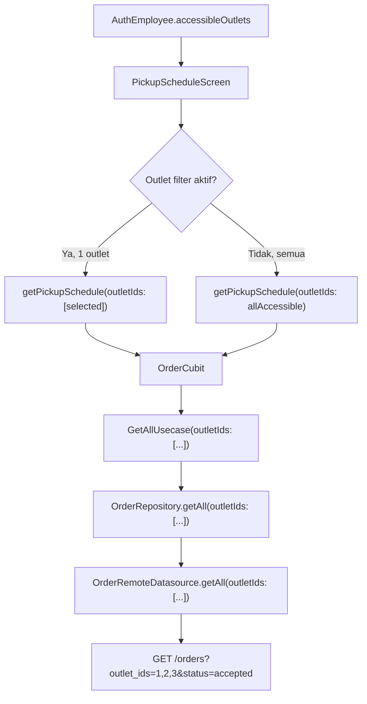
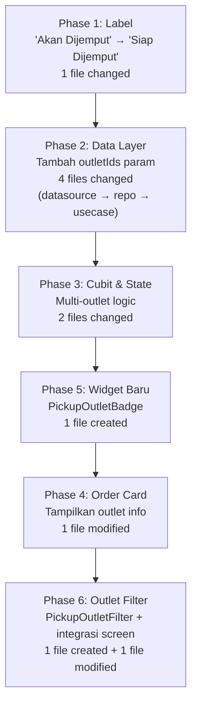

# Plan: Fitur Kurir Multi-Outlet Pickup

> Dokumen ini adalah plan implementasi berdasarkan [courier_multi_outlet_pickup_user_need.md](file:///C:/Bimo/Project/wash_wallet/docs/user_need/courier_multi_outlet_pickup_user_need.md).

---

## ⚠️ Instruksi Wajib untuk AI/Developer

> [!IMPORTANT]
> **SEBELUM MULAI CODING, BACA SEMUA dokumen standarisasi di `docs/spec/`:**
> - [cubit_spec.md](file:///C:/Bimo/Project/wash_wallet/docs/spec/cubit_spec.md)
> - [state_spec.md](file:///C:/Bimo/Project/wash_wallet/docs/spec/state_spec.md)
> - [provider_spec.md](file:///C:/Bimo/Project/wash_wallet/docs/spec/provider_spec.md)
> - [usecase_spec.md](file:///C:/Bimo/Project/wash_wallet/docs/spec/usecase_spec.md)
> - [repository_spec.md](file:///C:/Bimo/Project/wash_wallet/docs/spec/repository_spec.md)
> - [repository_impl_spec.md](file:///C:/Bimo/Project/wash_wallet/docs/spec/repository_impl_spec.md)
> - [remote_datasource_spec.md](file:///C:/Bimo/Project/wash_wallet/docs/spec/remote_datasource_spec.md)
>
> Baca juga referensi pola yang sudah ada di [implementation_plan_new.md](file:///C:/Bimo/Project/wash_wallet/docs/plan/implementation_plan_new.md) sebagai gold standard.

> [!CAUTION]
> **Aturan Coding yang WAJIB Dipatuhi:**
>
> 1. **Gunakan shared UI components** dari `wash_wallet_ui` (`AppCard`, `AppButton`, `AppEmptyState`, `AppBadge`, `AppChip`, `AppDivider`, `AppLoadingIndicator`, `AppDialog`, `AppLayout`, `AppHeader`, `AppBottomBar`, `OrderStatusBadge`, dll)
> 2. **JANGAN hardcode warna** — selalu gunakan `context.colors.xxx` dari theme (`SemanticColors`)
> 3. **JANGAN hardcode spacing** — gunakan `context.space.xxx` dari `SpacingValues`
> 4. **JANGAN hardcode text style** — gunakan `context.typography.xxx` dari `AppTypography`
> 5. **JANGAN hardcode radius** — gunakan `context.radius.xxx` dari `RadiusValues`
> 6. **JANGAN tulis comment** — biarkan clean code, code harus self-explanatory
> 7. **JANGAN buat file panjang** — pecah menjadi beberapa widget terpisah di folder `widgets/`
> 8. **Gunakan `Result<T>` dengan `.when()`** — BUKAN `dartz Either` dengan `.fold()`
> 9. **Gunakan `sealed class` + Equatable** untuk state
> 10. **Satu usecase = satu file = satu `call()` method**
> 11. **Provider: private constructor + static factory methods**
> 12. **Cubit constructor: named parameters**
> 13. **Folder `usecases/`** (plural, bukan singular)
> 14. **Gunakan relative imports** untuk file dalam feature yang sama

---

## 1. Kondisi Saat Ini — Review

### 1.1 Apa yang Sudah Ada

Fitur kurir sudah diimplementasikan sebagai bagian dari app `production` di path `apps/production/lib/features/order/`. Berikut struktur saat ini:

```
apps/production/lib/features/order/
├── data/
│   ├── datasources/order_remote_datasource.dart
│   └── repositories/order_repository_impl.dart
├── domain/
│   ├── repositories/order_repository.dart
│   └── usecases/
│       ├── get_all_usecase.dart
│       ├── get_by_id_usecase.dart
│       ├── start_usecase.dart
│       ├── complete_usecase.dart
│       ├── pickup_usecase.dart
│       └── confirm_pickup_usecase.dart
└── presentation/
    ├── bloc/
    │   ├── order_cubit.dart
    │   └── order_state.dart
    ├── providers/order_provider.dart
    ├── screens/
    │   ├── pickup_schedule_screen.dart
    │   ├── pickup_confirmation_screen.dart
    │   ├── index_order_screen.dart
    │   └── show_order_screen.dart
    └── widgets/
        └── pickup/
            ├── pickup_order_card.dart
            └── pickup_date_selector.dart
```

### 1.2 Fitur yang Sudah Berjalan

| Fitur | Status | Lokasi |
|---|---|---|
| Bottom navbar tab "Kurir" (index 2) | ✅ | [pickup_schedule_screen.dart](file:///C:/Bimo/Project/wash_wallet/apps/production/lib/features/order/presentation/screens/pickup_schedule_screen.dart) |
| Kalender 7 hari + date selector | ✅ | [pickup_date_selector.dart](file:///C:/Bimo/Project/wash_wallet/apps/production/lib/features/order/presentation/widgets/pickup/pickup_date_selector.dart) |
| Tab "Akan Dijemput" & "Dalam Perjalanan" | ✅ | [pickup_schedule_screen.dart L117](file:///C:/Bimo/Project/wash_wallet/apps/production/lib/features/order/presentation/screens/pickup_schedule_screen.dart#L117) |
| Order card dengan info customer & alamat | ✅ | [pickup_order_card.dart](file:///C:/Bimo/Project/wash_wallet/apps/production/lib/features/order/presentation/widgets/pickup/pickup_order_card.dart) |
| Grouping order berdasarkan time slot | ✅ | [pickup_schedule_screen.dart L203-L234](file:///C:/Bimo/Project/wash_wallet/apps/production/lib/features/order/presentation/screens/pickup_schedule_screen.dart#L203-L234) |
| Aksi "Ambil Sekarang" + dialog konfirmasi | ✅ | [pickup_schedule_screen.dart L300-L321](file:///C:/Bimo/Project/wash_wallet/apps/production/lib/features/order/presentation/screens/pickup_schedule_screen.dart#L300-L321) |
| Aksi "Konfirmasi" dengan foto | ✅ | [pickup_confirmation_screen.dart](file:///C:/Bimo/Project/wash_wallet/apps/production/lib/features/order/presentation/screens/pickup_confirmation_screen.dart) |
| Overdue order section | ✅ | [pickup_schedule_screen.dart L161-L201](file:///C:/Bimo/Project/wash_wallet/apps/production/lib/features/order/presentation/screens/pickup_schedule_screen.dart#L161-L201) |
| State `PickupScheduleLoaded` | ✅ | [order_state.dart L95-L115](file:///C:/Bimo/Project/wash_wallet/apps/production/lib/features/order/presentation/bloc/order_state.dart#L95-L115) |
| Entity `AuthEmployee.accessibleOutlets` | ✅ | [auth_employee.dart](file:///C:/Bimo/Project/wash_wallet/packages/wash_wallet_domain/lib/src/entities/auth_employee.dart) sudah mendukung multi-outlet |
| Entity `OutletAccess` | ✅ | [outlet_access.dart](file:///C:/Bimo/Project/wash_wallet/packages/wash_wallet_domain/lib/src/entities/outlet_access.dart) |
| `OrderStatusBadge` mendukung `picking_up` | ✅ | Shared UI sudah punya badge untuk status kurir |

### 1.3 Gap — Yang Harus Diubah

| # | Gap | Detail | Severity |
|---|---|---|---|
| G1 | Label "Akan Dijemput" harus "Siap Dijemput" | Tab text di [pickup_schedule_screen.dart L117](file:///C:/Bimo/Project/wash_wallet/apps/production/lib/features/order/presentation/screens/pickup_schedule_screen.dart#L117) | 🟢 Simple |
| G2 | Single-outlet fetch | [order_cubit.dart L163-L165](file:///C:/Bimo/Project/wash_wallet/apps/production/lib/features/order/presentation/bloc/order_cubit.dart#L163-L165) hanya menerima satu `outletId` | 🔴 Core |
| G3 | UI passing single `outletId` | [pickup_schedule_screen.dart L40](file:///C:/Bimo/Project/wash_wallet/apps/production/lib/features/order/presentation/screens/pickup_schedule_screen.dart#L40) hanya `authState.employee.outletId` | 🔴 Core |
| G4 | Tidak ada info outlet di order card | [pickup_order_card.dart](file:///C:/Bimo/Project/wash_wallet/apps/production/lib/features/order/presentation/widgets/pickup/pickup_order_card.dart) tidak menampilkan nama outlet | 🟠 Important |
| G5 | Tidak ada outlet filter/selector UI | Kurir multi-outlet perlu bisa filter per outlet atau lihat semua | 🟠 Important |
| G6 | API hanya support single `outletId` | Datasource [order_remote_datasource.dart L17](file:///C:/Bimo/Project/wash_wallet/apps/production/lib/features/order/data/datasources/order_remote_datasource.dart#L17) param `int? outletId` | 🔴 Core |

---

## 2. Proposed Changes

### Alur Data Baru (Multi-Outlet)



---

### Phase 1 — Label & Teks (G1)

Ubah semua referensi "Akan Dijemput" → "Siap Dijemput".

#### [MODIFY] [pickup_schedule_screen.dart](file:///C:/Bimo/Project/wash_wallet/apps/production/lib/features/order/presentation/screens/pickup_schedule_screen.dart)

| Baris | Sebelum | Sesudah |
|---|---|---|
| L117 | `Tab(text: 'Akan Dijemput')` | `Tab(text: 'Siap Dijemput')` |

---

### Phase 2 — Multi-Outlet Data Layer (G6)

#### [MODIFY] [order_remote_datasource.dart](file:///C:/Bimo/Project/wash_wallet/apps/production/lib/features/order/data/datasources/order_remote_datasource.dart)

Tambah parameter `outletIds` (List) di samping `outletId` (single) yang tetap dipertahankan untuk backward compatibility.

Perubahan pada interface `OrderRemoteDatasource`:
```dart
Future<List<OrderModel>> getAll({
  // ... existing params ...
  int? outletId,
  List<int>? outletIds,
  // ... rest params ...
});
```

Perubahan pada implementasi `OrderRemoteDatasourceImpl.getAll()`:
- Jika `outletIds` diberikan dan tidak kosong, kirim sebagai query param `'outletIds': outletIds.join(',')`
- Jika hanya `outletId` diberikan, tetap kirim sebagai `'outletId': outletId`

#### [MODIFY] [order_repository.dart](file:///C:/Bimo/Project/wash_wallet/apps/production/lib/features/order/domain/repositories/order_repository.dart)

Tambah `List<int>? outletIds` pada method `getAll()`.

#### [MODIFY] [order_repository_impl.dart](file:///C:/Bimo/Project/wash_wallet/apps/production/lib/features/order/data/repositories/order_repository_impl.dart)

Forward `outletIds` ke datasource.

#### [MODIFY] [get_all_usecase.dart](file:///C:/Bimo/Project/wash_wallet/apps/production/lib/features/order/domain/usecases/get_all_usecase.dart)

Tambah `List<int>? outletIds` pada parameter `call()`.

---

### Phase 3 — Multi-Outlet Cubit Logic (G2, G3)

#### [MODIFY] [order_cubit.dart](file:///C:/Bimo/Project/wash_wallet/apps/production/lib/features/order/presentation/bloc/order_cubit.dart)

Ubah signature `getPickupSchedule()`:
```dart
Future<void> getPickupSchedule({
  required List<int> outletIds,
  required DateTime date,
}) async {
```

Ubah kedua panggilan `_getAllUsecase` di dalam method ini:
```dart
final scheduledResult = await _getAllUsecase(
  status: 'accepted',
  outletIds: outletIds,
  forCourierPickupDate: dateStr,
  sortBy: 'pickupSchedule',
  sortDirection: 'asc',
  perPage: 100,
);

final inProgressResult = await _getAllUsecase(
  status: 'picking_up',
  outletIds: outletIds,
  forCourierPickupDate: dateStr,
  sortBy: 'pickupSchedule',
  sortDirection: 'asc',
  perPage: 100,
);
```

Ubah juga method `pickup()` agar refresh menggunakan `outletIds` dari state:
```dart
Future<void> pickup(int orderId) async {
  final result = await _pickupUsecase(orderId);

  result.when(
    success: (order) {
      if (state is PickupScheduleLoaded) {
        final currentState = state as PickupScheduleLoaded;
        getPickupSchedule(
          outletIds: currentState.outletIds,
          date: currentState.selectedDate,
        );
      }
    },
    failure: (failure) => emit(OrderError(failure.message)),
  );
}
```

#### [MODIFY] [order_state.dart](file:///C:/Bimo/Project/wash_wallet/apps/production/lib/features/order/presentation/bloc/order_state.dart)

Tambah `outletIds` ke `PickupScheduleLoaded` agar cubit bisa re-fetch setelah aksi pickup:
```dart
class PickupScheduleLoaded extends OrderState {
  final List<Order> scheduledOrders;
  final List<Order> overdueOrders;
  final List<Order> inProgressOrders;
  final DateTime selectedDate;
  final List<int> outletIds;

  const PickupScheduleLoaded({
    required this.scheduledOrders,
    this.overdueOrders = const [],
    required this.inProgressOrders,
    required this.selectedDate,
    required this.outletIds,
  });

  @override
  List<Object?> get props => [
    scheduledOrders,
    overdueOrders,
    inProgressOrders,
    selectedDate,
    outletIds,
  ];
}
```

---

### Phase 4 — Outlet Info pada Order Card (G4)

#### [MODIFY] [pickup_order_card.dart](file:///C:/Bimo/Project/wash_wallet/apps/production/lib/features/order/presentation/widgets/pickup/pickup_order_card.dart)

Tambahkan outlet badge di antara Row order number (L59-L93) dan nama customer (L96-L101).

Import widget `PickupOutletBadge` dari Phase 5, lalu sisipkan:

```dart
if (order.outlet != null) ...[
  SizedBox(height: context.space.sm),
  PickupOutletBadge(outletName: order.outlet!.name),
],
```

---

### Phase 5 — Widget Baru: Outlet Badge (G4)

#### [NEW] `apps/production/lib/features/order/presentation/widgets/pickup/pickup_outlet_badge.dart`

Widget untuk menampilkan nama outlet pada order card. Menggunakan `context.colors` dan `context.typography`.

```dart
import 'package:flutter/material.dart';
import 'package:wash_wallet_ui/wash_wallet_ui.dart';

class PickupOutletBadge extends StatelessWidget {
  final String outletName;

  const PickupOutletBadge({super.key, required this.outletName});

  @override
  Widget build(BuildContext context) {
    return Container(
      padding: EdgeInsets.symmetric(
        horizontal: context.space.sm,
        vertical: 2,
      ),
      decoration: BoxDecoration(
        color: context.colors.secondarySurface,
        borderRadius: BorderRadius.circular(context.radius.sm),
      ),
      child: Row(
        mainAxisSize: MainAxisSize.min,
        children: [
          Icon(
            Icons.store_outlined,
            size: 12,
            color: context.colors.secondary,
          ),
          SizedBox(width: context.space.xs),
          Text(
            outletName,
            style: context.typography.labelSmall.copyWith(
              color: context.colors.secondary,
              fontWeight: FontWeight.w500,
            ),
          ),
        ],
      ),
    );
  }
}
```

> [!TIP]
> Warna menggunakan `secondarySurface` / `secondary` agar secara visual berbeda dari badge order number yang menggunakan `primaryContainer` / `onPrimary`. Ini memberikan kontras yang cukup untuk membedakan outlet badge dari element lain.

---

### Phase 6 — Outlet Filter UI (G5)

#### [NEW] `apps/production/lib/features/order/presentation/widgets/pickup/pickup_outlet_filter.dart`

Widget chip filter horizontal untuk memilih outlet.

Aturan tampil:
- Jika employee hanya punya **1 outlet** → **JANGAN tampilkan** widget ini
- Jika employee punya **2+ outlet** → tampilkan chip "Semua Outlet" + satu chip per outlet

```dart
import 'package:flutter/material.dart';
import 'package:wash_wallet_ui/wash_wallet_ui.dart';
import 'package:wash_wallet_domain/wash_wallet_domain.dart';

class PickupOutletFilter extends StatelessWidget {
  final List<OutletAccess> outlets;
  final int? selectedOutletId;
  final ValueChanged<int?> onOutletSelected;

  const PickupOutletFilter({
    super.key,
    required this.outlets,
    required this.selectedOutletId,
    required this.onOutletSelected,
  });

  @override
  Widget build(BuildContext context) {
    if (outlets.length <= 1) return const SizedBox.shrink();

    return SingleChildScrollView(
      scrollDirection: Axis.horizontal,
      padding: EdgeInsets.symmetric(horizontal: context.space.lg),
      child: Row(
        children: [
          _buildChip(
            context,
            label: 'Semua Outlet',
            isSelected: selectedOutletId == null,
            onTap: () => onOutletSelected(null),
          ),
          ...outlets.map(
            (outlet) => Padding(
              padding: EdgeInsets.only(left: context.space.sm),
              child: _buildChip(
                context,
                label: outlet.outletName,
                isSelected: selectedOutletId == outlet.outletId,
                onTap: () => onOutletSelected(outlet.outletId),
              ),
            ),
          ),
        ],
      ),
    );
  }

  Widget _buildChip(
    BuildContext context, {
    required String label,
    required bool isSelected,
    required VoidCallback onTap,
  }) {
    return GestureDetector(
      onTap: onTap,
      child: Container(
        padding: EdgeInsets.symmetric(
          horizontal: context.space.md,
          vertical: context.space.sm,
        ),
        decoration: BoxDecoration(
          color: isSelected
              ? context.colors.primary
              : context.colors.surface,
          borderRadius: BorderRadius.circular(context.radius.full),
          border: Border.all(
            color: isSelected
                ? context.colors.primary
                : context.colors.border,
          ),
        ),
        child: Text(
          label,
          style: context.typography.labelMedium.copyWith(
            color: isSelected
                ? context.colors.textOnPrimary
                : context.colors.textSecondary,
          ),
        ),
      ),
    );
  }
}
```

#### [MODIFY] [pickup_schedule_screen.dart](file:///C:/Bimo/Project/wash_wallet/apps/production/lib/features/order/presentation/screens/pickup_schedule_screen.dart)

Perubahan yang diperlukan di screen:

**1. Tambah state dan import:**
```dart
import '../widgets/pickup/pickup_outlet_filter.dart';
```
Tambah field di state class:
```dart
int? _selectedOutletId;
```

**2. Ubah `_loadData()` agar multi-outlet:**
```dart
void _loadData() {
  final authState = context.read<AuthCubit>().state;
  if (authState is Authenticated) {
    final outletIds = _selectedOutletId != null
        ? [_selectedOutletId!]
        : authState.employee.accessibleOutletIds;
    context.read<OrderCubit>().getPickupSchedule(
      outletIds: outletIds,
      date: _selectedDate,
    );
  }
}
```

**3. Tambah `PickupOutletFilter` di body Column, antara `PickupDateSelector` dan `TabBar`:**
```dart
body: Column(
  children: [
    PickupDateSelector(
      selectedDate: _selectedDate,
      onDateSelected: (date) {
        setState(() => _selectedDate = date);
        _loadData();
      },
    ),
    // BARU — outlet filter
    Builder(
      builder: (context) {
        final authState = context.read<AuthCubit>().state;
        if (authState is Authenticated) {
          return PickupOutletFilter(
            outlets: authState.employee.accessibleOutlets,
            selectedOutletId: _selectedOutletId,
            onOutletSelected: (outletId) {
              setState(() => _selectedOutletId = outletId);
              _loadData();
            },
          );
        }
        return const SizedBox.shrink();
      },
    ),
    SizedBox(height: context.space.md),
    TabBar(/* ... existing ... */),
    // ... rest
  ],
),
```

---

## 3. Ringkasan Perubahan per File

### Files yang DIUBAH

| File | Phase | Perubahan |
|---|---|---|
| [pickup_schedule_screen.dart](file:///C:/Bimo/Project/wash_wallet/apps/production/lib/features/order/presentation/screens/pickup_schedule_screen.dart) | 1, 6 | Rename tab label, tambah outlet filter, ubah `_loadData()` ke multi-outlet |
| [order_cubit.dart](file:///C:/Bimo/Project/wash_wallet/apps/production/lib/features/order/presentation/bloc/order_cubit.dart) | 3 | `getPickupSchedule(outletIds: [...])`, update `pickup()` refresh |
| [order_state.dart](file:///C:/Bimo/Project/wash_wallet/apps/production/lib/features/order/presentation/bloc/order_state.dart) | 3 | Tambah `outletIds` di `PickupScheduleLoaded` |
| [order_remote_datasource.dart](file:///C:/Bimo/Project/wash_wallet/apps/production/lib/features/order/data/datasources/order_remote_datasource.dart) | 2 | Tambah param `List<int>? outletIds` |
| [order_repository.dart](file:///C:/Bimo/Project/wash_wallet/apps/production/lib/features/order/domain/repositories/order_repository.dart) | 2 | Tambah param `List<int>? outletIds` |
| [order_repository_impl.dart](file:///C:/Bimo/Project/wash_wallet/apps/production/lib/features/order/data/repositories/order_repository_impl.dart) | 2 | Forward `outletIds` ke datasource |
| [get_all_usecase.dart](file:///C:/Bimo/Project/wash_wallet/apps/production/lib/features/order/domain/usecases/get_all_usecase.dart) | 2 | Tambah param `List<int>? outletIds` |
| [pickup_order_card.dart](file:///C:/Bimo/Project/wash_wallet/apps/production/lib/features/order/presentation/widgets/pickup/pickup_order_card.dart) | 4 | Tampilkan `PickupOutletBadge` |

### Files BARU

| File | Phase | Deskripsi |
|---|---|---|
| `widgets/pickup/pickup_outlet_badge.dart` | 5 | Badge outlet name di order card |
| `widgets/pickup/pickup_outlet_filter.dart` | 6 | Chip filter horizontal per outlet |

### Struktur Akhir Folder `widgets/pickup/`

```
widgets/pickup/
├── pickup_date_selector.dart    (existing)
├── pickup_order_card.dart       (modified)
├── pickup_outlet_badge.dart     (NEW)
└── pickup_outlet_filter.dart    (NEW)
```

---

## 4. Implementation Order



> [!TIP]
> Phase 1 bisa dilakukan terlebih dahulu sebagai quick win karena tidak ada dependency. Phase 2-3 adalah core changes yang harus dilakukan bersamaan. Phase 4-6 adalah UI enhancements yang membutuhkan Phase 5 selesai dulu.

---

## 5. Verification Plan

### Per Acceptance Criteria (dari User Need)

| AC | Deskripsi | Cara Verifikasi |
|---|---|---|
| AC1 | Teks "Siap Dijemput" | Buka tab kurir → tab pertama bertuliskan "Siap Dijemput" |
| AC2 | Order dari status `accepted` | Order yang tampil di tab "Siap Dijemput" berasal dari status `accepted` (sudah benar saat ini, tidak berubah) |
| AC3 | Multi-outlet visible | Login sebagai kurir dengan 2+ outlet → order dari semua outlet muncul |
| AC4 | Non-accessible outlet hidden | Kurir tanpa akses ke outlet X → order outlet X TIDAK muncul |
| AC5 | Outlet info visible | Setiap order card menampilkan nama outlet via badge |
| AC6 | Outlet distinguishable | Saat ada order dari 2+ outlet, badge outlet terlihat jelas dan berbeda |

### Test Skenario Detail

1. **Kurir 1 outlet**: Login → tab kurir → order muncul tanpa outlet filter (karena cuma 1) → outlet badge tetap terlihat di card
2. **Kurir 2+ outlet**: Login → tab kurir → outlet filter muncul ("Semua Outlet" / "Outlet A" / "Outlet B") → default "Semua Outlet" → order dari semua outlet tampil → setiap card punya badge outlet
3. **Kurir 2+ outlet, filter 1**: Pilih chip "Outlet A" → hanya order outlet A yang tampil
4. **Pickup flow multi-outlet**: Tap "Ambil Sekarang" → dialog → konfirmasi → order pindah ke tab "Dalam Perjalanan" → refresh tetap mempertahankan filter outlet yang aktif
5. **Ganti tanggal + outlet**: Pilih tanggal lain → filter outlet tetap aktif → data refresh sesuai tanggal + outlet
6. **Empty state**: Kurir tanpa order → empty state dengan teks "Belum ada jadwal penjemputan untuk hari ini"

---

## 6. Catatan Penting

### Asumsi Backend

> [!WARNING]
> Plan ini mengasumsikan backend sudah mendukung atau akan mendukung:
> - Query param `outletIds` (comma-separated list) pada `GET /orders` endpoint
> - Middleware aggregate mode untuk route kurir ([lihat RBAC plan](file:///C:/Bimo/Project/wash_wallet/docs/plan/multi_outlet_rolel_based_access_controll_plan.md))
>
> Jika backend belum mendukung `outletIds`, alternatif sementara:
> 1. Lakukan multiple API calls (satu per outlet) dan merge hasilnya di cubit
> 2. Gunakan `outletId` tunggal dan buat request paralel via `Future.wait()`
>
> Namun ini **bukan** solusi ideal dan harus diganti setelah backend siap.

### Hal yang TIDAK Termasuk dalam Plan Ini

- Perubahan backend (Laravel) — sudah dicover di [multi_outlet_rolel_based_access_controll_plan.md](file:///C:/Bimo/Project/wash_wallet/docs/plan/multi_outlet_rolel_based_access_controll_plan.md)
- Fix RBAC blockers (B1, B2, H1-H3) — harus diselesaikan terlebih dahulu sebelum multi-outlet berfungsi
- Perubahan di app `cashier` atau `customer` — plan ini hanya untuk app `production`
- Fitur baru di luar scope user need (notifikasi push, tracking real-time)
