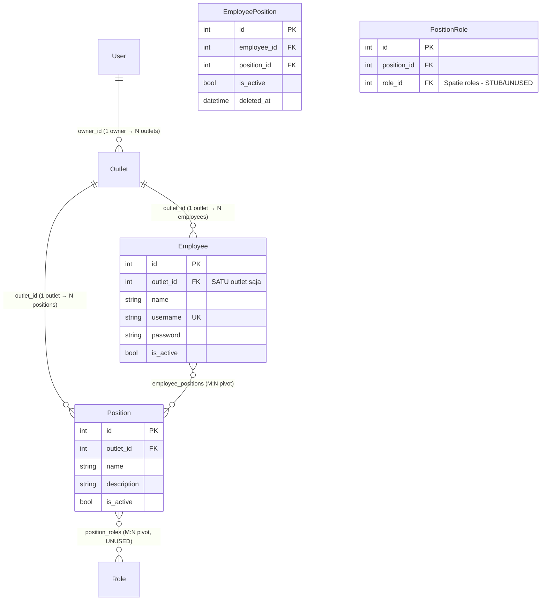
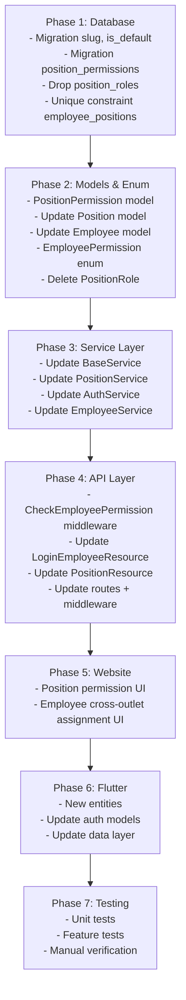
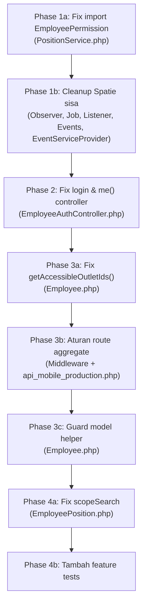

# Multi-Outlet Role-Based Access Control (RBAC)

## 1. Kondisi Saat Ini — Review

### 1.1 Arsitektur Data Saat Ini



### 1.2 Temuan Detail per Layer

#### Database Layer (Migrations)

| Tabel | File | Temuan |
|---|---|---|
| `employees` | [migration](file:///c:/Bimo/Project/wash_wallet/webapp/wash_wallet_be/database/migrations/2025_10_05_155449_create_employees_table.php) | `outlet_id` = FK wajib, relasi 1:1 ke satu outlet |
| `positions` | [migration](file:///c:/Bimo/Project/wash_wallet/webapp/wash_wallet_be/database/migrations/2025_10_05_030955_create_positions_table.php) | Terikat ke satu `outlet_id` — sudah benar, posisi per outlet |
| `employee_positions` | [migration](file:///c:/Bimo/Project/wash_wallet/webapp/wash_wallet_be/database/migrations/2025_10_06_033129_create_employee_positions_table.php) | Pivot M:N employee↔position, tapi **tidak ada unique constraint** `[employee_id, position_id]` |
| `position_roles` | [migration](file:///c:/Bimo/Project/wash_wallet/webapp/wash_wallet_be/database/migrations/2025_10_06_033140_create_position_roles_table.php) | Menggunakan Spatie `roles` table. **Model PositionRole kosong** — tidak dipakai di manapun, **aman diganti** |

#### Model Layer

| Model | File | Temuan |
|---|---|---|
| [Employee](file:///c:/Bimo/Project/wash_wallet/webapp/wash_wallet_be/app/Models/Employee.php) | `outlet_id` hardcoded sebagai satu-satunya outlet. Method `assignPosition()` / `syncPositions()` ada tapi **tidak validasi apakah position milik outlet yang sama** |
| [Position](file:///c:/Bimo/Project/wash_wallet/webapp/wash_wallet_be/app/Models/Position.php) | Hanya `name`, `description`, `is_active`. **Tidak ada kolom permission/akses granular** |
| [PositionRole](file:///c:/Bimo/Project/wash_wallet/webapp/wash_wallet_be/app/Models/PositionRole.php) | **Model stub kosong** — tidak dipakai, akan diganti |
| [EmployeePosition](file:///c:/Bimo/Project/wash_wallet/webapp/wash_wallet_be/app/Models/EmployeePosition.php) | Ada `scopeByOutletId` tapi filter lewat `employee.outlet_id`, bukan lewat `position.outlet_id` |

#### Service Layer

| Service | File | Temuan |
|---|---|---|
| [BaseService](file:///c:/Bimo/Project/wash_wallet/webapp/wash_wallet_be/app/Services/BaseService.php) | `applyTenantScope()` untuk employee → **hanya filter `$user->outlet_id`** (satu outlet). Method `resolveOutletId()` return `$user->outlet_id` langsung |
| [PositionService](file:///c:/Bimo/Project/wash_wallet/webapp/wash_wallet_be/app/Services/PositionService.php) | `createDefaultPositionsForOutlet()` membuat **Kasir** dan **Produksi** saja. **Kurir belum ada** sebagai default |
| [AuthService](file:///c:/Bimo/Project/wash_wallet/webapp/wash_wallet_be/app/Services/AuthService.php) | `loginEmployee()` load `outlet` dan return. **Tidak mengirim data posisi/permission ke mobile app** |

#### API Layer

| Controller/Resource | File | Temuan |
|---|---|---|
| [EmployeeAuthController](file:///c:/Bimo/Project/wash_wallet/webapp/wash_wallet_be/app/Http/Controllers/Api/EmployeeAuthController.php) | Login load `outlet` dan `positions`, tapi **resource tidak serialize posisi+akses** |
| [LoginEmployeeResource](file:///c:/Bimo/Project/wash_wallet/webapp/wash_wallet_be/app/Http/Resources/Employee/LoginEmployeeResource.php) | Hanya return `outletId` tunggal. **roles/permissions di-comment out** |
| [EmployeeResource](file:///c:/Bimo/Project/wash_wallet/webapp/wash_wallet_be/app/Http/Resources/Employee/EmployeeResource.php) | `outletId` single value. `employeePositions` tersedia tapi tanpa permission data |

#### Mobile (Flutter)

| Entity | File | Temuan |
|---|---|---|
| [AuthEmployee](file:///c:/Bimo/Project/wash_wallet/packages/wash_wallet_domain/lib/src/entities/auth_employee.dart) | Hanya `outletId` tunggal, **tidak ada data posisi/permission** |
| [Employee](file:///c:/Bimo/Project/wash_wallet/packages/wash_wallet_domain/lib/src/entities/employee.dart) | `outletId` nullable tapi tetap single value |

#### Mobile Apps

| App | Routing | Temuan |
|---|---|---|
| `apps/cashier` | [api_mobile_cashier.php](file:///c:/Bimo/Project/wash_wallet/webapp/wash_wallet_be/routes/api_mobile_cashier.php) | Semua route tanpa middleware permission check |
| `apps/production` | [api_mobile_production.php](file:///c:/Bimo/Project/wash_wallet/webapp/wash_wallet_be/routes/api_mobile_production.php) | Sama, tidak ada permission gate. **Route kurir akan ditambahkan di sini** |

---

### 1.3 Gap Analysis: Kondisi Saat Ini vs User Needs

| # | User Need | Status | Gap |
|---|---|---|---|
| 1 | Owner bisa buat & kelola posisi per outlet | ✅ | — |
| 2 | Outlet otomatis punya posisi default: **Kasir, Produksi, Kurir** | ⚠️ | **Kurir belum ada** di default positions |
| 3 | Owner bisa ubah akses pada posisi default | ❌ | **Tidak ada konsep permission di Position** |
| 4 | Owner bisa buat posisi custom dengan kombinasi akses | ❌ | **Position hanya punya name & description** |
| 5 | Owner bisa tentukan akses granular per posisi | ❌ | **Belum ada tabel permission per position** |
| 6 | Akses granular: order, produksi, kurir, pembayaran, customer, layanan | ❌ | **Daftar permission belum didefinisikan** |
| 7 | Owner bisa assign employee ke banyak posisi | ✅ | — (tapi kurang unique constraint) |
| 8 | Kurir bisa di-assign ke posisi pada outlet berbeda (milik owner yg sama) | ❌ | **Employee terikat 1 outlet via `outlet_id`** |
| 9 | Dicegah assign ke outlet milik owner lain | ❌ | **Tidak ada guard/validation** |
| 10 | Owner lihat posisi & outlet yang bisa diakses employee | ⚠️ | Ada `employeePositions` tapi tanpa info outlet cross-mapping |
| 11 | Ubah/cabut posisi tanpa hapus employee | ✅ | — |
| 12 | Mobile akses berdasarkan posisi aktif, bukan `outlet_id` | ❌ | **`BaseService.applyTenantScope()` masih pakai `$user->outlet_id`** |
| 13 | Employee akses fitur sesuai posisi | ❌ | **Tidak ada permission check di route/middleware** |
| 14 | Kasir → buat order, fungsi kasir (bisa beda per outlet) | ❌ | Route terbuka tanpa permission |
| 15 | Produksi → antrean cuci/produksi | ❌ | Route terbuka tanpa permission |
| 16 | Kurir → jadwal pickup, ambil pesanan (multi-outlet) | ❌ | Kurir belum punya route |
| 17 | Kurir multi-outlet bisa kerja sesuai akses masing-masing | ❌ | Terikat 1 outlet |
| 18 | Website hanya owner | ✅ | — |
| 19 | Tetap support outlet default untuk kompatibilitas | ✅ | `outlet_id` tetap ada |
| 20 | Validasi akses berdasarkan outlet + permission | ❌ | **Perlu middleware + service layer** |
| 21 | Data akses employee saat login untuk mobile | ❌ | **Login response hanya `outletId` tunggal** |

---

## 2. Design Decisions (Resolved)

| # | Keputusan | Jawaban |
|---|---|---|
| Q1 | `PositionRole` (Spatie) diganti? | ✅ **Diganti** oleh `PositionPermission` custom. `PositionRole` tidak dipakai di manapun |
| Q2 | Multi-outlet: switch manual atau otomatis? | ✅ **Otomatis** tampilkan data dari semua outlet sekaligus. **Hanya Kurir** yang punya akses multi-outlet |
| Q3 | Route kurir terpisah atau gabung production? | ✅ **Digabung** di app production (`api_mobile_production.php`) |
| Q4 | Permission `service.manage` & `customer.manage` untuk kasir? | ✅ **Bisa dikonfigurasi** per posisi per outlet. Misal Kasir outlet A bisa CRUD kategori, Kasir outlet B hanya bisa read |

---

## 3. Proposed Changes

### 3.1 Arsitektur Data Baru

```mermaid
erDiagram
    User ||--o{ Outlet : "owner_id"
    Outlet ||--o{ Employee : "outlet_id (default/primary)"
    Outlet ||--o{ Position : "outlet_id"
    Position ||--o{ PositionPermission : "position_id"
    Employee ||--o{ EmployeePosition : "employee_id"
    Position ||--o{ EmployeePosition : "position_id"
    
    Position {
        int id PK
        int outlet_id FK
        string name
        string slug "kasir, produksi, kurir, custom-xxx"
        string description
        bool is_default "true utk posisi bawaan"
        bool is_active
    }
    
    PositionPermission {
        int id PK
        int position_id FK
        string permission_key "order.create, production.view, dll"
        datetime created_at
        unique_constraint "position_id + permission_key"
    }
    
    EmployeePosition {
        int id PK
        int employee_id FK
        int position_id FK
        bool is_active
        datetime deleted_at
        unique_constraint "employee_id + position_id"
    }
    
    Employee {
        int id PK
        int outlet_id FK "tetap - default/primary outlet"
        string name
        string username UK
        bool is_active
    }
```

### 3.2 Konsep Kunci: Permission per Posisi per Outlet

Karena `Position` sudah terikat ke `outlet_id`, maka **setiap outlet punya instance posisi sendiri** dengan permissions sendiri. Ini berarti:

```
Outlet A → Kasir-A → [order.create, order.view, customer.manage, service.manage]
Outlet B → Kasir-B → [order.create, order.view, customer.view]  ← lebih terbatas
Outlet A → Kurir-A → [courier.view, courier.manage]
Outlet B → Kurir-B → [courier.view, courier.manage]
```

Employee Kurir bisa di-assign ke **Kurir-A** dan **Kurir-B** sekaligus → otomatis bisa lihat pesanan dari kedua outlet.

Employee Kasir tetap hanya terikat di posisi di outlet `employees.outlet_id` saja.

### 3.3 Daftar Permission Granular

| Permission Key | Label | Deskripsi |
|---|---|---|
| `order.create` | Buat Order | Membuat order baru |
| `order.view` | Lihat Order | Melihat daftar & detail order |
| `order.manage` | Kelola Order | Start, complete, accept, reject, weigh |
| `payment.manage` | Kelola Pembayaran | Proses pembayaran, mark COD paid |
| `production.view` | Lihat Produksi | Lihat antrean cuci/produksi |
| `production.manage` | Kelola Produksi | Start & complete proses produksi |
| `courier.view` | Lihat Kurir | Lihat jadwal pickup & pesanan kurir |
| `courier.manage` | Kelola Kurir | Ambil pesanan, konfirmasi pickup |
| `customer.view` | Lihat Customer | Lihat daftar customer |
| `customer.manage` | Kelola Customer | CRUD customer |
| `service.view` | Lihat Layanan | Lihat daftar layanan & kategori |
| `service.manage` | Kelola Layanan | CRUD layanan & kategori |

### 3.4 Default Positions → Default Permissions

| Position Default | Slug | Default Permissions |
|---|---|---|
| **Kasir** | `kasir` | `order.create`, `order.view`, `order.manage`, `payment.manage`, `customer.view`, `customer.manage`, `service.view` |
| **Produksi** | `produksi` | `order.view`, `production.view`, `production.manage` |
| **Kurir** | `kurir` | `order.view`, `courier.view`, `courier.manage` |

> [!NOTE]
> Owner bisa mengubah permissions default ini sesukanya per outlet. Misal Kasir di outlet A bisa ditambah `service.manage`, sedangkan Kasir di outlet B tidak.

### 3.5 Aturan Multi-Outlet

> [!IMPORTANT]
> **Hanya employee dengan posisi Kurir** yang bisa di-assign ke posisi di outlet lain milik owner yang sama. Employee dengan posisi lain (Kasir, Produksi, custom) tetap terikat di outlet default-nya (`employees.outlet_id`).

Secara teknis:
- `EmployeePosition` bisa merujuk `Position` dari **outlet manapun** (milik owner yang sama)
- Tapi **validasi di service layer** membatasi: hanya assignment ke posisi ber-slug `kurir` yang dibolehkan cross-outlet
- Kasir/Produksi/custom hanya boleh di-assign ke posisi di outlet yang sama dengan `employee.outlet_id`

---

### 3.6 Perubahan per Component

---

#### Backend — Database

##### [NEW] Migration: `add_slug_and_is_default_to_positions_table`
- Tambah kolom `slug` (string, nullable, indexed)
- Tambah kolom `is_default` (boolean, default false)
- Backfill data: set `slug='kasir'` dan `is_default=true` untuk posisi yang name-nya 'Kasir', dst.

##### [NEW] Migration: `create_position_permissions_table`
- Kolom: `id`, `position_id` (FK → positions, cascade delete), `permission_key` (string, max 50)
- Unique constraint: `[position_id, permission_key]`
- Index: `position_id`

##### [MODIFY] Migration: `add_unique_to_employee_positions`
- Tambah unique constraint `[employee_id, position_id]` di `employee_positions`

##### [DELETE] `position_roles` table
- Drop table `position_roles` karena tidak dipakai dan digantikan `position_permissions`

---

#### Backend — Models

##### [MODIFY] [Position.php](file:///c:/Bimo/Project/wash_wallet/webapp/wash_wallet_be/app/Models/Position.php)
- Tambah `slug`, `is_default` ke `$fillable` dan `$casts`
- Tambah relasi `permissions(): HasMany → PositionPermission`
- Tambah helper:
  - `hasPermission(string $key): bool`
  - `getPermissionKeys(): array`
  - `isKurir(): bool` → `$this->slug === 'kurir'`
- Tambah scope `scopeDefault()`, `scopeBySlug()`

##### [NEW] Model: `PositionPermission.php`
- Menggantikan stub `PositionRole.php`
- `$fillable = ['position_id', 'permission_key']`
- Relasi `position(): BelongsTo`
- Scope `scopeByPositionId()`, `scopeByKey()`

##### [DELETE] [PositionRole.php](file:///c:/Bimo/Project/wash_wallet/webapp/wash_wallet_be/app/Models/PositionRole.php)
- Hapus model stub yang tidak digunakan

##### [MODIFY] [Employee.php](file:///c:/Bimo/Project/wash_wallet/webapp/wash_wallet_be/app/Models/Employee.php)
- Tambah method:
  - `getAccessibleOutletIds(): array` — return semua outlet IDs dari active positions
  - `hasPermissionOnOutlet(string $permission, int $outletId): bool`
  - `getPermissionsForOutlet(int $outletId): array`
  - `getOutletPositionMap(): Collection` — positions grouped by outlet
  - `isKurirOnOutlet(int $outletId): bool`

##### [MODIFY] [EmployeePosition.php](file:///c:/Bimo/Project/wash_wallet/webapp/wash_wallet_be/app/Models/EmployeePosition.php)
- Fix `scopeByOutletId` untuk filter via `position.outlet_id` bukan `employee.outlet_id`
- Tambah relasi ke outlet via position: `outlet()` melalui position

---

#### Backend — Enum

##### [NEW] `app/Enums/EmployeePermission.php`
```php
enum EmployeePermission: string
{
    case OrderCreate     = 'order.create';
    case OrderView       = 'order.view';
    case OrderManage     = 'order.manage';
    case PaymentManage   = 'payment.manage';
    case ProductionView  = 'production.view';
    case ProductionManage = 'production.manage';
    case CourierView     = 'courier.view';
    case CourierManage   = 'courier.manage';
    case CustomerView    = 'customer.view';
    case CustomerManage  = 'customer.manage';
    case ServiceView     = 'service.view';
    case ServiceManage   = 'service.manage';
    
    public function label(): string { /* ... */ }
    
    public static function defaultForSlug(string $slug): array { /* ... */ }
}
```

---

#### Backend — Service Layer

##### [MODIFY] [BaseService.php](file:///c:/Bimo/Project/wash_wallet/webapp/wash_wallet_be/app/Services/BaseService.php)
- `applyTenantScope()` untuk Employee:
  - Ubah dari `byOutletId($user->outlet_id)` menjadi `byOutletIds($user->getAccessibleOutletIds())`
  - Ini otomatis menampilkan data dari semua outlet yang accessible (untuk kurir = multi-outlet, untuk kasir/produksi = hanya default outlet)
- `resolveOutletId()`: tetap return `$user->outlet_id` (default outlet), tapi tambah optional `$outletId` parameter dari request
- Tambah `resolveAccessibleOutletIds(): array`
- Tambah `checkPermission(string $permission, ?int $outletId = null): void` — throw 403 jika tidak punya permission

##### [MODIFY] [PositionService.php](file:///c:/Bimo/Project/wash_wallet/webapp/wash_wallet_be/app/Services/PositionService.php)
- Tambah **Kurir** ke `getDefaultPositions()` (dengan slug dan is_default)
- `createDefaultPositionsForOutlet()` → juga seed `position_permissions` default sesuai mapping di §3.4
- Tambah methods:
  - `updatePermissions(int $positionId, array $permissionKeys): void`
  - `getPermissions(int $positionId): array`
- Validasi assign employee:
  - Untuk posisi kurir → boleh cross-outlet (owner sama)
  - Untuk posisi lain → hanya di outlet `employee.outlet_id`
  - Tolak jika outlet bukan milik owner yang sama

##### [MODIFY] [AuthService.php](file:///c:/Bimo/Project/wash_wallet/webapp/wash_wallet_be/app/Services/AuthService.php)
- `loginEmployee()`:
  - Eager load: `positions.permissions`, `positions.outlet` 
  - Positions diload hanya yang `is_active = true` dan `employee_positions.is_active = true`

##### [MODIFY] [EmployeeService.php](file:///c:/Bimo/Project/wash_wallet/webapp/wash_wallet_be/app/Services/EmployeeService.php)
- Update assign position logic dengan validasi cross-outlet rules

---

#### Backend — Middleware

##### [NEW] `app/Http/Middleware/CheckEmployeePermission.php`
- Middleware yang menerima permission key(s) sebagai parameter
- Cek: employee memiliki permission yang diminta pada **outlet yang sedang diakses**
- Untuk kurir: outlet dari request context (query param/header)
- Untuk kasir/produksi: `employee.outlet_id`
- Return 403 jika tidak punya akses

Usage di routes:
```php
Route::middleware('employee.permission:order.create')->group(function () {
    Route::post('/orders', ...);
});
```

---

#### Backend — API Resources

##### [MODIFY] [LoginEmployeeResource.php](file:///c:/Bimo/Project/wash_wallet/webapp/wash_wallet_be/app/Http/Resources/Employee/LoginEmployeeResource.php)
Response baru saat login:
```json
{
  "id": 1,
  "name": "John",
  "username": "john",
  "outletId": 5,
  "isActive": true,
  "outlet": { "id": 5, "name": "Outlet A", ... },
  "accessibleOutlets": [
    {
      "outletId": 5,
      "outletName": "Outlet A",
      "positions": [
        {
          "positionId": 10,
          "positionName": "Kurir",
          "slug": "kurir",
          "permissions": ["order.view", "courier.view", "courier.manage"]
        }
      ]
    },
    {
      "outletId": 8,
      "outletName": "Outlet B",
      "positions": [
        {
          "positionId": 22,
          "positionName": "Kurir",
          "slug": "kurir",
          "permissions": ["order.view", "courier.view", "courier.manage"]
        }
      ]
    }
  ],
  "allPermissions": ["order.view", "courier.view", "courier.manage"]
}
```
- `outletId` tetap ada untuk backward compatibility (default outlet)
- `accessibleOutlets` berisi semua outlet + posisi + permissions
- `allPermissions` flat list semua unique permissions untuk kemudahan mobile

##### [MODIFY] [PositionResource.php](file:///c:/Bimo/Project/wash_wallet/webapp/wash_wallet_be/app/Http/Resources/Position/PositionResource.php)
- Tambah `slug`, `isDefault`, `permissions: string[]`

##### [MODIFY] [EmployeeResource.php](file:///c:/Bimo/Project/wash_wallet/webapp/wash_wallet_be/app/Http/Resources/Employee/EmployeeResource.php)
- Tambah `accessibleOutlets` (ketika relation loaded)

---

#### Backend — Routes

##### [MODIFY] [api_mobile_cashier.php](file:///c:/Bimo/Project/wash_wallet/webapp/wash_wallet_be/routes/api_mobile_cashier.php)
- Tambah middleware permission per route group:
  - Orders → `employee.permission:order.create,order.view,order.manage`
  - Customers → `employee.permission:customer.view` atau `customer.manage`
  - Categories/Services → `employee.permission:service.view` atau `service.manage`
  - Deposits/PettyCash/Expenses → `employee.permission:payment.manage`

##### [MODIFY] [api_mobile_production.php](file:///c:/Bimo/Project/wash_wallet/webapp/wash_wallet_be/routes/api_mobile_production.php)
- Tambah middleware permission per route group:
  - Orders (produksi) → `employee.permission:production.view,production.manage`
  - Order items/processes → `employee.permission:production.manage`
- **Tambah route group kurir**:
  - `GET /courier/orders` → `employee.permission:courier.view` (orders dari semua outlet accessible)
  - `POST /courier/orders/{id}/pickup` → `employee.permission:courier.manage`
  - `POST /courier/orders/{id}/confirm-pickup` → `employee.permission:courier.manage`
  - `GET /courier/schedules` → `employee.permission:courier.view`

---

#### Backend — Website (Owner Dashboard)

##### [MODIFY] Web controllers & views untuk Position management
- Halaman detail posisi: tampilkan daftar permissions sebagai checkbox/toggle
- Owner bisa toggle permissions per posisi
- Halaman detail employee: tampilkan semua posisi + outlet terkait
- Tambah tombol "Assign ke Outlet Lain" (hanya muncul untuk posisi kurir)
- Validasi: hanya bisa assign ke outlet milik owner yang sama

---

#### Flutter — Domain Layer

##### [MODIFY] [auth_employee.dart](file:///c:/Bimo/Project/wash_wallet/packages/wash_wallet_domain/lib/src/entities/auth_employee.dart)
```dart
class AuthEmployee extends Equatable {
  final int id;
  final String name;
  final String username;
  final String? email;
  final String? phone;
  final int outletId; // tetap: default/primary outlet
  final List<OutletAccess> accessibleOutlets;
  final List<String> allPermissions;
  
  bool hasPermission(String key) => allPermissions.contains(key);
  bool hasAnyPermission(List<String> keys) => keys.any(allPermissions.contains);
  List<int> get accessibleOutletIds => accessibleOutlets.map((o) => o.outletId).toList();
}
```

##### [NEW] Entity: `outlet_access.dart`
```dart
class OutletAccess extends Equatable {
  final int outletId;
  final String outletName;
  final List<PositionAccess> positions;
  
  List<String> get permissions => 
    positions.expand((p) => p.permissions).toSet().toList();
}
```

##### [NEW] Entity: `position_access.dart`
```dart
class PositionAccess extends Equatable {
  final int positionId;
  final String positionName;
  final String slug;
  final List<String> permissions;
}
```

##### [MODIFY] [employee.dart](file:///c:/Bimo/Project/wash_wallet/packages/wash_wallet_domain/lib/src/entities/employee.dart)
- Tambah `List<OutletAccess>? accessibleOutlets` (nullable untuk backward compat)

##### Corresponding data layer models & mappers
- Update model classes in `wash_wallet_data` to parse new API response
- Update remote data sources

---

## 4. Backward Compatibility

> [!IMPORTANT]
> **Zero breaking change** pada data existing:
> - `employees.outlet_id` **tetap ada dan tetap required** — ini adalah default/primary outlet
> - Semua query existing yang pakai `outlet_id` tetap bekerja
> - `BaseService.applyTenantScope()` untuk employee non-kurir masih return data dari 1 outlet saja (karena `getAccessibleOutletIds()` return `[outlet_id]` saja)
> - Login response lama (`outletId` field) tetap ada
> - Mobile app versi lama yang belum baca `accessibleOutlets` masih bisa login dan bekerja normal

> [!NOTE]
> **Migration PositionRole → PositionPermission**: Karena `position_roles` belum dipakai sama sekali, migration ini aman. Table `position_roles` akan di-drop dan diganti `position_permissions`.

---

## 5. Verification Plan

### Automated Tests

#### Unit Tests
- `Employee::getAccessibleOutletIds()` → kasir return `[outlet_id]`, kurir return multiple
- `Employee::hasPermissionOnOutlet()` → verify true/false sesuai posisi
- `Position::hasPermission()` → verify check terhadap `position_permissions`
- `PositionService::createDefaultPositionsForOutlet()` → verify 3 default positions (Kasir, Produksi, Kurir) + permissions masing-masing
- `EmployeePermission::defaultForSlug()` → verify mapping benar

#### Feature/Integration Tests
- API login → response mengandung `accessibleOutlets` + `allPermissions`
- Assign kurir ke posisi di outlet lain (same owner) → **201 success**
- Assign kurir ke posisi di outlet lain (different owner) → **403 forbidden**
- Assign kasir ke posisi di outlet lain → **422 validation error**
- Route dengan `employee.permission:order.create` → employee tanpa permission → **403**
- Route tanpa permission middleware → tetap accessible (backward compat)
- `applyTenantScope()` untuk kurir → return data dari semua accessible outlets

### Manual Verification
- Login mobile app sebagai kasir → verify hanya lihat data 1 outlet
- Login sebagai kurir multi-outlet → verify lihat pesanan dari semua outlet
- Owner dashboard → toggle permissions posisi → verify employee akses berubah
- Owner dashboard → assign kurir ke outlet lain → verify berhasil
- Owner dashboard → coba assign kasir ke outlet lain → verify ditolak

---

## 6. Implementation Order



> [!TIP]
> Phase 1–4 (backend core) bisa dikerjakan dulu tanpa mengganggu mobile app yang sudah jalan. Mobile app versi lama tetap kompatibel karena `outletId` field di login response tidak berubah.


# Fix Multi-Outlet RBAC — Review Issues

## Background

Plan ini adalah tindak lanjut hasil review implementasi [multi_outlet_rolel_based_access_controll_plan.md](file:///C:/Bimo/Project/wash_wallet/docs/plan/multi_outlet_rolel_based_access_controll_plan.md).
Semua isu diangkat dari [review.md](file:///C:/Bimo/Project/wash_wallet/docs/review.md).

Implementasi sebelumnya **sudah** mengerjakan arsitektur inti (migration, models, enum, BaseService, middleware, resources, routes). Yang belum terselesaikan adalah beberapa bug/inkonsistensi yang ditemukan saat review statis.

## Design Decisions (Resolved)

| # | Pertanyaan | Jawaban |
|---|---|---|
| Q1 | Backward compatibility `getAccessibleOutletIds()` — apakah primary outlet selalu dimasukkan? | ❌ **Tidak perlu**. Primary outlet hanya masuk jika ada posisi aktif di sana. Employee tanpa posisi aktif tidak boleh akses apapun |
| Q2 | Apakah ada referensi Spatie events selain di 4 file inti? | ✅ **Sudah diverifikasi** — referensi hanya ada di `Events/`, `Listeners/SyncPositionEmployeePermissions.php`, `Jobs/SyncEmployeePermissionsJob.php`, dan `Providers/EventServiceProvider.php`. Tidak ada di tests, console, atau tempat lain. **Aman untuk dihapus seluruhnya** |
| Q3 | Pendekatan middleware aggregate untuk route kurir? | ✅ **Disetujui** — gunakan parameter `aggregate` pada middleware `CheckEmployeePermission` |

---

## Ringkasan Issue per Severity

| Sev | # | Isu | Status |
|---|---|---|---|
| 🔴 Blocker | B1 | `PositionService` memakai `EmployeePermission` tanpa import → fatal `Class not found` | Bug |
| 🔴 Blocker | B2 | Sisa integrasi Spatie/PositionRole belum dibersihkan: Observer, Job, Listener, Event, EventServiceProvider | Legacy debt |
| 🟠 High | H1 | `login` controller reload hanya `['outlet', 'positions']` tanpa `permissions`, lalu return `EmployeeResource` bukan `LoginEmployeeResource` → `allPermissions` selalu kosong | Bug |
| 🟠 High | H2 | `me()` controller load `['outlet', 'positions']` tanpa `positions.permissions` → sama, payload kosong | Bug |
| 🟠 High | H3 | `getAccessibleOutletIds()` selalu memasukkan primary `outlet_id` meskipun tidak punya posisi aktif di sana → scope kurir bocor ke outlet yg tidak di-assign | Logic bug |
| 🟡 Medium | M1 | Route aggregate `/courier/orders` vs middleware satu-outlet context — perlu aturan eksplisit | Design gap |
| 🟡 Medium | M2 | `assignPosition()` / `assignPositions()` / `syncPositions()` di `Employee` model bisa bypass validasi cross-outlet yang ada di `EmployeeService` | Guard missing |
| 🟢 Low | L1 | `EmployeePosition::scopeSearch()` memakai kolom `first_name`, `last_name`, `title` yang tidak ada | Bug |
| 🟢 Low | L2 | Coverage test kurang: login permission payload, assign kurir cross-outlet, deny owner lain, aggregate courier, middleware permission | Test gap |

---

## Proposed Changes

---

### Phase 1 — 🔴 Blocker Fixes

#### B1: Import `EmployeePermission` di `PositionService`

##### [MODIFY] [PositionService.php](file:///C:/Bimo/Project/wash_wallet/webapp/wash_wallet_be/app/Services/PositionService.php)

Kondisi saat ini: baris 251 dan 288 memanggil `EmployeePermission::defaultForSlug()` dan `EmployeePermission::tryFrom()` tanpa ada `use App\Enums\EmployeePermission;` di header file.

Perubahan:
- Tambah `use App\Enums\EmployeePermission;` di blok import

---

#### B2: Cleanup sisa integrasi Spatie / PositionRole

##### [MODIFY] [PositionObserver.php](file:///C:/Bimo/Project/wash_wallet/webapp/wash_wallet_be/app/Observers/PositionObserver.php)

Kondisi saat ini:
- `deleting()` memanggil `$position->employees()->update(...)` — relasi `employees()` tidak ada di model `Position`
- `deleted()` memanggil `$position->roles()->detach()` (Spatie) dan `$position->employees()->withTrashed()` — kedua method tidak ada
- `restored()` memanggil `$position->syncEmployeePermissions()` — method tidak ada

Perubahan:
- `deleting()`: Hapus baris `$position->employees()->update([...])` — sudah ditangani via `employee_positions.deleted_at` oleh SoftDelete cascade
- `deleted()`: Hapus seluruh blok forceDelete `roles()->detach()` dan `employees()->withTrashed()` — `position_roles` sudah di-drop dan tidak relevan
- `restored()`: Hapus `$position->syncEmployeePermissions()` — sudah tidak ada mekanisme Spatie sync

Pengganti yang bersih:
```php
public function deleting(Position $position): void
{
    // Soft-delete: employee_positions akan tetap; 
    // is_active = false akan handled by PositionService jika diperlukan
}

public function deleted(Position $position): void
{
    if ($position->isForceDeleting()) {
        // Hapus permission data saat force-delete
        $position->permissions()->delete();
    }
}

public function restored(Position $position): void
{
    // Tidak ada aksi tambahan — permission data tetap terjaga
}
```

---

##### [DELETE] Events Spatie yang tidak dipakai

File yang akan dihapus:
- [RoleAssignedToPosition.php](file:///C:/Bimo/Project/wash_wallet/webapp/wash_wallet_be/app/Events/RoleAssignedToPosition.php)
- [RoleDetachedFromPosition.php](file:///C:/Bimo/Project/wash_wallet/webapp/wash_wallet_be/app/Events/RoleDetachedFromPosition.php)
- [RolesSyncedToPosition.php](file:///C:/Bimo/Project/wash_wallet/webapp/wash_wallet_be/app/Events/RolesSyncedToPosition.php)

##### [DELETE] [SyncPositionEmployeePermissions.php](file:///C:/Bimo/Project/wash_wallet/webapp/wash_wallet_be/app/Listeners/SyncPositionEmployeePermissions.php)

Listener ini hanya mentrigger `SyncEmployeePermissionsJob` yang masih pakai metode Spatie lama.

##### [MODIFY] [SyncEmployeePermissionsJob.php](file:///C:/Bimo/Project/wash_wallet/webapp/wash_wallet_be/app/Jobs/SyncEmployeePermissionsJob.php)

Kondisi saat ini: job memanggil `$position->load(['activeEmployees', 'roles'])` dan `$position->syncEmployeeRoles($employee)` — semua method ini tidak ada.

Karena job ini sepenuhnya Spatie-based dan tidak relevan dengan sistem `PositionPermission` baru, **file ini akan dihapus**.

##### [DELETE] [SyncEmployeePermissionsJob.php](file:///C:/Bimo/Project/wash_wallet/webapp/wash_wallet_be/app/Jobs/SyncEmployeePermissionsJob.php)

##### [MODIFY] [EventServiceProvider.php](file:///C:/Bimo/Project/wash_wallet/webapp/wash_wallet_be/app/Providers/EventServiceProvider.php)

Hapus semua referensi Spatie dari `$listen` array:
- `RoleAssignedToPosition` → `SyncPositionEmployeePermissions`
- `RoleDetachedFromPosition` → `SyncPositionEmployeePermissions`
- `RolesSyncedToPosition` → `SyncPositionEmployeePermissions`
- Import `use` yang terkait

Sisakan event Outlet (`OutletCreated`, `OutletRenamed`, `OutletDeleted`) dan observasi `PositionObserver`.

---

### Phase 2 — 🟠 High: Konsistensi Login Permission Payload

#### H1 + H2: Fix `EmployeeAuthController` — login & me()

##### [MODIFY] [EmployeeAuthController.php](file:///C:/Bimo/Project/wash_wallet/webapp/wash_wallet_be/app/Http/Controllers/Api/EmployeeAuthController.php)

**Issue `login()`:**
- Saat ini: `$employee->load(['outlet', 'positions'])` → return `new EmployeeResource($employee)`
- `EmployeeResource` tidak punya `accessibleOutlets`/`allPermissions`
- `AuthService::loginEmployee()` sudah melakukan eager load yang benar (`positions.permissions`, `positions.outlet`) — tapi di controller, di-override dengan load ulang yang **mengabaikan** `permissions`

Perubahan `login()`:
```php
$employee = $result['employee']; // sudah ter-eager-load dari AuthService
// JANGAN reload — AuthService sudah load dengan benar
return $this->successResponse([
    'token'     => $result['token'],
    'tokenType' => 'Bearer',
    'employee'  => new LoginEmployeeResource($employee), // ganti ke LoginEmployeeResource
], 'Login successful');
```

**Issue `me()`:**
- Saat ini: `$employee->load(['outlet', 'positions'])` — tanpa `positions.permissions`
- Return `LoginEmployeeResource` tapi data permission tidak akan ter-load

Perubahan `me()`:
```php
$employee->load([
    'outlet',
    'positions' => function ($query) {
        $query->where('positions.is_active', true)
              ->where('employee_positions.is_active', true);
    },
    'positions.permissions',
    'positions.outlet',
]);
return $this->successResponse(new LoginEmployeeResource($employee), 'Success');
```

---

### Phase 3 — 🟠 High: Accessible Outlet Scope & Medium Issues

#### H3: Fix `getAccessibleOutletIds()` — jangan include primary outlet jika tidak ada posisi aktif

##### [MODIFY] [Employee.php](file:///C:/Bimo/Project/wash_wallet/webapp/wash_wallet_be/app/Models/Employee.php)

Kondisi saat ini:
```php
public function getAccessibleOutletIds(): array
{
    $activePositionOutletIds = $this->positions()...->pluck('positions.outlet_id')->toArray();
    return array_unique(array_merge([$this->outlet_id], $activePositionOutletIds)); // ← primary selalu masuk
}
```

Masalah: Kurir yang tidak punya posisi aktif di outlet primer tetap mendapat akses ke outlet primer tersebut.

Perubahan:
```php
public function getAccessibleOutletIds(): array
{
    return $this->positions()
        ->where('employee_positions.is_active', true)
        ->where('positions.is_active', true)
        ->pluck('positions.outlet_id')
        ->unique()
        ->values()
        ->toArray();
    // Tidak ada fallback ke primary outlet — employee tanpa posisi aktif
    // secara RBAC tidak berhak mengakses outlet manapun (Q1: no backward compat)
}
```

> [!NOTE]
> **Q1 sudah dijawab**: Tidak perlu backward compatibility. Employee tanpa posisi aktif tidak mendapat akses. Primary `outlet_id` di tabel `employees` tetap ada sebagai referensi data, tapi tidak otomatis memberi akses.

---

#### M1: Aturan Eksplisit Route Aggregate vs Single-Outlet

##### [MODIFY] [CheckEmployeePermission.php](file:///C:/Bimo/Project/wash_wallet/webapp/wash_wallet_be/app/Http/Middleware/CheckEmployeePermission.php)

Tambah parameter opsional `$aggregate` pada middleware alias:

```
employee.permission:courier.view          → mode single-outlet (wajib ada X-Outlet-ID atau outlet dari context)
employee.permission:courier.view,aggregate → mode aggregate (cek permission di minimal 1 outlet accessible)
```

Aturan eksplisit:
- **Route list/aggregate** (GET /courier/orders): check `hasPermissionOnAnyAccessibleOutlet(permission)`
- **Route mutasi/detail** (POST /courier/orders/{id}/pickup): wajib ada `outlet_id` dari context order → check `hasPermissionOnOutlet(permission, $outletId)`

Perubahan middleware:
```php
// Handle aggregate mode
if ($aggregate) {
    $hasPermission = collect($employee->getAccessibleOutletIds())
        ->contains(fn($id) => $employee->hasPermissionOnOutlet($permission, $id));
} else {
    $outletId = /* resolve dari header/context */;
    $hasPermission = $employee->hasPermissionOnOutlet($permission, $outletId);
}
```

##### [MODIFY] [api_mobile_production.php](file:///C:/Bimo/Project/wash_wallet/webapp/wash_wallet_be/routes/api_mobile_production.php)

Anotasi middleware route kurir:
- `GET /courier/orders` → `employee.permission:courier.view,aggregate`
- `POST /courier/orders/{id}/pickup` → `employee.permission:courier.manage` (single-outlet, ambil dari order)
- `POST /courier/orders/{id}/confirm-pickup` → `employee.permission:courier.manage`
- `GET /courier/schedules` → `employee.permission:courier.view,aggregate`

---

#### M2: Guard di Model Helper Agar Tidak Bypass Validasi

##### [MODIFY] [Employee.php](file:///C:/Bimo/Project/wash_wallet/webapp/wash_wallet_be/app/Models/Employee.php)

Method `assignPosition()`, `assignPositions()`, `syncPositions()` saat ini tidak ada validasi cross-outlet.

Tambah guard internal:
```php
private function validatePositionOwnership(int $positionId): void
{
    $position = Position::find($positionId);
    if (!$position) {
        throw new \InvalidArgumentException("Position ID {$positionId} not found.");
    }
    // Kasir/Produksi/custom: hanya boleh di outlet default
    if (!$position->isKurir() && $position->outlet_id !== $this->outlet_id) {
        throw new \InvalidArgumentException(
            "Non-kurir position must belong to employee's primary outlet."
        );
    }
    // Kurir: outlet harus milik owner yang sama
    if ($position->isKurir()) {
        $ownerOutletIds = Outlet::where('owner_id', $this->outlet->owner_id)->pluck('id')->toArray();
        if (!in_array($position->outlet_id, $ownerOutletIds)) {
            throw new \InvalidArgumentException(
                "Kurir position must belong to the same owner's outlets."
            );
        }
    }
}

public function assignPosition(int $positionId, bool $isActive = true): void
{
    $this->validatePositionOwnership($positionId);
    // ... existing logic
}
```

> [!NOTE]
> Guard ini adalah **safety net** — `EmployeeService` tetap menjadi primary gate. Guard model mencegah bypass langsung dari mana saja.

---

### Phase 4 — 🟢 Low Fixes

#### L1: Fix `EmployeePosition::scopeSearch()`

##### [MODIFY] [EmployeePosition.php](file:///C:/Bimo/Project/wash_wallet/webapp/wash_wallet_be/app/Models/EmployeePosition.php)

Kondisi saat ini:
```php
public function scopeSearch(Builder $query, string $search): Builder
{
    return $query->whereHas('employee', function (Builder $q) use ($search) {
        $q->where('first_name', 'like', '%' . $search . '%')  // ← kolom tidak ada
          ->orWhere('last_name', 'like', '%' . $search . '%'); // ← kolom tidak ada
    })->orWhereHas('position', function (Builder $q) use ($search) {
        $q->where('title', 'like', '%' . $search . '%'); // ← kolom tidak ada
    });
}
```

Tabel `employees` punya kolom: `name`, `username`, `phone`.
Tabel `positions` punya kolom: `name`, `slug`, `description`.

Perubahan:
```php
public function scopeSearch(Builder $query, string $search): Builder
{
    return $query->whereHas('employee', function (Builder $q) use ($search) {
        $q->where('name', 'like', '%' . $search . '%')
          ->orWhere('username', 'like', '%' . $search . '%');
    })->orWhereHas('position', function (Builder $q) use ($search) {
        $q->where('name', 'like', '%' . $search . '%');
    });
}
```

---

#### L2: Tambah Feature Tests

##### [NEW] `tests/Feature/Auth/EmployeeLoginPermissionTest.php`

Test case:
- Login employee kasir → `allPermissions` mengandung `order.create`, `order.view`, dll
- Login employee kurir → `accessibleOutlets` berisi lebih dari 1 outlet jika multi-outlet
- `me()` endpoint → payload sama dengan login (tidak kosong)

##### [NEW] `tests/Feature/Rbac/EmployeePermissionMiddlewareTest.php`

Test case:
- Request ke route `order.create` dengan employee punya permission → **200/201**
- Request ke route `order.create` dengan employee tanpa permission → **403**
- Request ke route aggregate `courier.view` dari kurir multi-outlet → **200**

##### [NEW] `tests/Feature/Rbac/CrossOutletAssignmentTest.php`

Test case:
- Assign kurir ke posisi outlet lain (owner sama) → **201 success**
- Assign kurir ke posisi outlet lain (owner beda) → **403 forbidden**
- Assign kasir ke posisi outlet lain → **422 validation error**
- `getAccessibleOutletIds()` kurir: hanya outlet yang punya posisi aktif (bukan primary jika tidak ada posisi di sana)

---

## Urutan Pengerjaan



> [!TIP]
> **Phase 1 dan 2** adalah blocker — harus dikerjakan dulu sebelum testing apapun. Phase 3 dan 4 bisa dikerjakan paralel setelah Phase 1 dan 2 selesai.

---

## Verification Plan

### Automated Tests (yang akan dijalankan)

```bash
# Lint syntax check file yang berubah
php -l app/Services/PositionService.php
php -l app/Observers/PositionObserver.php
php -l app/Providers/EventServiceProvider.php
php -l app/Http/Controllers/Api/EmployeeAuthController.php
php -l app/Models/Employee.php
php -l app/Models/EmployeePosition.php

# Feature tests
php artisan test tests/Feature/Auth/EmployeeLoginPermissionTest.php
php artisan test tests/Feature/Rbac/
```

### Manual Verification

- Login mobile sebagai kasir → verify `allPermissions` terisi di response
- Login mobile sebagai kurir multi-outlet → verify `accessibleOutlets` berisi ≥2 outlet, `allPermissions` terisi
- `me()` endpoint → response sama dengan login (tidak kosong)
- Assign kasir ke outlet lain → harus ditolak (422)
- Assign kurir ke outlet owner sama → harus diterima (201)

---

## Catatan Verifikasi Q2

> [!NOTE]
> **Hasil grep untuk semua referensi Spatie events & job** — hanya ditemukan di 4 file berikut, tidak ada di tests, console command, atau file lain:
> - `app/Events/RoleAssignedToPosition.php` ← akan dihapus
> - `app/Events/RoleDetachedFromPosition.php` ← akan dihapus
> - `app/Events/RolesSyncedToPosition.php` ← akan dihapus
> - `app/Listeners/SyncPositionEmployeePermissions.php` ← akan dihapus
> - `app/Jobs/SyncEmployeePermissionsJob.php` ← akan dihapus
> - `app/Providers/EventServiceProvider.php` ← akan dimodifikasi (hapus bagian Spatie saja)
>
> **Kesimpulan: aman untuk dihapus tanpa risiko breaking change di tempat lain.**
