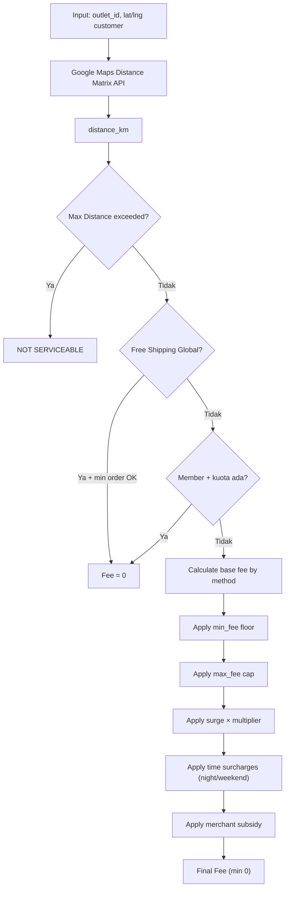

# Courier Pricing Engine — Full 12 Pricing Models + Modifiers

## ⚠️ INSTRUKSI WAJIB UNTUK AI MODEL

> [!CAUTION]
> **SEBELUM MENULIS KODE APAPUN**, baca file-file berikut secara menyeluruh:
>
> - `docs/spec/model_spec.md` — standar Model Eloquent (section headers, `$fillable`, `$casts`, scopes, helpers)
> - `docs/spec/service_spec.md` — standar Service (BaseService, constructor injection, logging, transactions)
> - `docs/spec/controller_spec.md` — standar Controller (API vs Web, error handling, getFilters)
> - `docs/spec/api_resource_spec.md` — standar Resource (camelCase, strict casting, `whenLoaded`)
> - Contoh model: `MembershipPlan.php`, `MembershipContract.php`, `CourierSetting.php`
> - Contoh service: `CourierSettingService.php`, `MembershipPlanService.php`
> - Contoh controller: `OutletController.php`
>
> **Semua kode HARUS mengikuti pola dari docs standarisasi di atas. Tidak boleh menyimpang.**

---

## Ringkasan

Membangun **Courier Pricing Engine** fleksibel yang mendukung **11 pricing method/modifier** stackable. Engine menghitung ongkir berdasarkan jarak (Google Maps Distance Matrix API) dan dapat dikonfigurasi per-outlet oleh owner.

**Pickup & Delivery** menggunakan tarif yang sama — jika antar-jemput maka biaya = 2× tarif.

**Promo ongkir** diimplementasikan sebagai **modul terpisah** (`CourierPromoModule`) dan TIDAK termasuk dalam scope plan ini. Akan dibuat implementation plan tersendiri.

---

## Keputusan Desain (Sudah Dikonfirmasi)

> [!NOTE]
> **Google Maps API Key**: `GOOGLE_MAPS_API_KEY` sudah di-enable Distance Matrix API di Google Cloud Console. ✅

> [!NOTE]
> **Tab "Config Aplikasi Customer"**: Tab ini bersifat **general** — menampung berbagai konfigurasi aplikasi customer per-outlet, tidak hanya courier pricing. CourierPricingSettings adalah salah satu sub-section di dalamnya. Tab ini bisa diperluas di masa depan dengan setting lain (misal: tampilan antarmuka customer, notifikasi, dll).

> [!NOTE]
> **Zone-Based Pricing (#11)**: Zone didefinisikan berdasarkan **data wilayah resmi** (kecamatan/kota) dari `LocationService` yang menggunakan API emsifa (`api-wilayah-indonesia`). Owner memilih dari dropdown kecamatan/kota (bukan input teks bebas), lalu menetapkan fee per zone. Data wilayah di-cache 24 jam. Tiap zone menyimpan `location_type` (`regency`/`district`), `location_id`, dan `location_name` (snapshot nama saat disimpan).

> [!NOTE]
> **Promo Ongkir**: Dipisah sepenuhnya dari core pricing engine sebagai **modul tersendiri**. Tidak ada kode promo di `CourierPricingEngine`. Implementation plan promo akan dibuat terpisah setelah core engine selesai.

---

## Arsitektur Engine

### 12 Pricing Methods

| #   | Method                          | Key                       | Formula                                           | Contoh                              |
| --- | ------------------------------- | ------------------------- | ------------------------------------------------- | ----------------------------------- |
| 1   | **Flat Rate**                   | `flat`                    | `flat_fee`                                        | Semua = Rp10.000                    |
| 2   | **Free Radius + Flat**          | `free_radius_flat`        | `≤radius → 0, else → flat_fee`                    | ≤3km gratis, >3km = Rp10.000        |
| 3   | **Tier/Range**                  | `tiered`                  | Lookup tabel tier                                 | 0-3km=10k, 3-5km=15k, 5-10km=25k    |
| 4   | **Base + Per KM**               | `base_per_km`             | `base + (dist × per_km)`                          | 5k + (8×2.5k) = 25k                 |
| 5   | **Progressive Per KM**          | `progressive`             | Sum per-km rates across tiers                     | 0-5km=2k/km, >5km=3.5k/km           |
| 6   | **Base + Per KM + Free Radius** | `base_per_km_free_radius` | `≤radius → 0, else → base + excess × per_km`      | ≤5km gratis, >5km = 5k + excess×2k  |
| 7   | **Minimum Fee**                 | _(modifier)_              | `max(calculated, min_fee)`                        | Min Rp8.000                         |
| 8   | **Maximum Cap**                 | _(modifier)_              | `min(calculated, max_fee)`                        | Max Rp30.000                        |
| 9   | **Surge/Dynamic**               | _(modifier)_              | `fee × multiplier`                                | 1.5× saat hujan                     |
| 10  | **Time-Based**                  | _(modifier)_              | `fee + night_surcharge / weekend_surcharge`       | Malam +5k, weekend +3k              |
| 11  | **Zone-Based**                  | `zone_based`              | Lookup dari tabel zone berdasarkan kecamatan/kota | Kec. Lowokwaru=10k, Kota Malang=15k |

> **Catatan**: #7, #8, #9, #10 adalah **modifiers** yang stackable di atas base method. #11 (Zone) adalah method terpisah berbasis wilayah resmi dari `LocationService`.
> **Promo ongkir** (sebelumnya #12) → modul terpisah, TIDAK ada dalam plan ini.

### Pricing Methods (7 values untuk enum `pricing_method`)

```
flat, free_radius_flat, base_per_km, tiered, progressive, base_per_km_free_radius, zone_based
```

### Modifiers (stackable, applied after base calculation)

| Modifier                     | Deskripsi                                      |
| ---------------------------- | ---------------------------------------------- |
| **Minimum Fee**              | Floor price (min Rp8.000)                      |
| **Maximum Cap**              | Ceiling price (max Rp30.000)                   |
| **Max Distance**             | Jarak maks yang dilayani (tolak jika melebihi) |
| **Surge Multiplier**         | Kalikan fee × multiplier                       |
| **Night Surcharge**          | Tambah biaya malam (+Rp5.000, 21:00-06:00)     |
| **Weekend Surcharge**        | Tambah biaya weekend (+Rp3.000)                |
| **Merchant Subsidy**         | Potongan ongkir yang ditanggung merchant       |
| **Free Shipping Global**     | Toggle gratis ongkir + min order               |
| **Membership Free Shipping** | Cek kuota gratis ongkir dari membership aktif  |

> **Promo** — tidak termasuk di sini, dihandle oleh `CourierPromoModule` (plan terpisah).

### Flow Kalkulasi



---

## Proposed Changes

### Phase 1 — Database Migrations

#### [NEW] `2026_05_09_000001_enhance_courier_settings_table.php`

Alter `courier_settings` — tambah kolom:

| Kolom                     | Tipe                       | Default  | Keterangan                 |
| ------------------------- | -------------------------- | -------- | -------------------------- |
| `pricing_method`          | enum (7 values)            | `'flat'` | Method aktif               |
| `flat_fee`                | decimal(15,2)              | 0        | Flat rate fee              |
| `base_fee`                | decimal(15,2)              | 0        | Base fee untuk base+per_km |
| `per_km_fee`              | decimal(15,2)              | 0        | Per KM fee                 |
| `free_radius_km`          | decimal(8,2)               | nullable | Free radius                |
| `min_fee`                 | decimal(15,2)              | 0        | Minimum fee floor          |
| `max_fee`                 | decimal(15,2)              | nullable | Maximum fee cap            |
| `max_distance_km`         | decimal(8,2)               | nullable | Max distance               |
| `surge_enabled`           | boolean                    | false    | Surge toggle               |
| `surge_multiplier`        | decimal(5,2)               | 1.00     | Surge multiplier           |
| `night_surcharge`         | decimal(15,2)              | 0        | Night surcharge amount     |
| `night_start_time`        | time                       | nullable | Default '21:00'            |
| `night_end_time`          | time                       | nullable | Default '06:00'            |
| `weekend_surcharge`       | decimal(15,2)              | 0        | Weekend surcharge          |
| `merchant_subsidy`        | decimal(15,2)              | 0        | Subsidi merchant           |
| `merchant_subsidy_type`   | enum('fixed','percentage') | 'fixed'  | Tipe subsidi               |
| `free_shipping_enabled`   | boolean                    | false    | Free shipping global       |
| `min_order_free_shipping` | decimal(15,2)              | nullable | Min order free ongkir      |

#### [NEW] `2026_05_09_000002_create_courier_pricing_tiers_table.php`

| Kolom                | Tipe                    | Keterangan                      |
| -------------------- | ----------------------- | ------------------------------- |
| `id`                 | bigint PK               |                                 |
| `courier_setting_id` | FK → courier_settings   |                                 |
| `min_km`             | decimal(8,2)            | Batas bawah km                  |
| `max_km`             | decimal(8,2) nullable   | Batas atas (null=unlimited)     |
| `fee`                | decimal(15,2)           | Flat fee untuk tier ini         |
| `per_km_fee`         | decimal(15,2) default 0 | Per km dalam tier (progressive) |
| `sort_order`         | integer default 0       |                                 |
| `timestamps`         |                         |                                 |

#### [NEW] `2026_05_09_000003_create_courier_pricing_zones_table.php`

Zone berdasarkan data wilayah resmi dari `LocationService` (emsifa API). Owner memilih kecamatan atau kota/kabupaten dari dropdown, bukan input teks bebas.

| Kolom                | Tipe                       | Keterangan                                                     |
| -------------------- | -------------------------- | -------------------------------------------------------------- |
| `id`                 | bigint PK                  |                                                                |
| `courier_setting_id` | FK → courier_settings      |                                                                |
| `location_type`      | enum(`regency`,`district`) | Jenis wilayah: kota/kab atau kecamatan                         |
| `location_id`        | integer                    | ID dari emsifa API (province_id, regency_id, atau district_id) |
| `location_name`      | string                     | Snapshot nama wilayah saat disimpan                            |
| `fee`                | decimal(15,2)              | Fee untuk zone ini                                             |
| `sort_order`         | integer default 0          | Urutan prioritas matching (lebih spesifik duluan)              |
| `timestamps`         |                            |                                                                |

> **Matching Logic**: Saat order masuk, `CustomerAddress` memiliki `district_id` dan `regency_id`. Engine mencocokkan zone dengan prioritas: district (`kecamatan`) lebih spesifik dari regency (`kota/kab`). Jika tidak ada zone yang cocok → fallback ke method lain atau not serviceable.

#### [NEW] `2026_05_09_000004_add_shipping_benefits_to_membership_plans.php`

Alter `membership_plans`:

| Kolom                         | Tipe             | Default                       |
| ----------------------------- | ---------------- | ----------------------------- |
| `free_shipping`               | boolean          | false                         |
| `free_shipping_quota`         | integer nullable | null = unlimited              |
| `free_shipping_validity_days` | integer nullable | null = ikut durasi membership |

#### [NEW] `2026_05_09_000005_add_shipping_usage_to_membership_contracts.php`

Alter `membership_contracts`:

| Kolom                      | Tipe              | Default |
| -------------------------- | ----------------- | ------- |
| `free_shipping_used`       | integer           | 0       |
| `free_shipping_expires_at` | datetime nullable |         |

---

### Phase 2 — Config & Service: Google Maps

#### [NEW] `config/google.php`

```php
return ['maps_api_key' => env('GOOGLE_MAPS_API_KEY')];
```

#### [NEW] `app/Services/GoogleMapsService.php`

- `getDistance(float $originLat, float $originLng, float $destLat, float $destLng): float` — return km
- Uses Distance Matrix API with caching (24h, key: `distance:{origin}:{dest}`)
- Fallback ke Haversine jika API gagal
- **Bukan extend BaseService** (utility service)

---

### Phase 3 — Models

#### [MODIFY] [CourierSetting.php](file:///c:/Bimo/Project/wash_wallet/webapp/wash_wallet_be/app/Models/CourierSetting.php)

Sesuai `model_spec.md`:

- Tambah section headers (TABLE & CONFIGURATION, RELATIONSHIPS, QUERY SCOPES, HELPERS)
- Update `$fillable` dengan semua kolom baru
- Update `$casts` lengkap termasuk timestamps
- Tambah `$hidden = ['deleted_at']`
- Relasi: `pricingTiers()` → `hasMany(CourierPricingTier)`, `pricingZones()` → `hasMany(CourierPricingZone)`
- Scopes: `scopeById`, `scopeByIds`, `scopeByOutletId`, `scopeByPricingMethod`, `scopeSortBy`
- Helpers: `calculateBaseFee(float $distanceKm): float`, `applyModifiers(float $baseFee, ?Carbon $orderTime): float`

#### [NEW] `app/Models/CourierPricingTier.php`

Sesuai `model_spec.md`:

- `$fillable`: courier_setting_id, min_km, max_km, fee, per_km_fee, sort_order
- `$casts`: semua decimal + timestamps
- Relasi: `belongsTo(CourierSetting::class)`
- Scopes: `scopeById`, `scopeByCourierSettingId`, `scopeOrdered`, `scopeSortBy`

#### [NEW] `app/Models/CourierPricingZone.php`

Sesuai `model_spec.md`:

- `$fillable`: `courier_setting_id`, `location_type`, `location_id`, `location_name`, `fee`, `sort_order`
- `$casts`: `location_type` → enum/string, `fee` → decimal
- Relasi: `belongsTo(CourierSetting::class)`
- Scopes: `scopeById`, `scopeByCourierSettingId`, `scopeByLocationType`, `scopeOrdered`
- Helper: `matchesAddress(CustomerAddress $address): bool` — cek apakah address cocok dengan zone ini

#### [MODIFY] [MembershipPlan.php](file:///c:/Bimo/Project/wash_wallet/webapp/wash_wallet_be/app/Models/MembershipPlan.php)

- Tambah `free_shipping`, `free_shipping_quota`, `free_shipping_validity_days` ke `$fillable` dan `$casts`

#### [MODIFY] [MembershipContract.php](file:///c:/Bimo/Project/wash_wallet/webapp/wash_wallet_be/app/Models/MembershipContract.php)

- Tambah `free_shipping_used`, `free_shipping_expires_at` ke `$fillable` dan `$casts`
- Helpers: `canUseFreeShipping(): bool`, `useFreeShipping(): void`, `getRemainingFreeShipping(): ?int`

---

### Phase 4 — Service Layer

#### [NEW] `app/Services/CourierPricingEngine.php` — Core Engine

> [!IMPORTANT]
> Ini adalah **utility class**, bukan extend BaseService. Tidak perlu tenant scope karena selalu menerima CourierSetting yang sudah di-resolve.

```php
class CourierPricingEngine
{
    public function calculate(
        CourierSetting $setting,
        float $distanceKm,
        ?float $orderTotal = null,
        ?int $customerId = null,
        ?int $outletId = null,
        ?Carbon $orderTime = null
    ): CourierPricingResult
}
```

Internal methods (private):

- `calculateFlat(CourierSetting $s): float`
- `calculateFreeRadiusFlat(CourierSetting $s, float $dist): float`
- `calculateBasePerKm(CourierSetting $s, float $dist): float`
- `calculateTiered(CourierSetting $s, float $dist): float`
- `calculateProgressive(CourierSetting $s, float $dist): float`
- `calculateBasePerKmFreeRadius(CourierSetting $s, float $dist): float`
- `calculateZoneBased(CourierSetting $s, ?CustomerAddress $address): float` — match address ke zone berdasarkan `location_id`+`location_type`, urutkan by `sort_order` (district dulu, baru regency)
- `applyMinFee(float $fee, CourierSetting $s): float`
- `applyMaxCap(float $fee, CourierSetting $s): float`
- `applySurge(float $fee, CourierSetting $s): float`
- `applyTimeSurcharges(float $fee, CourierSetting $s, ?Carbon $time): float`
- `applyMerchantSubsidy(float $fee, CourierSetting $s): array` — returns [finalFee, subsidyAmount]
- `checkFreeShipping(CourierSetting $s, ?float $orderTotal, ?int $customerId, ?int $outletId): ?string`

> **Tidak ada** method promo di engine ini. Promo dihandle di `CourierPromoModule` terpisah setelah engine return `CourierPricingResult`.

#### [NEW] `app/DTOs/CourierPricingResult.php` — Value Object

```php
class CourierPricingResult
{
    public float $distanceKm;
    public float $baseFee;            // sebelum modifiers
    public float $finalFee;           // setelah semua modifiers
    public float $customerPays;       // setelah subsidi
    public float $merchantSubsidy;    // jumlah subsidi merchant
    public float $minFee;
    public float $maxFee;
    public float $surgeMultiplier;
    public float $nightSurcharge;
    public float $weekendSurcharge;
    public ?string $discountSource;   // 'free_shipping_global'|'membership'|null
    public bool $isServiceable;       // false jika melebihi max distance
    public string $pricingMethod;
    public ?string $tierApplied;      // tier/zone yang dipakai
    public ?string $rejectionReason;  // alasan jika not serviceable
}
```

#### [MODIFY] [CourierSettingService.php](file:///c:/Bimo/Project/wash_wallet/webapp/wash_wallet_be/app/Services/CourierSettingService.php)

Sesuai `service_spec.md`:

- `updateSettings(int $outletId, array $data): CourierSetting` — update pricing config
- `syncPricingTiers(int $settingId, array $tiers): void` — sync tier data
- `syncPricingZones(int $settingId, array $zones): void` — sync zone data. Setiap zone menyimpan `location_type`, `location_id`, dan `location_name` (snapshot dari LocationService)
- `calculateDeliveryFee(int $outletId, float $destLat, float $destLng, ?CustomerAddress $address, ...): CourierPricingResult`
    - Calls GoogleMapsService → gets distance → calls PricingEngine
    - Untuk `zone_based`: pass `$address` ke engine agar bisa match berdasarkan `district_id`/`regency_id`
- `getZoneLocationOptions(int $outletId): array` — return daftar kecamatan+kota yang tersedia dari LocationService (berguna untuk dropdown UI zone editor). Cukup fetch regencies & districts dari province yang sama dengan outlet.

#### [MODIFY] [MembershipPlanService.php](file:///c:/Bimo/Project/wash_wallet/webapp/wash_wallet_be/app/Services/MembershipPlanService.php)

- Handle `freeShipping`, `freeShippingQuota`, `freeShippingValidityDays` di store/update

#### [MODIFY] [MembershipContractService.php](file:///c:/Bimo/Project/wash_wallet/webapp/wash_wallet_be/app/Services/MembershipContractService.php)

- Set `free_shipping_expires_at` saat create contract
- Method `useFreeShipping(int $contractId): bool`

---

### Phase 5 — HTTP Layer

#### [MODIFY] [UpdateCourierSettingRequest.php](file:///c:/Bimo/Project/wash_wallet/webapp/wash_wallet_be/app/Http/Requests/Courier/UpdateCourierSettingRequest.php)

- Validasi semua field baru + array `tiers` + array `zones`

#### [NEW] `app/Http/Requests/Courier/CalculateDeliveryFeeRequest.php`

- Validasi: `latitude`, `longitude`, `outletId`, optional `customerId`, `orderTotal`

#### [MODIFY] API [CourierSettingController.php](file:///c:/Bimo/Project/wash_wallet/webapp/wash_wallet_be/app/Http/Controllers/Api/CourierSettingController.php)

- Update `show()` + `update()` untuk data baru
- Tambah `calculateFee()` endpoint

#### [MODIFY] Web [OutletController.php](file:///c:/Bimo/Project/wash_wallet/webapp/wash_wallet_be/app/Http/Controllers/Web/OutletController.php)

- Pass `courierSetting` (with tiers + zones) ke outlet show response
- Tambah route `outlets.courier-settings.update` untuk web form

#### [NEW] `app/Http/Resources/CourierSetting/CourierSettingResource.php`

#### [NEW] `app/Http/Resources/CourierSetting/CourierPricingTierResource.php`

#### [NEW] `app/Http/Resources/CourierSetting/CourierPricingZoneResource.php`

Sesuai `api_resource_spec.md`: camelCase, strict casting, `whenLoaded`.

---

### Phase 6 — Frontend

#### [MODIFY] [types/outlet.ts](file:///c:/Bimo/Project/wash_wallet/webapp/wash_wallet_be/resources/js/types/outlet.ts)

Tambah interfaces:

```typescript
interface CourierPricingTier {
    id?: number;
    minKm: number;
    maxKm: number | null;
    fee: number;
    perKmFee: number;
    sortOrder: number;
}
interface CourierPricingZone {
    id?: number;
    name: string;
    fee: number;
    maxDistanceKm: number | null;
    sortOrder: number;
}
interface CourierPricingSetting {
    id: number;
    pricingMethod: string;
    flatFee: number;
    baseFee: number;
    perKmFee: number;
    freeRadiusKm: number | null;
    minFee: number;
    maxFee: number | null;
    maxDistanceKm: number | null;
    surgeEnabled: boolean;
    surgeMultiplier: number;
    nightSurcharge: number;
    weekendSurcharge: number;
    nightStartTime: string | null;
    nightEndTime: string | null;
    merchantSubsidy: number;
    merchantSubsidyType: "fixed" | "percentage";
    freeShippingEnabled: boolean;
    minOrderFreeShipping: number | null;
    pricingTiers: CourierPricingTier[];
    pricingZones: CourierPricingZone[];
}
```

#### [MODIFY] [Show.tsx](file:///c:/Bimo/Project/wash_wallet/webapp/wash_wallet_be/resources/js/Pages/Dashboard/Outlets/Show.tsx)

- Tambah tab **"Config Aplikasi Customer"** dengan icon `Smartphone`
- Tab ini bersifat umum dan dapat diperluas — render `CustomerAppConfigTab` yang berisi beberapa sub-section

#### [NEW] `Outlets/CustomerAppConfig/Index.tsx` — Tab Container

Berfungsi sebagai wadah/layout tab yang dapat diperluas. Struktur:

```
CustomerAppConfig/
  Index.tsx              ← Tab container (navigasi sub-section via sidebar card atau accordion)
  Partials/
    CourierPricingSettings.tsx   ← Sub-section courier pricing
    [FutureSetting].tsx          ← Placeholder untuk setting lain di masa depan
```

UI tab menampilkan **daftar kartu setting** di sisi kiri (atau atas) dan konten detail di kanan — mirip pola settings page. Saat ini hanya ada satu kartu "Pengiriman & Ongkir", tapi arsitektur sudah siap untuk tambahan.

#### [NEW] `Outlets/CustomerAppConfig/Partials/CourierPricingSettings.tsx`

UI komponen utama:

1. **Pricing Method Selector** — 7 card pilihan method (dengan visual icon & deskripsi)
2. **Method Configuration** — form dinamis sesuai method yang dipilih
3. **Tier Editor** (jika `tiered`/`progressive`) — tabel + tambah/hapus row
4. **Zone Editor** (jika `zone_based`) — dropdown pilih `location_type` (Kecamatan/Kota), lalu dropdown pilih wilayah dari data LocationService. Data wilayah di-load via API `/api/location/regencies/{id}` dan `/api/location/districts/{id}` (existing endpoint). Tampil sebagai tabel zone dengan kolom: Jenis Wilayah | Nama Wilayah | Fee | Hapus
5. **Modifiers Section** — min fee, max cap, max distance, surge, night/weekend surcharge, merchant subsidy
6. **Free Shipping Section** — toggle + min order
7. **Pricing Calculator** — input jarak → preview hasil kalkulasi real-time

#### [MODIFY] MembershipPlans [Create.tsx](file:///c:/Bimo/Project/wash_wallet/webapp/wash_wallet_be/resources/js/Pages/Dashboard/Outlets/MembershipPlans/Create.tsx) & [Edit.tsx](file:///c:/Bimo/Project/wash_wallet/webapp/wash_wallet_be/resources/js/Pages/Dashboard/Outlets/MembershipPlans/Edit.tsx)

- Tambah section "Benefit Pengiriman":
    - Toggle `freeShipping`
    - Input `freeShippingQuota` (angka atau "Unlimited")
    - Input `freeShippingValidityDays` (hari, atau "Ikut Durasi Membership")

---

### Phase 7 — Routes

#### Web Routes

```php
Route::put('outlets/{outlet}/courier-settings', [OutletController::class, 'updateCourierSettings'])
    ->name('outlets.courier-settings.update');
```

#### API Routes (mobile cashier + customer)

```php
Route::get('courier-setting', [CourierSettingController::class, 'show']);
Route::put('courier-setting', [CourierSettingController::class, 'update']);
Route::post('courier-setting/calculate', [CourierSettingController::class, 'calculateFee']);
```

---

## Urutan Implementasi

### Core Engine (Phase 1-7)

1. Migrations (enhance courier_settings, create tiers, create zones dengan location fields, membership plan, membership contract)
2. Config `google.php` + `.env`
3. Models (CourierSetting, CourierPricingTier, CourierPricingZone, MembershipPlan, MembershipContract)
4. GoogleMapsService
5. CourierPricingResult DTO
6. CourierPricingEngine (core logic — termasuk `calculateZoneBased` berbasis `location_id`+`location_type`)
7. CourierSettingService (update + syncZones + getZoneLocationOptions + calculateDeliveryFee)

### HTTP Layer (Phase 8-12)

8. MembershipPlanService & MembershipContractService (shipping benefit)
9. Form Requests (UpdateCourierSetting + CalculateDeliveryFee)
10. Resources (CourierSettingResource, TierResource, ZoneResource)
11. Controllers (API CourierSettingController + Web OutletController)
12. Routes

### Frontend (Phase 13-15)

13. TypeScript types (CourierPricingZone pakai `locationType`, `locationId`, `locationName`)
14. Frontend UI: `CustomerAppConfig/Index.tsx` (expandable container) + `CourierPricingSettings.tsx` (zone editor pakai dropdown LocationService)
15. Membership UI (shipping benefit section)

### Modul Terpisah (Out of Scope plan ini)

- **Promo Ongkir** → implementation plan tersendiri (`courier_promo_implementation_plan.md`)

---

## Verification Plan

### Automated

- `php artisan migrate:fresh` — pastikan semua migration jalan termasuk kolom `location_type`, `location_id`, `location_name` di `courier_pricing_zones`
- Unit test `CourierPricingEngine` — test setiap method + modifier combinations
- Unit test `calculateZoneBased`: address dengan `district_id` cocok → fee district; address hanya punya `regency_id` → fee regency; tidak cocok → exception/not serviceable
- Feature test API `calculate` endpoint

### Manual

1. Buka detail outlet → tab **Config Aplikasi Customer** → verifikasi layout container expandable muncul
2. Buka sub-section "Pengiriman & Ongkir" → pilih tiered pricing → buat 3-4 tier → save
3. Test pricing calculator di UI
4. Test zone-based → buka Zone Editor → pilih Jenis: "Kecamatan" → dropdown tampil daftar kecamatan dari API location → pilih 3 kecamatan berbeda, assign fee → save
5. Test kalkulasi zone: order dari address di kecamatan yang didaftarkan → fee sesuai
6. Test modifiers: min fee, max cap, surge, night, weekend, merchant subsidy
7. Buat membership plan dengan free shipping 5x
8. Buat kontrak → verifikasi kuota berkurang saat order

---

## Modul Terpisah: Promo Ongkir

> [!IMPORTANT]
> Promo ongkir **tidak diimplementasikan dalam plan ini**. Akan dibuat implementation plan terpisah (`courier_promo_implementation_plan.md`) setelah core engine selesai dan stabil.
>
> Arsitektur yang direkomendasikan: `CourierPromoService` menerima `CourierPricingResult` dari engine dan menerapkan diskon/potongan promo di atasnya. Tidak ada coupling ke `CourierPricingEngine`.
