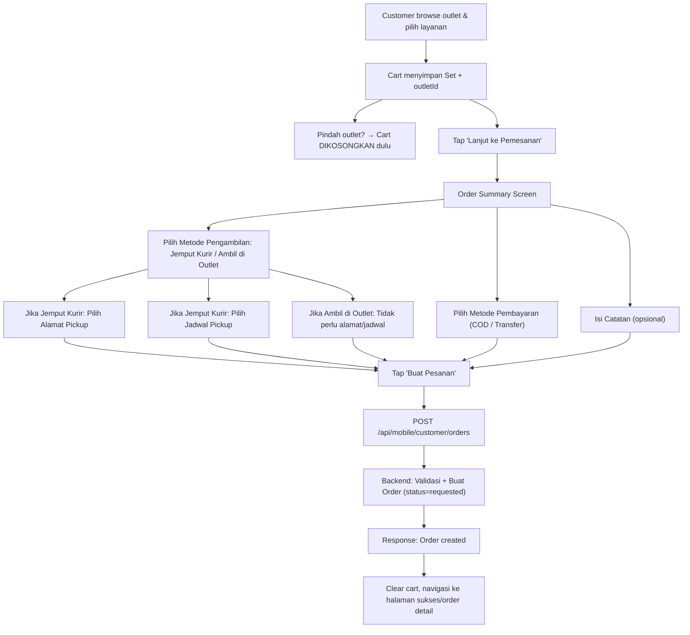
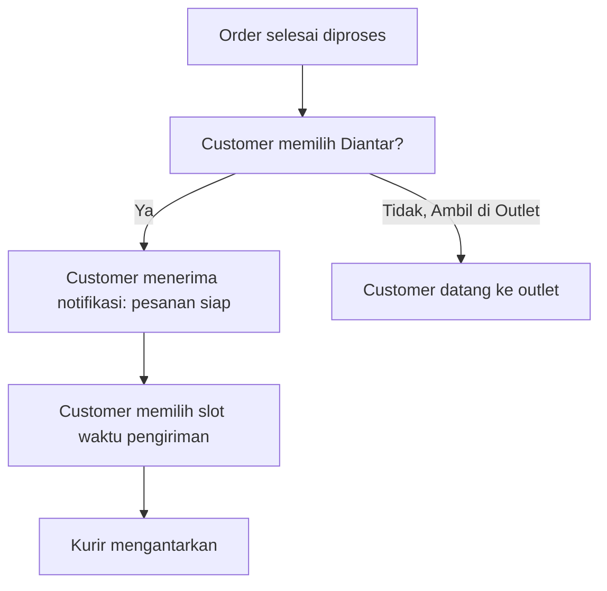

# Customer Create Order — Implementation Plan

## Deskripsi

Fitur ini memungkinkan customer membuat pesanan (order) melalui aplikasi Flutter. Customer memilih layanan laundry dari halaman outlet (sudah ada), lalu menyelesaikan pesanan di halaman **Order Summary / Checkout** dengan mengisi: metode pengambilan (pickup / diantar), metode pembayaran, catatan, alamat (jika pickup), dan jadwal pengambilan.

> [!IMPORTANT]
> **Untuk AI model lain yang mengeksekusi plan ini**: Selalu baca dan pahami spec/konteks file yang akan diubah sebelum mengerjakan. Baca model, service, controller, dan entity yang terkait terlebih dahulu sebelum menulis kode. Pastikan mengikuti pola arsitektur yang sudah ada di codebase.

## Alur Bisnis



### Alur Pengiriman (setelah order selesai — BUKAN saat buat order)



> [!NOTE]
> **Scope saat ini**: Hanya alur **customer membuat order** (memilih pickup kurir atau ambil sendiri di outlet). Fitur memilih jadwal delivery setelah selesai dibahas di plan terpisah.

## User Review Required

> [!IMPORTANT]
> **Field `outlet_id` pada Order**: Saat ini, `orders` table tidak memiliki kolom `outlet_id` secara langsung — outlet di-resolve melalui `employee_id → outlet_id`. Karena order dari customer app tidak memiliki `employee_id`, kita perlu menambah kolom `outlet_id` di tabel `orders` agar bisa langsung menghubungkan order ke outlet. Mohon review apakah pendekatan ini sesuai.

> [!WARNING]
> **Quantity & harga TIDAK diisi oleh customer**. Order items hanya menyimpan `laundry_service_id`. Field `quantity`, `unit_price`, `subtotal`, `total_amount` pada order & order_items di-set ke `0` atau `null` sampai cashier melakukan penimbangan (fitur terpisah yang dibahas nanti).

> [!IMPORTANT]
> **`customer_id` vs `customer_account_id`**: Sistem memiliki dua model — `CustomerAccount` (global auth) dan `Customer` (outlet-specific). Saat customer membuat order via app, kita gunakan `customer_account_id` dari auth. `customer_id` (outlet-level) di-set `null` saat pembuatan, bisa di-resolve atau dibuat oleh cashier saat accept nanti.

## Open Questions — SUDAH DIJAWAB

✅ **Delivery setelah selesai**: Customer **tidak** memilih jadwal pengiriman saat buat order. Jadwal delivery dipilih nanti setelah order selesai diproses, dipicu oleh notifikasi. _(Scope plan ini: hanya order creation)_

✅ **Validasi jarak**: Ada, namun **ditunda** karena Google Maps API belum dikonfigurasi. Akan menjadi fitur mendatang.

✅ **Multi-outlet cart**: **Wajib dari outlet yang sama**. Jika customer pindah ke outlet berbeda, cart harus dikosongkan otomatis. Cart perlu menyimpan `outletId` yang sedang aktif.

✅ **Metode pengambilan**: Customer memilih antara:

- **Jemput Kurir** (pickup): customer mengisi alamat + jadwal pickup
- **Ambil di Outlet**: customer tidak perlu mengisi alamat/jadwal

---

## Proposed Changes

### A. Backend (Laravel)

---

#### Database Migration

#### [NEW] `database/migrations/xxxx_add_outlet_id_and_address_to_orders_table.php`

Menambah kolom yang diperlukan untuk customer order flow:

```php
Schema::table('orders', function (Blueprint $table) {
    // Outlet langsung (karena order dari customer app tidak punya employee_id)
    $table->foreignId('outlet_id')->nullable()->after('customer_account_id')
          ->constrained('outlets')->onDelete('restrict');

    // Referensi ke alamat customer yang dipilih
    $table->foreignId('customer_address_id')->nullable()->after('outlet_id')
          ->constrained('customer_addresses')->onDelete('set null');
});
```

Kolom yang sudah tersedia dan akan digunakan:

- `customer_account_id` ✅ (sudah ada dari migration `2026_04_22_124104`)
- `source` ✅ (enum: `cashier`, `customer_app`)
- `status` ✅ (enum includes `requested`)
- `payment_method` ✅ (varchar)
- `payment_status` ✅ (enum includes `cod`, `pending_payment`)
- `pickup_address` ✅ (text, snapshot alamat)
- `pickup_schedule` ✅ (datetime)
- `pickup_fee` ✅ (decimal)
- `delivery_fee` ✅ (decimal)
- `notes` ✅

---

#### Order Model

#### [MODIFY] [Order.php](file:///c:/Bimo/Project/wash_wallet/webapp/wash_wallet_be/app/Models/Order.php)

- Tambahkan `outlet_id` dan `customer_address_id` ke `$fillable`
- Tambahkan relasi `outlet()` → `BelongsTo Outlet`
- Tambahkan relasi `customerAddress()` → `BelongsTo CustomerAddress`
- Tambahkan scope `scopeByCustomerAccountId()`

---

#### Service Layer

#### [NEW] `app/Services/CustomerOrderService.php`

Service khusus untuk order dari customer app. **Terpisah** dari `OrderService` yang ada (digunakan cashier/web) karena logika berbeda:

**Method: `storeFromCustomer(CustomerAccount $account, array $data): Order`**

- Resolve outlet dari laundry service items
- Validasi semua items berasal dari outlet yang sama
- Validasi service aktif
- Jika `pickupType = courier`:
    - Validasi `customerAddressId` milik customer account
    - Validasi `pickupScheduleId` aktif dan milik outlet yang sama
    - Lookup `pickup_fee` dari CourierSetting
- Buat order dengan:
    - `customer_account_id` = auth customer
    - `customer_id` = `null` (belum di-assign outlet-level customer)
    - `employee_id` = `null`
    - `outlet_id` = resolved dari service items
    - `customer_address_id` = dari request (nullable, null jika ambil di outlet)
    - `source` = `customer_app`
    - `status` = `requested`
    - `payment_method` = dari request (`cod` / `transfer`)
    - `payment_status` = `cod` jika COD, `pending_payment` jika transfer
    - `pickup_address` = snapshot string dari CustomerAddress (null jika ambil di outlet)
    - `pickup_schedule` = dari request (null jika ambil di outlet)
    - `pickup_fee` = dari CourierSetting (0 jika ambil di outlet)
    - `subtotal`, `total_amount`, `paid_amount` = `0` (ditentukan cashier nanti)
    - `notes` = dari request
    - _(field `delivery\__` dibiarkan null — diisi nanti setelah order selesai)\*
- Buat order items:
    - `laundry_service_id`, `laundry_service_name`, `category_name`, `unit_name` = snapshot
    - `quantity`, `unit_price`, `subtotal`, `total_amount` = `0`
    - `status` = `pending`

**Method: `getCustomerOrders(CustomerAccount $account, array $filters): LengthAwarePaginator|Collection`**

- List orders untuk customer account

**Method: `getCustomerOrderById(CustomerAccount $account, int $orderId): Order`**

- Get single order milik customer account

---

#### [MODIFY] `app/Services/CourierScheduleService.php`

---

#### Form Request

#### [NEW] `app/Http/Requests/Order/StoreCustomerOrderRequest.php`

```php
public function rules(): array
{
    return [
        'paymentMethod'      => 'required|string|in:cod,transfer',
        'pickupType'         => 'required|string|in:courier,self_pickup',
        'notes'              => 'nullable|string|max:1000',
        // Wajib diisi hanya jika pickupType = courier
        'customerAddressId'  => 'required_if:pickupType,courier|nullable|integer|exists:customer_addresses,id',
        'pickupScheduleId'   => 'required_if:pickupType,courier|nullable|integer|exists:courier_schedules,id',
        'pickupDate'         => 'required_if:pickupType,courier|nullable|date|after_or_equal:today',
        'orderItems'         => 'required|array|min:1',
        'orderItems.*.laundryServiceId' => 'required|integer|exists:laundry_services,id',
    ];
}
```

---

#### API Resource

#### [NEW] `app/Http/Resources/Order/CustomerOrderResource.php`

Resource yang disesuaikan untuk response ke customer app. Lebih ringan daripada `OrderResource`:

- `id`, `orderNumber`, `status`, `statusLabel`
- `paymentMethod`, `paymentStatus`, `paymentStatusLabel`
- `pickupAddress`, `pickupSchedule`, `pickupFee`
- `notes`
- `orderItems[]` → `{ id, laundryServiceId, laundryServiceName, categoryName, unitName }`
- `outlet` → `{ id, name, address, phone }`
- `createdAt`

---

#### Controller

#### [MODIFY] [OrderController.php](file:///c:/Bimo/Project/wash_wallet/webapp/wash_wallet_be/app/Http/Controllers/Api/Mobile/Customer/OrderController.php)

Implement methods:

```php
class OrderController extends Controller
{
    public function __construct(
        private CustomerOrderService $customerOrderService,
    ) {}

    // POST /api/mobile/customer/orders
    public function store(StoreCustomerOrderRequest $request): JsonResponse

    // GET /api/mobile/customer/orders
    public function index(Request $request): JsonResponse

    // GET /api/mobile/customer/orders/{id}
    public function show(int $id): JsonResponse
}
```

---

#### Routes

#### [MODIFY] [api_mobile_customer.php](file:///c:/Bimo/Project/wash_wallet/webapp/wash_wallet_be/routes/api_mobile_customer.php)

Tambahkan order routes di dalam middleware `auth:customer_sanctum`:

```php
Route::prefix('orders')
    ->name('orders.')
    ->controller(\App\Http\Controllers\Api\Mobile\Customer\OrderController::class)
    ->group(function () {
        Route::get('/', 'index')->name('index');
        Route::post('/', 'store')->name('store');
        Route::get('/{id}', 'show')->name('show');
    });
```

---

### B. Frontend — Flutter Customer App

---

#### Shared Package — Core

#### [MODIFY] [api_endpoints.dart](file:///c:/Bimo/Project/wash_wallet/packages/wash_wallet_core/lib/src/network/api/api_endpoints.dart)

Tambah endpoints:

```dart
// Customer Orders
String get customerOrders => '$_prefix/orders';
String customerOrder(int orderId) => '$_prefix/orders/$orderId';

// Courier schedules per outlet
String outletCourierSchedules(int outletId) => '$_prefix/outlets/$outletId/courier-schedules';
```

---

#### Feature: Order — Data Layer

#### [MODIFY] [order_remote_datasource.dart](file:///c:/Bimo/Project/wash_wallet/apps/customer/lib/features/order/data/datasources/order_remote_datasource.dart)

Implement `OrderRemoteDatasource`:

```dart
class OrderRemoteDatasource {
  final Dio dio;
  final ApiEndpoints endpoints;

  Future<Map<String, dynamic>> createOrder(Map<String, dynamic> payload);
  Future<Map<String, dynamic>> getOrders({int page = 1, int perPage = 15});
  Future<Map<String, dynamic>> getOrderById(int orderId);
  Future<Map<String, dynamic>> getCourierSchedules(int outletId, String date);
}
```

#### [MODIFY] [order_repository.dart](file:///c:/Bimo/Project/wash_wallet/apps/customer/lib/features/order/domain/repositories/order_repository.dart)

Define repository interface:

```dart
abstract class OrderRepository {
  Future<Result<Order>> createOrder(CreateOrderParams params);
  Future<Result<List<Order>>> getOrders({int page, int perPage});
  Future<Result<Order>> getOrderById(int orderId);
  Future<Result<CourierScheduleData>> getCourierSchedules(int outletId, String date);
}
```

#### [MODIFY] [order_repository_impl.dart](file:///c:/Bimo/Project/wash_wallet/apps/customer/lib/features/order/data/repositories/order_repository_impl.dart)

Implement repository.

---

#### Feature: Order — Domain Layer

#### [NEW] `features/order/domain/entities/create_order_params.dart`

```dart
class CreateOrderParams {
  final String paymentMethod;    // 'cod' | 'transfer'
  final String pickupType;       // 'courier' | 'self_pickup'
  final String? notes;
  // Hanya diisi jika pickupType == 'courier'
  final int? customerAddressId;
  final int? pickupScheduleId;
  final String? pickupDate;      // YYYY-MM-DD
  final List<OrderItemParam> orderItems;
}

class OrderItemParam {
  final int laundryServiceId;
}
```

#### [NEW] `features/order/domain/entities/courier_schedule.dart`

```dart
class CourierSchedule {
  final int id;
  final int outletId;
  final String dayOfWeek;
  final String dayLabel;
  final String type; // 'pickup' | 'delivery'
  final String typeLabel;
  final String startTime; // HH:mm
  final String endTime;   // HH:mm
  final bool isActive;
}

class CourierScheduleData {
  final List<CourierSchedule> schedules;
  final double pickupFee;
  final double deliveryFee;
}
```

#### [MODIFY] [store_usecase.dart](file:///c:/Bimo/Project/wash_wallet/apps/customer/lib/features/order/domain/usecases/store_usecase.dart)

Implement `CreateOrderUsecase` menggunakan `OrderRepository.createOrder()`.

---

#### Feature: Order — Presentation Layer

#### [NEW] `features/order/presentation/bloc/create_order_cubit.dart` + `create_order_state.dart`

State management untuk checkout flow:

```dart
// States:
// CreateOrderInitial
// CreateOrderLoading
// CreateOrderLoadingSchedules
// CreateOrderSchedulesLoaded(schedules, fees)
// CreateOrderSuccess(order)
// CreateOrderError(message)

class CreateOrderCubit extends Cubit<CreateOrderState> {
  // Methods:
  void loadCourierSchedules(int outletId, String date);
  void selectAddress(CustomerAddress address);
  void selectPaymentMethod(String method);
  void selectPickupSchedule(CourierSchedule schedule);
  void selectPickupDate(DateTime date);
  void setNotes(String notes);
  Future<void> submitOrder(Set<int> cartServiceIds);
}
```

#### [NEW] `features/order/presentation/screens/order_summary_screen.dart`

**Order Summary / Checkout Screen** — UI Utama:

Layout (dari atas ke bawah):

1. **AppBar**: "Ringkasan Pesanan" + back button
2. **Section: Layanan yang Dipesan** — List service names dari cart (read from `CartCubit` + outlet data)
3. **Section: Alamat Pengambilan** — Card menampilkan alamat terpilih + tombol "Ubah" → bottom sheet pilih dari daftar address
4. **Section: Jadwal Pengambilan** — Date picker + time slot selector (dari courier schedules API)
5. **Section: Metode Pembayaran** — Radio buttons: COD / Transfer
6. **Section: Catatan** — TextField untuk notes
7. **Section: Ringkasan Biaya** — Menampilkan `Pickup Fee` (dari courier setting), note "Harga layanan ditentukan setelah penimbangan"
8. **Bottom Button**: "Buat Pesanan" → trigger `CreateOrderCubit.submitOrder()`

#### [NEW] `features/order/presentation/screens/order_success_screen.dart`

Halaman sukses setelah order berhasil dibuat. Menampilkan order number, status, dan tombol ke halaman order detail atau kembali ke home.

#### [NEW] `features/order/presentation/widgets/address_selector_bottom_sheet.dart`

Bottom sheet yang menampilkan list alamat customer (dari `CustomerAddressListCubit`) dengan opsi pilih.

#### [NEW] `features/order/presentation/widgets/schedule_selector_widget.dart`

Widget untuk memilih tanggal pickup dan slot waktu. Menampilkan date picker + horizontal scroll chip list dari courier schedules yang tersedia.

#### [NEW] `features/order/presentation/widgets/payment_method_selector.dart`

Radio group widget untuk COD dan Transfer.

---

#### Feature: Order — Provider

#### [NEW] `features/order/presentation/providers/order_provider.dart`

Factory untuk membuat `CreateOrderCubit` dengan dependency injection (Dio, ApiEndpoints).

---

#### Router

#### [MODIFY] [app_router.dart](file:///c:/Bimo/Project/wash_wallet/apps/customer/lib/core/router/app_router.dart)

Tambah routes:

```dart
GoRoute(
  path: '/order-summary',
  builder: (context, state) {
    final extra = state.extra as Map<String, dynamic>;
    final outletId = extra['outletId'] as int;
    return MultiBlocProvider(
      providers: [
        BlocProvider(create: (_) => OrderProvider.createOrderCubit(dio, endpoints)),
        // CustomerAddressListCubit sudah tersedia via global provider
      ],
      child: OrderSummaryScreen(outletId: outletId),
    );
  },
),
GoRoute(
  path: '/order-success',
  builder: (context, state) {
    final order = state.extra; // Order data
    return OrderSuccessScreen(order: order);
  },
),
```

#### [MODIFY] [cart_floating_button.dart](file:///c:/Bimo/Project/wash_wallet/apps/customer/lib/features/order/presentation/widgets/cart_floating_button.dart)

Update navigasi dari `context.push('/order-summary')` menjadi `context.push('/order-summary', extra: {'outletId': outletId})` agar outletId diteruskan ke order summary screen.

---

#### Main App

#### [MODIFY] [main.dart](file:///c:/Bimo/Project/wash_wallet/apps/customer/lib/main.dart)

Tidak perlu perubahan signifikan karena `CreateOrderCubit` akan di-provide secara lokal di route. `CartCubit` sudah di-provide per-outlet di router.

---

## API Contract

### `POST /api/mobile/customer/orders`

**Request Body:**

```json
{
    "paymentMethod": "cod",
    "notes": "Tolong hati-hati dengan baju putih",
    "customerAddressId": 5,
    "pickupScheduleId": 12,
    "pickupDate": "2026-05-01",
    "orderItems": [
        { "laundryServiceId": 3 },
        { "laundryServiceId": 7 },
        { "laundryServiceId": 15 }
    ]
}
```

**Response (201):**

```json
{
    "success": true,
    "message": "Order created successfully",
    "data": {
        "id": 42,
        "orderNumber": "ORD-20260501-0001",
        "status": "requested",
        "statusLabel": "Diajukan",
        "paymentMethod": "cod",
        "paymentStatus": "cod",
        "paymentStatusLabel": "COD",
        "pickupAddress": "Jl. Contoh No. 10, Jakarta",
        "pickupSchedule": "2026-05-01T09:00:00+07:00",
        "pickupFee": 5000,
        "notes": "Tolong hati-hati dengan baju putih",
        "outlet": {
            "id": 3,
            "name": "LaundryKu Cabang Utama"
        },
        "orderItems": [
            {
                "id": 1,
                "laundryServiceId": 3,
                "laundryServiceName": "Cuci Setrika",
                "categoryName": "Regular",
                "unitName": "Kg"
            },
            {
                "id": 2,
                "laundryServiceId": 7,
                "laundryServiceName": "Dry Clean",
                "categoryName": "Premium",
                "unitName": "Pcs"
            }
        ],
        "createdAt": "2026-05-01T08:30:00+07:00"
    }
}
```

### `GET /api/mobile/customer/outlets/{id}/courier-schedules?date=2026-05-01`

Sudah tersedia (existing endpoint). Returns pickup & delivery schedules + fees.

---

## File Summary

### Backend — New Files

| File                                                                     | Deskripsi                                 |
| ------------------------------------------------------------------------ | ----------------------------------------- |
| `database/migrations/xxxx_add_outlet_id_and_address_to_orders_table.php` | Tambah `outlet_id`, `customer_address_id` |
| `app/Services/CustomerOrderService.php`                                  | Service khusus order dari customer app    |
| `app/Http/Requests/Order/StoreCustomerOrderRequest.php`                  | Validasi request                          |
| `app/Http/Resources/Order/CustomerOrderResource.php`                     | API response format                       |

### Backend — Modified Files

| File                                                           | Perubahan                                |
| -------------------------------------------------------------- | ---------------------------------------- |
| `app/Models/Order.php`                                         | Tambah fillable, relasi, scope           |
| `app/Services/CourierScheduleService.php`                      | Tambah `getAvailableSchedules()`         |
| `app/Http/Controllers/Api/Mobile/Customer/OrderController.php` | Implement `store()`, `index()`, `show()` |
| `routes/api_mobile_customer.php`                               | Tambah order routes                      |

### Frontend — New Files

| File                                                                     | Deskripsi                      |
| ------------------------------------------------------------------------ | ------------------------------ |
| `features/order/domain/entities/create_order_params.dart`                | DTO untuk create order         |
| `features/order/domain/entities/courier_schedule.dart`                   | Entity courier schedule + data |
| `features/order/presentation/bloc/create_order_cubit.dart`               | Cubit checkout                 |
| `features/order/presentation/bloc/create_order_state.dart`               | States checkout                |
| `features/order/presentation/screens/order_summary_screen.dart`          | Checkout UI                    |
| `features/order/presentation/screens/order_success_screen.dart`          | Success page                   |
| `features/order/presentation/widgets/address_selector_bottom_sheet.dart` | Pilih alamat                   |
| `features/order/presentation/widgets/schedule_selector_widget.dart`      | Pilih jadwal                   |
| `features/order/presentation/widgets/payment_method_selector.dart`       | Pilih payment                  |
| `features/order/presentation/providers/order_provider.dart`              | DI provider                    |

### Frontend — Modified Files

| File                                                               | Perubahan            |
| ------------------------------------------------------------------ | -------------------- |
| `packages/wash_wallet_core/lib/src/network/api/api_endpoints.dart` | Tambah endpoints     |
| `features/order/data/datasources/order_remote_datasource.dart`     | Implement API calls  |
| `features/order/data/repositories/order_repository_impl.dart`      | Implement repository |
| `features/order/domain/repositories/order_repository.dart`         | Define interface     |
| `features/order/domain/usecases/store_usecase.dart`                | Create order usecase |
| `features/order/presentation/widgets/cart_floating_button.dart`    | Pass outletId        |
| `core/router/app_router.dart`                                      | Tambah routes        |

---

## Verification Plan

### Automated Tests

1. **Backend**: Run `php artisan migrate` — pastikan migration berhasil
2. **Backend**: Test endpoint via curl/Postman:
    - `POST /api/mobile/customer/orders` — Buat order baru
    - `GET /api/mobile/customer/orders` — List orders
    - `GET /api/mobile/customer/orders/{id}` — Detail order
3. **Frontend**: `flutter analyze` — Pastikan tidak ada error

### Manual Verification

1. **Flow lengkap**:
    - Login sebagai customer
    - Browse outlet → pilih layanan → tap "Lanjut ke Pemesanan"
    - Di Order Summary: pilih alamat, tanggal, jadwal, metode bayar
    - Submit → pastikan order terbuat dengan `status=requested`
2. **Validasi edge case**:
    - Submit tanpa pilih alamat → error
    - Submit tanpa pilih jadwal → error
    - Submit dengan cart kosong → tidak bisa masuk halaman
3. **Verifikasi di database**: Order record memiliki field yang benar
