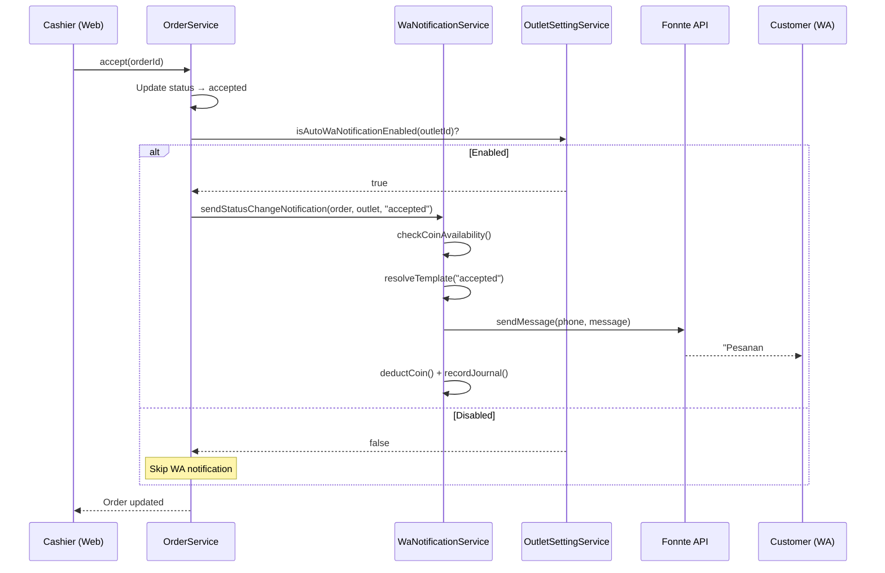

# Improvement: Auto WA Notification pada Perubahan Status Order + Settings Tab

## Deskripsi

Menambahkan fitur notifikasi WhatsApp **otomatis** ketika terjadi perubahan status order. Saat ini, WA notification hanya dikirim secara manual via tombol di UI web. Dengan fitur ini, outlet dapat mengaktifkan opsi **auto-notif** — setiap kali status order berubah (misal: accepted, weighing, queued, in_progress, ready, dll), sistem otomatis mengirim pesan WA ke customer dan memotong coin.

Fitur ini juga menambahkan **tab "Pengaturan" baru** di halaman detail Outlet (web dashboard) yang berisi daftar toggle settings per outlet. Untuk saat ini hanya satu setting: **Notifikasi WhatsApp Otomatis**.

### Catatan Penting untuk Status Order

- Saat order baru diajukan (`requested`) dan di-acc (`accepted`), order **belum bisa cetak label**. Label baru bisa dicetak setelah cashier melakukan penimbangan (status → `queued`).
- Setelah order di-acc, hanya akan dikirim **notifikasi WA** (jika setting aktif) — bukan cetak label.

---

## Keputusan Desain

> [!IMPORTANT]
> **Storage Mechanism:** Setting akan disimpan di **tabel baru `outlet_settings`** (key-value per outlet) — bukan di tabel `outlet_features` karena `outlet_features` terkait dengan fitur berbayar/trial/subscription. Settings ini adalah pengaturan on/off gratis yang melekat pada outlet.

> [!IMPORTANT]
> **Konsistensi Kode:** AI yang mengerjakan fitur ini **WAJIB** selalu merujuk ke pola kode yang sudah ada:
> - Backend: Ikuti pattern `BaseService`, `OrderService`, `WaNotificationService`, `OutletFeatureService`
> - Frontend: Ikuti pattern `OutletShow.tsx` (tabs), `SettingsTab.tsx` (card layout), dan design system yang ada (`Card`, `Button`, CSS variables)
> - Route: Ikuti pattern `web.php` dan `api.php` yang sudah ada
> - Selalu gunakan design tokens (`var(--color-*)`, `var(--spacing-*)`) bukan hardcoded values

---

## Open Questions

1. **Template pesan per status berbeda?** Apakah setiap perubahan status mengirim pesan yang berbeda (misal: "Pesanan Anda diterima", "Pesanan sedang dicuci", "Pesanan siap diambil"), atau satu template generic?
   - **Rekomendasi:** Pesan berbeda per status agar lebih informatif. Template akan di-hardcode dulu, bisa di-customize nanti.

2. **Status mana saja yang memicu notifikasi?** Apakah semua perubahan status kirim WA, atau hanya status tertentu?
   - **Rekomendasi:** Hanya status yang relevan bagi customer:
     - `accepted` → "Pesanan diterima"
     - `queued` (setelah timbang) → "Pesanan siap dikerjakan, total Rp X"
     - `in_progress` → "Pesanan sedang diproses"
     - `ready` → "Pesanan siap diambil/diantar"
     - `delivered` → "Pesanan telah dikirim"
     - `cancelled` → "Pesanan dibatalkan"

---

## Proposed Changes

### Komponen 1: Database — Tabel `outlet_settings`

#### [NEW] Migration: `create_outlet_settings_table.php`

```php
Schema::create('outlet_settings', function (Blueprint $table) {
    $table->id();
    $table->foreignId('outlet_id')->constrained('outlets')->cascadeOnDelete();
    $table->string('key', 100);      // e.g., 'auto_wa_notification'
    $table->string('value', 255);     // e.g., 'true' / 'false'
    $table->timestamps();

    $table->unique(['outlet_id', 'key']);
});
```

---

### Komponen 2: Backend — Model & Service

#### [NEW] [OutletSetting.php](file:///c:/Bimo/Project/wash_wallet/webapp/wash_wallet_be/app/Models/OutletSetting.php)

Model Eloquent untuk `outlet_settings` dengan:
- Relationship `belongsTo(Outlet::class)`
- Scopes: `scopeByOutletId`, `scopeByKey`
- Helper method: `static getValueFor(int $outletId, string $key, ?string $default = null): ?string`

#### [MODIFY] [Outlet.php](file:///c:/Bimo/Project/wash_wallet/webapp/wash_wallet_be/app/Models/Outlet.php)

Tambahkan:
- Relationship: `public function settings(): HasMany` → `OutletSetting`
- Helper: `public function getSetting(string $key, ?string $default = null): ?string`

#### [NEW] [OutletSettingService.php](file:///c:/Bimo/Project/wash_wallet/webapp/wash_wallet_be/app/Services/OutletSettingService.php)

Service class mengikuti pattern `BaseService` yang menyediakan:
- `getAll(int $outletId): Collection` — Get semua settings untuk outlet
- `getValue(int $outletId, string $key, ?string $default = null): ?string`
- `setValue(int $outletId, string $key, string $value): OutletSetting`
- `isAutoWaNotificationEnabled(int $outletId): bool`

---

### Komponen 3: Backend — WA Notification per Status

#### [MODIFY] [WaNotificationService.php](file:///c:/Bimo/Project/wash_wallet/webapp/wash_wallet_be/app/Services/WaNotificationService.php)

Tambahkan:
1. **Template per status:**
   ```php
   public static function getTemplateForStatus(string $status): ?string
   ```
   Mapping status → template pesan WA yang informatif.

2. **Method auto-send:**
   ```php
   public function sendStatusChangeNotification(Order $order, Outlet $outlet, string $newStatus): ?array
   ```
   - Cek apakah `auto_wa_notification` aktif di outlet
   - Cek apakah customer punya phone number
   - Cek coin availability
   - Resolve template berdasarkan status
   - Kirim via `FonnteService`
   - Deduct coin & record journal

#### [MODIFY] [OrderService.php](file:///c:/Bimo/Project/wash_wallet/webapp/wash_wallet_be/app/Services/OrderService.php)

Inject `WaNotificationService` dan `OutletSettingService` di constructor.

Pada setiap method yang mengubah status order, tambahkan call ke auto WA notification:
- `accept()` (line 801) → setelah update status ke `accepted`
- `weight()` (line 880) → setelah update status ke `queued`
- `start()` (line 990) → setelah update status ke `in_progress`
- Status lainnya yang ada di `updateStatus()`/`complete()`

Pattern pemanggilan (try-catch agar tidak gagalkan flow utama):
```php
try {
    $this->waNotificationService->sendStatusChangeNotification(
        $order, $outlet, Order::STATUS_ACCEPTED
    );
} catch (Exception $e) {
    Log::warning('Auto WA notification failed', [
        'order_id' => $order->id,
        'status' => 'accepted',
        'error' => $e->getMessage(),
    ]);
    // Tidak throw — agar flow utama tetap jalan
}
```

---

### Komponen 4: Backend — API Controller

#### [NEW] [OutletSettingController.php](file:///c:/Bimo/Project/wash_wallet/webapp/wash_wallet_be/app/Http/Controllers/Web/OutletSettingController.php)

Controller untuk CRUD settings via Inertia (web):
- `index(Outlet $outlet)` → Return semua settings outlet
- `update(Request $request, Outlet $outlet)` → Update key-value setting

#### [MODIFY] Route `web.php`

Tambahkan route:
```php
Route::prefix('outlets/{outlet}/settings')->group(function () {
    Route::get('/', [OutletSettingController::class, 'index'])->name('outlet-settings.index');
    Route::put('/', [OutletSettingController::class, 'update'])->name('outlet-settings.update');
});
```

---

### Komponen 5: Frontend — Tab "Pengaturan" di Outlet Show

#### [MODIFY] [Outlets/Show.tsx](file:///c:/Bimo/Project/wash_wallet/webapp/wash_wallet_be/resources/js/Pages/Dashboard/Outlets/Show.tsx)

Tambahkan tab baru "Pengaturan" (icon: `Settings`) sebagai tab terakhir di `tabsConfig`:
```tsx
{
    label: "Pengaturan",
    icon: <Settings className="w-4 h-4" />,
},
```

Dan render komponen `OutletSettingsTab` di `<Tabs>`.

#### [NEW] [Outlets/Partials/OutletSettingsTab.tsx](file:///c:/Bimo/Project/wash_wallet/webapp/wash_wallet_be/resources/js/Pages/Dashboard/Outlets/Partials/OutletSettingsTab.tsx)

Komponen yang menampilkan daftar settings outlet dengan **switch toggle**:

```
┌─────────────────────────────────────────────────┐
│  🔔 Notifikasi WhatsApp                         │
│                                                  │
│  Kirim notifikasi WhatsApp otomatis ke           │
│  customer setiap kali status pesanan berubah.    │
│  Biaya: 1 coin per notifikasi.             [🔘] │
│                                                  │
│  Status yang dikirimkan:                         │
│  • Pesanan Diterima                              │
│  • Pesanan Ditimbang & Harga Tersedia            │
│  • Pesanan Sedang Diproses                       │
│  • Pesanan Siap Diambil/Diantar                  │
│  • Pesanan Dikirim                               │
│  • Pesanan Dibatalkan                            │
└─────────────────────────────────────────────────┘
```

Pattern UI mengikuti `SettingsTab.tsx` (Card layout, icon, deskripsi) dengan penambahan switch toggle.

#### [MODIFY] [Outlets/types.ts](file:///c:/Bimo/Project/wash_wallet/webapp/wash_wallet_be/resources/js/Pages/Dashboard/Outlets/types.ts)

Tambahkan type `OutletSettings`:
```typescript
interface OutletSettings {
    auto_wa_notification: boolean;
}
```

Dan extend `Outlet` type dengan property `settings?: OutletSettings`.

---

### Komponen 6: Backend — Controller Outlet Show

#### [MODIFY] [OutletController.php](file:///c:/Bimo/Project/wash_wallet/webapp/wash_wallet_be/app/Http/Controllers/Web/OutletController.php)

Pada method `show()`, tambahkan load `settings` ke outlet data yang dikirim ke Inertia, agar `OutletSettingsTab` punya data initial.

---

## Ringkasan Alur



---

## Verification Plan

### Automated Tests
- `php artisan migrate` — pastikan migration `outlet_settings` berhasil
- `php artisan tinker` — test `OutletSetting::create()`, `Outlet->getSetting()`

### Manual Verification
1. **Web Dashboard:**
   - Buka Outlet Show → pastikan tab "Pengaturan" muncul
   - Toggle switch on/off → pastikan disimpan ke DB
   - Refresh halaman → pastikan state toggle persistent

2. **Order Flow:**
   - Aktifkan auto WA di setting outlet
   - Accept order dari customer app → pastikan WA terkirim ke customer
   - Timbang order → pastikan WA "harga tersedia" terkirim
   - Matikan auto WA → pastikan tidak ada WA terkirim saat status berubah

3. **Edge Cases:**
   - Customer tanpa nomor telepon → tidak error, hanya skip
   - Coin tidak cukup → log warning, tidak gagalkan flow order
   - Outlet belum punya row di `outlet_settings` → default `false` (tidak kirim)

---

## Catatan untuk AI yang Mengerjakan

> [!WARNING]
> **WAJIB: Konsistensi Kode**
> - Selalu baca dan ikuti pattern di file-file yang sudah ada sebelum menulis kode baru
> - Backend: Ikuti pattern `BaseService` (constructor injection, try-catch-log, `DB::transaction`)
> - Frontend: Ikuti pattern `Tabs`, `Card`, `Button` component dari design system
> - CSS: Gunakan CSS variables (`var(--color-*)`) bukan hardcoded colors
> - Naming: Ikuti konvensi camelCase di frontend, snake_case di backend
> - Routes: Ikuti pattern grouping yang sudah ada di `web.php`

> [!IMPORTANT]
> **Auto WA TIDAK boleh gagalkan flow order.** Selalu wrap dalam try-catch. Jika coin habis atau API error, order tetap harus berhasil di-update. Cukup log warning.

> [!TIP]
> **File referensi penting untuk konsistensi:**
> - [WaNotificationService.php](file:///c:/Bimo/Project/wash_wallet/webapp/wash_wallet_be/app/Services/WaNotificationService.php) — pattern existing WA notification
> - [OrderService.php](file:///c:/Bimo/Project/wash_wallet/webapp/wash_wallet_be/app/Services/OrderService.php) — pattern order status changes
> - [OutletShow.tsx](file:///c:/Bimo/Project/wash_wallet/webapp/wash_wallet_be/resources/js/Pages/Dashboard/Outlets/Show.tsx) — pattern tabs di outlet
> - [SettingsTab.tsx](file:///c:/Bimo/Project/wash_wallet/webapp/wash_wallet_be/resources/js/Pages/Dashboard/Profile/Partials/SettingsTab.tsx) — pattern settings card UI
> - [Outlet.php](file:///c:/Bimo/Project/wash_wallet/webapp/wash_wallet_be/app/Models/Outlet.php) — pattern model dengan helpers
> - [OutletFeature.php](file:///c:/Bimo/Project/wash_wallet/webapp/wash_wallet_be/app/Models/OutletFeature.php) — pattern scope dan helpers per outlet
